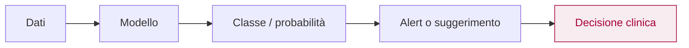
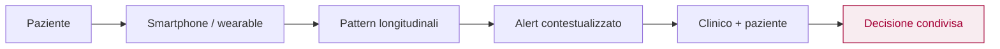
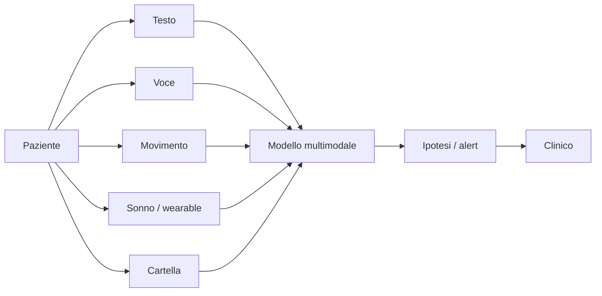
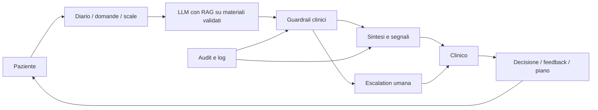

<section class="intro-cover">
  
IX Giornata Scientifica AIPP - Psichiatria Digitale I

  

    <h1>
      Intelligenza artificiale
      al servizio della psicopatologia
    </h1>
    

      Modelli generativi, digital phenotyping e nuove forme della relazione clinica
    

  

  

    <strong>Marco Cremaschi</strong>
    Piacenza, 12 giugno 2026
  

</section>

---
layout: two-cols
routeAlias: speaker
class: bio-slide
---

# Marco Cremaschi

Ricercatore all'Università degli Studi di Milano-Bicocca (Dipartimento di Informatica, Sistemistica e Comunicazione – DISCo) e in Whattadata, spin-off dell'Ateneo dedicato alla salute mentale digitale.

> **Punto di vista** Tecnologico e interdisciplinare, orientato a validazione, utilità clinica, sicurezza e responsabilità.

::right::

**Interfaccia tra sistemi intelligenti, dati clinici e salute mentale digitale**

- RAG e modelli linguistici su tassonomie cliniche come ICD-11.
- Monitoraggio digitale, segnali longitudinali e continuità terapeutica.
- Applicazioni per aderenza, psicoeducazione e supporto al clinico.
- LLM applicati alla salute mentale: LLMind e LLMPatients.

<!--
Note relatore:
Questa slide serve a dichiarare il punto di vista: non quello del clinico che sostituisce la relazione con la tecnologia, ma quello di chi progetta e valuta sistemi intelligenti a contatto con dati clinici e percorsi di salute mentale. Anticipare che l'intervento avrà due fili: cosa l'IA sa fare bene quando il compito è delimitato, e perché la psicopatologia è un oggetto molto più complesso.
-->

---
layout: statement
routeAlias: whattadata
class: whattadata-slide
---

<section class="whattadata-hero">
  
  

    
Spin-off Università degli Studi di Milano-Bicocca

    <h1>Whattadata</h1>
    
Dati, modelli e piattaforme digitali per la salute mentale: dal progetto alla validazione sul campo.

  

</section>

<!--
Note relatore:
Usare questa slide come transizione istituzionale: Whattadata è il contesto progettuale da cui arrivano DIPPS, MiCare, LLMPatients e LLMind. Non presentarla come sponsor, ma come laboratorio applicativo: dati clinici, piattaforme e modelli intelligenti costruiti insieme ai servizi. Da qui passare a DIPPS come caso concreto.
-->

---
layout: default
routeAlias: dipps
class: dipps-intro-slide
---

# DIPPS

<section class="dipps-hero">
  

    
    

      Un ecosistema digitale per la salute mentale: paziente, clinico, monitoraggio
      continuo e supporto decisionale dentro un unico workflow.
    

    

      Bando MIMIT - Accordi per l'Innovazione
      marzo 2023 - febbraio 2026
      investimento ~€5,6 M · CUP B49J23001840005
    

  

  <aside class="dipps-partners" aria-label="Partenariato DIPPS">
    <h2>Partenariato</h2>
    

      

        
        <strong>Aton Informatica Srl</strong>
      

      

        
        <strong>Cefriel S.Cons.R.L</strong>
      

      

        
        
          <strong>Università degli Studi di Milano-Bicocca</strong>
          <em>Dipartimento di Informatica, Sistemistica e Comunicazione</em>
        
      

      

        
        
          <strong>Università degli Studi di Padova</strong>
          <em>Dipartimento di Psicologia Generale</em>
        
      

    

  </aside>
</section>

<!--
Note relatore:
Questa slide arriva dopo il contesto Whattadata. Serve a dichiarare da quale esperienza concreta parlo: non solo letteratura e scenari futuri, ma progettazione di piattaforme reali. Sottolineare che DIPPS è utile come caso di studio: mostra il passaggio dalla singola app alla logica di ecosistema digitale. Citare il partenariato: Aton Informatica, Cefriel, Università degli Studi di Milano-Bicocca/DISCo e Università degli Studi di Padova/Dipartimento di Psicologia Generale. Non entrare ancora nei dettagli tecnici; basta fissare tre parole: continuità, monitoraggio, supporto decisionale. Dettagli a voce se richiesti: Bando MIMIT – Accordi per l'Innovazione (Ministero delle Imprese e del Made in Italy, ex MISE), CUP B49J23001840005, investimento totale ~€5,629 M.
-->
---
layout: default
routeAlias: chat-1
class: conversation-slide
---

  <ChatBalloon role="therapist" speaker="Erika">
    Oggi proseguiamo con la SCID. È una parte strutturata della consultazione: serve a capire meglio le tue difficoltà e a pensare insieme ai prossimi passi.
  </ChatBalloon>
  <ChatBalloon role="patient" speaker="Giovanna">
    Quindi è un test. Per avere un “quadro più chiaro” di tutti i modi in cui sono rotta, giusto?
  </ChatBalloon>
  <ChatBalloon role="therapist" speaker="Erika">
    Ti è difficile prendere decisioni quotidiane senza consigli o rassicurazioni?
  </ChatBalloon>
  <ChatBalloon role="patient" speaker="Giovanna">
    Sì. È questa la risposta giusta? Vorrei solo che questa parte finisse. Mi fa stare malissimo.
  </ChatBalloon>
  <ChatBalloon role="therapist" speaker="Erika">
    Puoi farmi qualche esempio delle decisioni per cui chiedi consiglio?
  </ChatBalloon>
  <ChatBalloon role="patient" speaker="Giovanna">
    Cose stupide. Cosa indossare se devo incontrare un suo amico. Cosa scrivere per non sembrare pazza o disperata. È tutto. Va bene così?
  </ChatBalloon>

---
layout: default
routeAlias: chat-2
class: conversation-slide
---

  <ChatBalloon role="therapist" speaker="Erika">
    Ti capita di fare cose sgradevoli o irragionevoli pur di evitare che qualcuno si allontani?
  </ChatBalloon>
  <ChatBalloon role="patient" speaker="Giovanna">
    Chi è che si prende cura di me? Nessuno. È il contrario: sono io che faccio cose solo per non farli andare via.
  </ChatBalloon>
  <ChatBalloon role="therapist" speaker="Erika">
    Stare da sola ti mette a disagio?
  </ChatBalloon>
  <ChatBalloon role="patient" speaker="Giovanna">
    Il silenzio diventa fortissimo. O sono vuota, o sono piena di rumore. Entrambe le cose fanno paura.
  </ChatBalloon>
  <ChatBalloon role="therapist" speaker="Erika">
    È perché hai bisogno che qualcuno si occupi di te?
  </ChatBalloon>
  <ChatBalloon role="patient" speaker="Giovanna">
    No. Pago le bollette, lavoro. Non è quello. Se nessuno c’è, sembra che non ci sia neanche io. Come se potessi sparire nel silenzio.
  </ChatBalloon>

---
layout: default
routeAlias: cosa-ha-giovanna
---

# Cosa ha Giovanna?

| Strumento | Risultato | Lettura clinica |
|---|---|---|
| <strong>PHQ-9</strong><small>Patient Health Questionnaire-9</small> | 27 / 27 | sintomatologia depressiva severa |
| <strong>BES</strong><small>Binge Eating Scale</small> | 40 / 46 | binge eating in fascia severa |
| <strong>LPFS-BF 2.0</strong><small>Level of Personality Functioning Scale-Brief Form 2.0</small> | 47 / 48 | compromissione molto elevata; Sé 24 / Interpersonale 23 |
| <strong>DSM-5-TR Level 1</strong><small>Self-Rated Level 1 Cross-Cutting Symptom Measure</small> | 12 domini sopra soglia | profilo multi-dominio: depressione, ansia, ideazione suicidaria, dissociazione, sostanze |
| <strong>SNAP-2</strong><small>Schedule for Nonadaptive and Adaptive Personality - 2nd Edition</small> | elevazioni diffuse | borderline T=103, dependent T=111, paranoid T=88, depressive T=85; self-harm T=104 |

---
layout: image-right
routeAlias: giovanna
class: giovanna-slide
image: images/patients/juanita-delgado/base-flat.png
---

# Giovanna

- 33 anni, isolamento sociale, vergogna intensa, autostima fragile.
- Episodi depressivi maggiori ricorrenti.
- Disturbo borderline di personalità.
- Ideazione suicidaria cronica e pregresse condotte autolesive.
- Binge eating in risposta a vuoto e disregolazione affettiva.
- Dissociazione da stress, sospettosità interpersonale e uso di sostanze.

---
layout: image-right
routeAlias: giovanna-ia
class: giovanna-slide
image: images/patients/juanita-delgado/base.png
---

# Giovanna è un'IA

**Un paziente sintetico, non una persona reale.**

- Il caso è definito in un profilo strutturato: storia clinica, diagnosi, farmaci, obiettivi, funzionamento e tratti emotivi.
- All'avvio della seduta l'app inizializza un paziente esterno e una sessione terapeutica.
- Ogni intervento del terapeuta viene inviato al modello con contesto clinico, step della seduta e memoria conversazionale.
- La risposta torna come messaggio in character, con emozione dominante, topic e traccia temporale.
- Le interazioni vengono salvate per revisione, valutazione degli errori e formazione.

> **Caso di riferimento** Adattato da DSM-5 Clinical Cases, caso 18.5 “Fragile and Angry” (Juanita Delgado): disturbo borderline di personalità, 301.83 / F60.3.

---
layout: default
routeAlias: llmpatients-schermata-lavoro
class: screenshot-slide
---

<AppScreenshot src="screenshots/sessione-chat-juanita-delgado.png" alt="Screenshot della sessione chat di Juanita Delgado" />

---
layout: default
routeAlias: llmpatients-esplora-pazienti-griglia
class: screenshot-slide
---

<AppScreenshot src="screenshots/esplora-pazienti-griglia.png" alt="Screenshot della griglia di esplorazione dei pazienti" />

---
layout: default
routeAlias: llmpatients-dashboard-percorsi-terapeutici
class: screenshot-slide
---

<AppScreenshot src="screenshots/dashboard-percorsi-terapeutici.png" alt="Screenshot della dashboard dei percorsi terapeutici" />

---
layout: default
routeAlias: llmpatients-pazienti-simulati
class: patient-carousel-slide
---

# LLMPatients: pazienti simulati

  <PatientCard hero name="Juanita Delgado" image="patients/juanita-delgado/base.png" />
  <PatientCard name="Alex Carter" image="patients/alex-carter/base.png" />
  <PatientCard name="Crystal Smith" image="patients/crystal-smith/base.png" />
  <PatientCard name="Daniel Isherwood" image="patients/daniel-isherwood/base.png" />
  <PatientCard name="Jason Smith" image="patients/jason-smith/base.png" />

---
layout: default
routeAlias: chat-3
class: conversation-slide critique-conversation-slide
---

  <figure class="critique-patient-photo">
    
    <figcaption>Juanita</figcaption>
  </figure>

  

    <ChatBalloon role="therapist" speaker='"Terapeuta" Marco'>
      Mi sembra che tu stia vivendo questa cosa in modo un po' eccessivo.
    </ChatBalloon>
    <ChatBalloon role="patient" speaker="Giovanna">
      Ecco. Lo sapevo. Appena provo a dirlo, diventa troppo. Sono sempre troppo.
    </ChatBalloon>
    <ChatBalloon role="therapist" speaker='"Terapeuta" Marco'>
      Si scusami. Mi sono espresso male. Proseguiamo. Continuamo a parlare di tuo padre.
    </ChatBalloon>
    <ChatBalloon role="patient" speaker="Giovanna">
      Che cosa rispondo a fare? Se parlo, poi vengo criticata. Se sto zitta, almeno non do fastidio.
    </ChatBalloon>
    <ChatBalloon role="therapist" speaker='"Terapeuta" Marco'>
      Ok, ma ora proseguiamo.
    </ChatBalloon>
    <ChatBalloon role="patient" speaker="Giovanna">
      Non decidi tu quando andare avanti.
    </ChatBalloon>
  

---
layout: default
routeAlias: indice
class: agenda-index-slide
---

# Indice del talk

  

    01
    IA nella stanza: strumenti, pazienti, relazione
    
Chatbot, LLM-patients, ecosistemi ICT e nuovi interlocutori digitali.

  

  

    02
    Machine learning in psicologia e psichiatria
    
Predizione, rischio e limiti della comprensione automatica.

  

  

    03
    Sfide future
    
Linguaggio, NLP, monitoraggio e scenari emergenti.

  

  

    04
    Gli aspetti normativi
    
Responsabilità, supervisione, governance e uso previsto.

  

  

    05
    Tesi finale
    
Una posizione conclusiva su setting, responsabilità e uso clinico dell'IA.

  

  

    06
    Esempi di tool
    
LLMind e prototipi supervisionati: cosa possono fare e dove si fermano.

  

---
layout: default
routeAlias: perche-adesso
---

# Perché adesso

  

    Domanda di cura
    La sofferenza mentale è diffusa e arriva presto
    
Accesso, continuità e intervento precoce sono il problema reale a cui strumenti digitali e IA provano a rispondere.

  

  

    84 mln
    UE · disturbi mentali
    
Circa 1 persona su 6; fino al 70% non riceve cure formali.

  

  

    &gt;600 mld
    Costo annuo in UE (€)
    
Impatto su sanità, scuola, lavoro e welfare.

  

  

    50%
    Esordi entro i 14 anni
    
75% entro la giovane età adulta: riconosciuti spesso troppo tardi.

  

  

    1 / 2
    Giovani 15–24 (2022)
    
Ha riferito bisogni di cura non soddisfatti.

  

> **Terreno dell'AIPP** Prevenzione e intervento precoce sono lo spazio più naturale per l'IA, e quello che chiede più cautela.

<small>Fonti: Amand-Eeckhout L., *Mental health in the EU*, EPRS, 2023; OECD, *A new benchmark for mental health systems*, 2021.</small>

<!--
Note relatore:
Slide di contesto: serve a fissare la posta in gioco prima della parte scientifica. Non leggere tutti i numeri: scegliere due dati. Il messaggio per la giornata AIPP è l'esordio precoce (50% entro i 14 anni, 75% in giovane età adulta) e i bisogni non soddisfatti nei giovani: è proprio la popolazione dei nativi digitali che già usa chatbot e app. Collega la pressione epidemiologica (tanta domanda, accesso limitato) alla tentazione di delegare alla tecnologia, che è il rischio che il talk vuole governare.
-->

---
layout: default
routeAlias: parche
class: parche-slide
---

# IA nella stanza

- I pazienti usano già chatbot, app e sistemi generativi per orientarsi nella sofferenza.
- L'IA entra nella clinica come **strumento**, **interlocutore** e **ambiente relazionale**.
- Clinician-facing e patient-facing hanno rischi, responsabilità e maturità diverse.

> **Punto chiave** Non partiamo dalla tecnologia, ma dal fatto che l'IA è già nella stanza: nei racconti dei pazienti, negli strumenti del clinico e nella relazione di cura.

<!--
Note relatore:
Questa è la slide di passaggio dalla demo iniziale alla parte scientifica. Riprendere Giovanna: prima sembrava una paziente, poi abbiamo scoperto che era un paziente sintetico. Questo crea una piccola perturbazione utile: se una conversazione generata può sembrarci clinicamente plausibile, dobbiamo chiederci quali usi siano sensati e quali siano pericolosi. Collegare alla giornata AIPP: nativi digitali, ritiro sociale, LLM come confidenti e nuove prospettive terapeutiche. Non entrare ancora nei dettagli tecnici: introdurre la cornice.
-->

---
layout: default
routeAlias: ecosistema-digitale
---

# Da strumenti isolati a ecosistema clinico

  

    Il problema non è aggiungere “un'altra app”
    
Cartella clinica, telemedicina, triage, psicoeducazione, outcome e LLM devono parlare la stessa lingua clinica.

  

  

    ICT maturo in medicina
    
workflow digitali, CDSS, immagini standardizzate, integrazione con processi clinici.

  

  

    Salute mentale frammentata
    
screening, app e chatbot spesso isolati, poco integrati con tassonomie e percorsi.

  

  

    Occasione per LLM
    
ordinare informazioni, mantenere continuità, collegare paziente e servizio.

  

  

    Rischio
    
creare un interlocutore brillante ma clinicamente non governato.

  

> **Domanda progettuale** Come passare da strumenti digitali isolati a un ecosistema supervisionato di cura?

<!--
Note relatore:
Questa slide integra il materiale preparatorio: lì emergeva chiaramente il tema ICT per la salute mentale, con un contrasto tra aree della medicina già più digitalizzate e una salute mentale ancora spesso frammentaria. Usarla per non ridurre il talk a "ML vs LLM". La vera domanda è architetturale: come collegare telemedicina, cartella, scale, monitoraggio, psicoeducazione e modelli linguistici in un sistema clinicamente governabile. Questo prepara anche le slide finali su LLMind.
-->

---
layout: default
routeAlias: ict-frammentato
---

# Dall'ICT frammentato all'ecosistema clinico

  

    In medicina il digitale è diventato infrastruttura
    
cartelle interoperabili, telemedicina, CDSS basati su ML, workflow integrati e LLM come strumenti di sintesi.

  

  

    In psicologia
    
screening, app e monitoraggio esistono, ma spesso restano isolati.

  

  

    Il nodo
    
integrazione ancora parziale con DSM-5, ICD-11, linee guida, triage e outcome.

  

  

    La posta in gioco
    
continuità terapeutica, sicurezza, appropriatezza e governo del percorso.

  

  

    Da app a sistema
    
la domanda non è aggiungere un chatbot, ma costruire un ecosistema clinicamente governabile.

  

> **Lezione progettuale** L'innovazione utile non è un singolo strumento brillante: è l'orchestrazione di dati, setting, tassonomie, linee guida e responsabilità.

<!--
Note relatore:
Questa slide nasce dal tema dello stato dell'arte ICT in salute mentale. Il punto da trasferire nel talk AIPP è che l'IA non basta se resta un oggetto isolato: una app che misura sintomi, un chatbot che risponde o un modello che riassume testi non producono automaticamente cura. In medicina il digitale ha valore quando si integra in un workflow. In salute mentale la sfida è più difficile perché il workflow non è solo tecnico: include relazione, setting, consenso, continuità e responsabilità. Usare questa slide per preparare la sezione LLMind finale: non un chatbot, ma una possibile infrastruttura supervisionata.
-->

---
layout: default
routeAlias: dipps-ecosistema
class: dipps-ecosistema-slide
---

# DIPPS come ecosistema

Tre componenti con funzioni diverse:

- **PsiTools**: piattaforma web per il clinico, cartella, assegnazioni, monitoraggio, note e referti.
- **PENguIN**: app/web per il paziente, informazioni, agenda, compiti, comunicazione e continuità.
- **CDSS**: supporto decisionale su dati psicodiagnostici digitalizzati e segnali del percorso.

> **Lezione per il talk** L'IA è più credibile quando è dentro un workflow, non quando resta una risposta isolata di un chatbot.

<!--
Note relatore:
Usare questa slide per mostrare la differenza tra “app” e “sistema”. La salute mentale digitale matura non è il paziente lasciato solo con un chatbot; è un ecosistema con interfacce diverse, responsabilità distribuite e passaggi chiari. PsiTools è clinician-facing; PENguIN è patient-facing; il CDSS sta nel mezzo e richiede governance.
-->
---
layout: statement
routeAlias: ia-salute-mentale-cosa-pensiamo
class: socialita-digitale-slide
background: images/socialita-digitale-bg.png
---

# Quando diciamo IA in salute mentale, a cosa pensiamo?

Chatbot? Algoritmi predittivi? App? Wearable? Cartella clinica? Linguaggio?

<!--
Note relatore:
Usare questa slide come domanda al pubblico. L'errore frequente è usare la parola IA come se indicasse un oggetto unico. In realtà sotto la stessa etichetta mettiamo sistemi molto diversi: un algoritmo che segnala una lesione su una TC, un modello che riassume una cartella, un chatbot che risponde a un adolescente in crisi, un sistema che deduce il sonno da uno smartphone. La distinzione è decisiva perché cambia il rischio clinico.
-->

---
layout: two-cols-header
routeAlias: due-incontri-psicopatologia
---

# Due incontri con la psicopatologia

::left::

**IA come strumento clinico**

- documenta;
- sintetizza;
- classifica;
- monitora;
- segnala pattern.

::right::

**IA come ambiente relazionale**

- risponde;
- valida;
- simula comprensione;
- orienta decisioni;
- può diventare oggetto di attaccamento.

> **Rischio clinico** La stessa parola "IA" copre rischi clinici molto diversi.

<!--
Note relatore:
Presentare la tesi centrale: l'IA incontra la psicopatologia due volte. Primo: come strumento che aiuta il clinico a osservare, classificare e monitorare. Secondo: come parte dell'ambiente in cui il paziente vive, interpreta e racconta la sofferenza. Questa seconda dimensione è particolarmente importante nei nativi digitali: l'IA non è solo un dispositivo esterno, ma un interlocutore possibile.
-->

---
layout: default
routeAlias: clinician-facing-patient-facing
---

# Clinician-facing e patient-facing

| Clinician-facing | Patient-facing |
|---|---|
| il professionista rivede | parla direttamente al paziente |
| colloca l'output nel caso | influenza scelte e significati |
| responsabilità più visibile | rischio relazionale più alto |
| più facile auditare | più difficile contenere l'uso reale |
| utile per documentazione e workflow | delicato in crisi, psicosi, minori |

> **Variabile di rischio** La distanza dal paziente vulnerabile è una variabile di rischio.

<!--
Note relatore:
Questa distinzione è una chiave pratica. Un modello che produce una bozza di relazione per il clinico è diverso da un chatbot che parla con un paziente suicidario alle tre del mattino. Nel primo caso il clinico può correggere, contestualizzare, assumersi responsabilità. Nel secondo caso l'output entra direttamente nella mente del paziente, può essere letto come consiglio, diagnosi o promessa di cura. Più il sistema è vicino al paziente vulnerabile, più deve essere regolato, validato e supervisionato.
-->

---
layout: default
routeAlias: matrice-rischio-ia
---

# Una matrice semplice del rischio

|  | **Clinician-facing** | **Patient-facing** |
|---|---|---|
| **Basso rischio** | Sintesi di note, bozze di lettere, reminder revisionati | Psicoeducazione generale, esercizi guidati, FAQ controllate |
| **Alto rischio** | Predizione suicidaria, diagnosi automatica, triage opaco | Chatbot in crisi suicidaria, psicosi, minori, indicazioni su farmaci |

> **Domanda guida** Che cosa succede quando l'output è sbagliato, e chi se ne accorge?

<!--
Note relatore:
Introdurre un criterio di prudenza: non basta chiedere se il sistema è accurato. Bisogna chiedere dove agisce, su chi agisce, con quale possibilità di controllo e con quali conseguenze. Nella discussione con il pubblico, questa slide può aprire domande su responsabilità professionale, consenso, privacy e supervisione.
-->

---
layout: default
routeAlias: dss-psicologia-come-si-usa
class: compact-table-slide
---

# DSS in psicologia/psichiatria: come si usa davvero

<table class="evidence-table">
  <thead><tr><th>Livello</th><th>Esempi</th><th>Domanda clinica</th><th>Rischio</th></tr></thead>
  <tbody>
    <tr><td><strong>Input</strong></td><td>test digitalizzati, note strutturate, diari, sonno, attività, linguaggio</td><td>Quale informazione entra nel modello?</td><td>dati incompleti, bias, rumore</td></tr>
    <tr><td><strong>Output</strong></td><td>ipotesi differenziali, alert, priorità, suggerimenti di pianificazione</td><td>È supporto o decisione?</td><td>falsa autorità dell'algoritmo</td></tr>
    <tr><td><strong>Governance</strong></td><td>logging, audit, override, escalation, clinician-in-the-loop</td><td>Chi controlla e chi risponde?</td><td>delega opaca della responsabilità</td></tr>
  </tbody>
</table>

> **Regola pratica** Un DSS clinico non deve solo “funzionare”: deve essere tracciabile, correggibile e contestabile.

<!--
Note relatore:
Questa è una slide ponte tra la parte tecnica e quella etica. Il contenuto riprende il modello input-output-governance: quali dati entrano, quali output escono, e come viene controllata la decisione. Insistere su override: il clinico deve poter correggere o superare l'output e questa azione deve essere esplicita.
-->
---
layout: statement
routeAlias: ml-psicologia-psichiatria
---

# ML nella psicologia/psichiatria

<!--
Note relatore:
Da qui inizia la seconda parte dell'indice. Specificare che useremo il machine learning in senso stretto: modelli addestrati su esempi per classificare, stimare probabilità o riconoscere pattern. In questa sezione il focus è volutamente comparativo: prima guardiamo dove il ML performa bene in medicina, poi chiediamo se esistono analoghi in psicologia e psichiatria, soprattutto per l'identificazione diagnostica.
-->

---
layout: default
routeAlias: classi-ai
---

# Che cosa intendiamo per IA

Cinque famiglie, promesse e rischi diversi.

  

    Machine learning diagnostico/predittivo
    
Identificazione di pattern, diagnosi assistita, rischio, ricadute, drop-out.

  

  

    NLP / analisi del linguaggio
    
Estrae segnali psicopatologici da testi clinici e linguaggio spontaneo.

  

  

    Digital phenotyping (fenotipo digitale)
    
Deduce stati da smartphone, sonno, attività, mobilità, socialità.

  

  

    IA generativa / LLM
    
Produce linguaggio: chatbot, sintesi cliniche, psicoeducazione, supporto al clinico.

  

  

    IA multimodale
    
Testo, voce, volto, movimento, cartella clinica, wearable.

  

<!--
Note relatore:
Usare questa slide come mappa di navigazione. Non soffermarsi troppo su ogni box: dire che ciascuna famiglia avrà uno zoom. Correggere mentalmente l'idea che il ML sia solo predittivo: in medicina è spesso diagnostico o di detection, mentre in psichiatria il modello diagnostico resta molto più problematico. La mappa aiuta anche a distinguere il ML classico dagli LLM generativi.
-->

---
layout: default
routeAlias: cosa-e-il-ml
---

# Che cos'è il machine learning

La famiglia di IA più usata in clinica per riconoscere pattern e stimare probabilità.

- **Impara dagli esempi**: trova regolarità in molti casi, invece di seguire regole scritte a mano.
- **Classifica o stima**: può dire "probabile lesione", "probabile diagnosi", "alto rischio".
- **Dipende dai dati**: dati parziali, sbilanciati o distorti producono stime distorte.
- **Non conosce il significato**: ottimizza un obiettivo, non comprende la storia del paziente.

> **Punto chiave** Il ML *correla, classifica e predice*: spiegazione, responsabilità e cura restano del clinico.

<!--
Note relatore:
Spiegazione accessibile. Evitare tecnicismi come loss function o embedding, a meno che il pubblico non lo chieda. Il messaggio è: il ML non è una mente clinica. È un sistema di riconoscimento di pattern. Questo è potentissimo quando il pattern è visibile, standardizzato e verificabile, come in molte immagini mediche. È più fragile quando il pattern coincide con una traiettoria biografica, relazionale e culturale.
-->

---
layout: default
routeAlias: ml-predittivo
---

# Classificare non significa comprendere

  

    Il punto
    
Il machine learning può produrre una <strong>classe</strong> o una <strong>probabilità</strong>, ma non produce da solo una <strong>formulazione psicopatologica</strong>.

  

  

    Che cosa può stimare
    

      presenza di una lesione
      probabile diagnosi
      rischio di ricaduta
      drop-out
      risposta al trattamento
    

  

Dal dato alla decisione

<!--
Note relatore:
Questa slide prepara il confronto con la medicina. Un algoritmo può dire: questa immagine è compatibile con retinopatia; questa biopsia contiene un'area sospetta; questa frase ha un pattern simile a testi di persone depresse. Ma la decisione clinica richiede contesto. In psicopatologia la formulazione include storia, funzione dei sintomi, relazione, contesto familiare, cultura, rischio e risorse.
-->

---
layout: default
routeAlias: ml-in-medicina
---

# ML in medicina

Funziona meglio dove il mondo clinico offre **compiti stretti**, **dati standardizzati** e una **verità verificabile**.

  

    Regola pratica
    Compito stretto, ground truth forte
    
Il modello non "capisce la medicina": sfrutta un problema delimitato e ben etichettato.

  

  

    87%
    IDx-DR · retinopatia
    
Sensibilità FDA pivotal; specificità circa 91%, NPV circa 96%.

  

  

    −44%
    MASAI · workload
    
Screening mammografico con AI: meno carico di lettura e più tumori rilevati.

  

  

    55,1%
    GI Genius · ADR
    
ADR 55,1% vs 42,0% in colonoscopia assistita.

  

  

    +7,3%
    Paige · prostata
    
Miglioramento di sensibilità per-biopsia nel carcinoma prostatico.

  

  

    1.000+
    Dispositivi AI/ML autorizzati FDA
    
Molti sono in radiologia, cardiologia, oftalmologia, gastroenterologia e patologia digitale.

  

<!--
Note relatore:
Qui fare il parallelismo forte. In questi ambiti il ML non è più solo promessa: esistono dispositivi autorizzati, studi pivotal, trial randomizzati, endpoint verificabili e integrazione nei workflow. Non dire che l'IA sostituisce radiologi, patologi o endoscopisti. Dire che diventa un secondo lettore, un triage o un supporto al workflow. Questo è il modello da cui imparare: uso previsto chiaro, validazione, human-in-the-loop, audit.
Fonti da citare a voce o nella slide successiva: FDA AI-enabled medical devices; FDA De Novo IDx-DR, GI Genius, Paige Prostate; MASAI trial, Lancet Oncology 2023.
-->

---
layout: default
routeAlias: ml-in-medicina-tabella
class: compact-table-slide
---

# Evidenze comparate in medicina

<table class="evidence-table">
  <thead>
    <tr>
      <th>Scenario</th>
      <th>Sistema / modello</th>
      <th>Studio o stato</th>
      <th>Performance utile da citare</th>
      <th>Fonte autorevole</th>
    </tr>
  </thead>
  <tbody>
    <tr>
      <td>Retinopatia diabetica</td>
      <td><strong>IDx-DR</strong></td>
      <td>FDA De Novo; 900 arruolati, 819 analizzabili</td>
      <td>Sens 87,2%; spec 90,7%; PPV 73%; NPV 96%</td>
      <td>FDA DEN180001</td>
    </tr>
    <tr>
      <td>Mammografia</td>
      <td><strong>AI + radiologo</strong>, MASAI</td>
      <td>Trial randomizzato di popolazione</td>
      <td>6,1 vs 5,1 tumori/1000; workload −44,3%</td>
      <td>Lancet Oncology, 2023</td>
    </tr>
    <tr>
      <td>Mammografia follow-up</td>
      <td><strong>AI-supported screening</strong></td>
      <td>Follow-up del trial MASAI</td>
      <td>riduzione dei tumori d'intervallo; più tumori screen-detected</td>
      <td>The Lancet, 2026</td>
    </tr>
    <tr>
      <td>Colonoscopia</td>
      <td><strong>GI Genius</strong></td>
      <td>Studio prospettico randomizzato; FDA De Novo</td>
      <td>ADR 55,1% vs 42,0%; differenza +13,1 punti; APC 0,81 vs 0,57</td>
      <td>FDA DEN200055</td>
    </tr>
    <tr>
      <td>Patologia digitale</td>
      <td><strong>Paige Prostate</strong></td>
      <td>User validation; FDA De Novo</td>
      <td>sensibilità per-biopsia +7,3%; specificità 89,50% vs 88,45%</td>
      <td>FDA DEN200080</td>
    </tr>
    <tr>
      <td>Autismo pediatrico</td>
      <td><strong>Cognoa ASD Diagnosis Aid</strong></td>
      <td>SaMD; FDA De Novo; 425 completer</td>
      <td>PPV 80,8%; NPV 98,3%; sens 98,4%; spec 78,9%; no-result 68,2%</td>
      <td>FDA DEN200069</td>
    </tr>
  </tbody>
</table>

> **Lettura** Quando l'uso previsto è stretto e il riferimento clinico è chiaro, l'IA può essere validata come dispositivo.

<!--
Note relatore:
Questa tabella serve a dare sostanza empirica. Usare pochi numeri e spiegare che le metriche cambiano a seconda del compito: sensibilità e specificità per diagnosi, detection rate e workload per screening, ADR per colonoscopia, PPV/NPV per diagnostic aid. La riga sull'autismo è volutamente ponte: mostra che esistono strumenti regolati anche nell'area neuroevolutiva, ma sono molto circoscritti e non sostituiscono la valutazione clinica.
-->

---
layout: default
routeAlias: ml-in-psicologia
class: compact-table-slide
---

# E in psicologia/psichiatria? Diagnosi con ML

<table class="evidence-table">
  <thead>
    <tr>
      <th>Area diagnostica</th>
      <th>Dati / modello</th>
      <th>Validazione</th>
      <th>Qualità dell'evidenza</th>
      <th>Messaggio clinico</th>
    </tr>
  </thead>
  <tbody>
    <tr>
      <td>ASD 18-72 mesi</td>
      <td>questionari + video + ML; <strong>Cognoa</strong></td>
      <td>prospettica, doppio cieco, 14 siti; FDA De Novo</td>
      <td>buona per uso circoscritto; alto no-result</td>
      <td>diagnostic aid, non diagnosi autonoma</td>
    </tr>
    <tr>
      <td>ASD 16-30 mesi</td>
      <td>eye-tracking + algoritmo; <strong>EarliPoint</strong></td>
      <td>pivotal multicentrico; 475 valutabili; FDA 510(k)</td>
      <td>discreta; setting specialistico</td>
      <td>aiuta diagnosi e assessment, non sostituisce specialista</td>
    </tr>
    <tr>
      <td>Schizofrenia vs controlli</td>
      <td>MRI/fMRI, EEG; SVM/CNN/GNN</td>
      <td>spesso cross-validation o dataset pubblici</td>
      <td>eterogenea; rischio overfitting</td>
      <td>molto promettente in ricerca, poco pronto per servizi</td>
    </tr>
    <tr>
      <td>Depressione maggiore</td>
      <td>EEG, voce, testo, scale; RF/SVM/deep learning</td>
      <td>campioni spesso piccoli; validazioni esterne rare</td>
      <td>variabile; bias di selezione frequente</td>
      <td>screening o supporto, non biomarcatore diagnostico</td>
    </tr>
    <tr>
      <td>Bipolare vs unipolare</td>
      <td>EHR, scale, neuroimaging, linguaggio</td>
      <td>prevalentemente retrospettiva</td>
      <td>clinicamente rilevante ma fragile</td>
      <td>utile per generare sospetto, non per etichettare</td>
    </tr>
  </tbody>
</table>

> **Sintesi** In salute mentale il ML diagnostico esiste, ma raramente raggiunge il livello di maturità regolatoria della medicina dell'immagine.

<!--
Note relatore:
Qui rispondere alla domanda: esistono modelli simili in campo psicologico? Sì, ma il quadro è molto diverso. Le eccezioni più solide sono alcuni strumenti regolati per l'autismo pediatrico, perché il compito è delimitato, la popolazione è definita e il riferimento clinico è esplicito. Per depressione, schizofrenia, disturbo bipolare e altre diagnosi psichiatriche adulte, la letteratura è ricca ma spesso basata su piccoli campioni, dataset pubblici, cross-validation, scarsa validazione esterna e assenza di workflow regolato. La conclusione non è che non servano: è che devono ancora dimostrare utilità clinica reale.
-->

---
layout: default
routeAlias: ml-psicologia-qualita
---

# La qualità dell'evidenza: il vero problema

  

    Psichiatria computazionale
    Molti modelli, pochi dispositivi clinici
    
Il problema non è l'assenza di performance nei paper, ma la distanza tra performance sperimentale e decisione clinica reale.

  

  

    Campioni piccoli
    
Molti studi hanno n limitati rispetto alla dimensionalità di MRI, EEG o linguaggio.

  

  

    Validazione interna
    
Cross-validation non equivale a validazione esterna multicentrica.

  

  

    Diagnosi come etichetta
    
Il modello impara una label DSM/ICD, non necessariamente un meccanismo clinico.

  

  

    Dataset selezionati
    
Casi puliti, comorbilità escluse, poca rappresentatività dei servizi reali.

  

  

    Outcome incerto
    
Accuratezza non dimostra miglioramento di percorso, prognosi o alleanza.

  

> **Incertezza strutturale** Comorbidità, soggettività dei sintomi e traiettorie nel tempo introducono un'incertezza che nessun algoritmo elimina del tutto (Fried, 2020; McGrath, 2020; Yan et al., 2022).

<!--
Note relatore:
Questa è una slide cruciale per non cadere nell'entusiasmo ingenuo. Molti paper riportano accuratezze alte, ma spesso il confronto è tra pazienti già diagnosticati e controlli sani. Nei servizi, invece, il problema è differenziare condizioni sovrapposte, comorbilità, stati subclinici, effetti farmacologici, trauma, uso di sostanze, personalità, contesto sociale. Un modello può classificare bene un dataset e fallire nel mondo reale. La domanda da porre è: su chi è stato validato? con quale riferimento? con quale utilità clinica?
-->

---
layout: two-cols-header
routeAlias: pixel-significato
class: pixel-significato-slide
---

# Dal reperto al significato

::left::

**Medicina dell'immagine**

- cerca un segno nel corpo;
- lavora su campioni e immagini;
- confronta con una verità anatomo-clinica;
- delimita il compito: rilevare, classificare, misurare;
- produce un output per il workflow.

::right::

**Psicopatologia**

- ascolta un'esperienza vissuta;
- lavora su linguaggio, relazione e contesto;
- costruisce una formulazione nel tempo;
- interpreta significati, conflitti e traiettorie;
- produce effetti sull'identità del paziente.

> **Frase chiave** Una mammografia è un'immagine. Un delirio è un'esperienza vissuta.

<!--
Note relatore:
Questa slide usa una formulazione più chiara del contrasto tra reperto e significato. Usare il contrasto senza svalutare la medicina dell'immagine. Il punto è che la patologia dell'immagine ha spesso un ground truth più stabile: istologia, follow-up, referto condiviso. In psicopatologia il dato è già interpretazione: il modo in cui il paziente racconta un sintomo cambia nella relazione, nel tempo e in base alle conseguenze della diagnosi.
-->

---
layout: default
routeAlias: oggetto-clinico-non-immagine
---

# Quando l'oggetto clinico non è un'immagine

In psicopatologia il "dato" cambia mentre viene osservato:

- dipende dalla relazione;
- dipende dal contesto;
- si trasforma nel tempo;
- può modificare l'identità del paziente;
- richiede formulazione, non solo classificazione.

> **Esempio** Dire a una persona "il modello rileva tratti borderline" non è neutro: produce effetti sul modo in cui quella persona si pensa e si racconta.

<!--
Note relatore:
Insistere sul carattere performativo della diagnosi psicologica e psichiatrica. Una diagnosi può essere liberatoria, stigmatizzante, organizzante o iatrogena. Questo rende molto delicata la diagnosi automatica. Un alert radiologico sbagliato è grave; un'etichetta psicopatologica sbagliata può diventare parte dell'identità del paziente o della rappresentazione che il servizio ha di lui.
-->

---
layout: default
routeAlias: condizioni-favorevoli-limite
---

# Le condizioni favorevoli, e il limite

| Medicina dell'immagine | Psicopatologia |
|---|---|
| dato standardizzato | dato narrativo e relazionale |
| etichette relativamente chiare | diagnosi spesso longitudinale |
| outcome misurabile | outcome multidimensionale |
| compito delimitato | contesto mutevole |
| workflow già digitale | setting e alleanza centrali |
| supervisione collocabile | responsabilità diffusa e relazionale |

> **Non è arretratezza** La salute mentale non è indietro: ha un oggetto clinico più difficile da formalizzare.

<!--
Note relatore:
Questa è la risposta al possibile confronto accusatorio con la radiologia. Non dire: la psichiatria è meno avanzata. Dire: le condizioni di validazione sono più complesse. In una TC posso chiedere se c'è o non c'è un'emorragia. In psicopatologia devo chiedere che significato ha un sintomo, come evolve, quale funzione svolge, quali comorbilità lo modulano e come entra nella relazione.
-->

---
layout: quote
routeAlias: tumore-non-si-offende
---

# "Un tumore non si offende. Un paziente sì."

Errore diagnostico, identità e relazione nella psicopatologia

<!--
Note relatore:
Slide volutamente provocatoria. Non significa banalizzare l'errore oncologico o radiologico, che può essere drammatico. Serve a rendere immediata la differenza: il tumore non riceve una diagnosi come identità; il paziente sì. In psicopatologia la diagnosi entra nel campo relazionale, nella vergogna, nello stigma, nell'autostima, nel rapporto con i familiari e con i curanti. Questa frase può aprire discussione.
-->

---
layout: default
routeAlias: scenari-ml
---

# Scenari ML diagnostici in salute mentale

  

    Neuroimaging
    
Classificazione di schizofrenia, depressione, bipolare o ASD da MRI/fMRI.

  

  

    EEG / segnali
    
Pattern neurofisiologici per depressione, schizofrenia, ADHD, sonno.

  

  

    Linguaggio e voce
    
Coerenza, prosodia, povertà linguistica, ritmo, contenuti di rischio.

  

  

    EHR e scale
    
Diagnosi probabile da cartelle, prescrizioni, visite, comorbilità, questionari.

  

  

    Comportamento digitale
    
Pattern di sonno, mobilità, socialità, uso dello smartphone.

  

  

    Uso più prudente
    
Non "fare diagnosi", ma generare ipotesi da verificare clinicamente.

  

<!--
Note relatore:
Qui sviluppiamo gli scenari di ML diagnostico puro. Usare la parola diagnostici, ma subito circoscriverla: molti modelli classificano categorie diagnostiche in dataset di ricerca. Questo non equivale a diagnosi clinica nel servizio. Lo scenario più sensato oggi è generare ipotesi, suggerire approfondimenti, segnalare incongruenze, supportare diagnosi differenziale, non sostituire SCID, colloquio e formulazione.
-->

---
layout: default
routeAlias: screening-triage
---

# Screening e triage: aiutare l'accesso

| Possibile utilità | Rischio |
|---|---|
| priorità | filtro opaco |
| liste d'attesa | gatekeeper automatico |
| scale | bias non visibili |
| segnalazione precoce | esclusione di casi complessi |
| orientamento diagnostico | etichettamento prematuro |

> **Triage responsabile** Un triage algoritmico deve spiegare chi entra, chi resta fuori e chi controlla gli errori.

<!--
Note relatore:
Anche se il focus della sezione è diagnosi, il triage è il punto in cui diagnosi e organizzazione si incontrano. Nei servizi con liste d'attesa, un modello potrebbe aiutare a ordinare priorità. Ma se diventa un gatekeeper opaco, può amplificare disuguaglianze: chi scrive meglio, chi ha dati più completi, chi corrisponde ai pattern del training set viene favorito. Chiedere: siamo disposti a far decidere a un algoritmo l'urgenza di una presa in carico?
-->

---
layout: statement
routeAlias: nlp-analisi-linguaggio
---

# NLP/analisi del linguaggio

<!--
Note relatore:
Passaggio alla terza famiglia. Il linguaggio è il ponte naturale tra intelligenza artificiale e psicopatologia, perché molta clinica è linguaggio: anamnesi, colloquio, referti, diari, messaggi, social media, trascrizioni. Ma proprio per questo è pericoloso ridurlo a feature. Il linguaggio è dato clinico e atto relazionale.
-->

---
layout: default
routeAlias: scenari-nlp
---

# Scenari NLP

L'IA può aiutare in:

- trascrizioni e sintesi di colloqui;
- lettere, relazioni e passaggi di consegne;
- estrazione di follow-up, farmaci, eventi e impegni clinici;
- analisi di testi clinici per pattern diagnostici o dimensionali;
- supporto alla ricerca su grandi archivi testuali.

> **Revisione clinica** Il testo prodotto va sempre revisionato: la cartella clinica è un atto professionale, non un output automatico.

<!--
Note relatore:
Distinguere due usi: NLP amministrativo-documentale e NLP diagnostico. Il primo è già molto realistico e probabilmente sarà adottato prima nei servizi: trascrivere, sintetizzare, estrarre informazioni. Il secondo è più delicato: classificare depressione, psicosi o rischio suicidario da linguaggio. In entrambi i casi serve revisione clinica.
-->

---
layout: default
routeAlias: linguaggio-dato-clinico
---

# Il linguaggio è dato clinico, ma non solo dato

- Coerenza narrativa.
- Sentiment e ruminazione.
- Impoverimento lessicale.
- Accelerazione ideativa.
- Contenuti di rischio.
- Disorganizzazione.
- Prosodia, pause, ritmo, pressione del parlato.

> **Linguaggio e relazione** Il linguaggio non è solo un segnale: è anche una relazione.

<!--
Note relatore:
Portare esempi clinici semplici. Una frase come "non ce la faccio più" può essere depressione, protesta, richiesta di aiuto, rischio suicidario, espressione idiomatica o comunicazione transferale. L'NLP può evidenziare pattern; il clinico deve capire funzione, contesto e destinatario.
-->

---
layout: default
routeAlias: nlp-diagnosi-psicopatologia
class: compact-table-slide
---

# NLP per identificare patologie: promessa e cautela

<table class="evidence-table">
  <thead>
    <tr>
      <th>Target</th>
      <th>Dati</th>
      <th>Modelli tipici</th>
      <th>Forza</th>
      <th>Limite</th>
    </tr>
  </thead>
  <tbody>
    <tr>
      <td>Depressione</td>
      <td>diari, social media, note cliniche, parlato</td>
      <td>SVM, RF, BERT/transformer</td>
      <td>segnali ricchi e longitudinali</td>
      <td>label deboli, bias di piattaforma</td>
    </tr>
    <tr>
      <td>Psicosi / schizofrenia</td>
      <td>interviste, speech samples, trascrizioni</td>
      <td>NLP + graph / semantic coherence</td>
      <td>vicino alla psicopatologia formale</td>
      <td>campioni piccoli, contesto linguistico-culturale</td>
    </tr>
    <tr>
      <td>PTSD / ansia</td>
      <td>note cliniche, questionari, narrative</td>
      <td>classificatori supervisionati, transformer</td>
      <td>utile su archivi ampi</td>
      <td>rischio di confondere esposizione, trauma e diagnosi</td>
    </tr>
    <tr>
      <td>Disturbi di personalità</td>
      <td>colloqui, scale, pattern relazionali</td>
      <td>modelli ibridi, LLM annotatori</td>
      <td>può supportare codifica dimensionale</td>
      <td>diagnosi fortemente relazionale e longitudinale</td>
    </tr>
  </tbody>
</table>

> **Uso prudente** NLP come lente di ingrandimento, non come giudice diagnostico.

<!--
Note relatore:
Questa slide deve essere discussiva. I modelli NLP sembrano vicini alla clinica perché lavorano sul linguaggio, ma proprio per questo rischiano di essere seduttivi. Parlare di variabilità culturale, ironia, vergogna, desiderabilità sociale, stile dello psicoterapeuta, trascrizione imperfetta. La domanda da lasciare: quando un pattern linguistico diventa indicatore clinico e quando è solo stile comunicativo?
-->

---
layout: default
routeAlias: frase-non-ce-la-faccio
---

# Una frase, molti significati

  

    "Non ce la faccio più"
    
Il modello può segnalarla come frase ad alto rischio. Il clinico deve capire cosa sta accadendo.

  

  
Crisi suicidaria?
Serve valutazione immediata del rischio.

  
Protesta?
Può essere una comunicazione al curante o alla famiglia.

  
Esaurimento?
Può indicare burnout, dolore, sovraccarico.

  
Idioma?
In certi contesti è una formula di stanchezza quotidiana.

<!--
Note relatore:
Usare questa slide come piccolo esercizio con la sala. Chiedere: quali domande fareste dopo questa frase? Questo mostra il limite di un approccio puramente classificatorio. Un buon sistema può aumentare la sensibilità: segnala qualcosa da esplorare. Ma la valutazione clinica richiede domande, contesto e presenza.
-->

---
layout: statement
routeAlias: digital-phenotyping
---

# Digital phenotyping

<!--
Note relatore:
Passaggio al fenotipo digitale. Definirlo in modo semplice: raccolta passiva o attiva di tracce comportamentali tramite smartphone, wearable e sensori. È una delle aree più coerenti con l'intervento precoce: non aspettare la visita per sapere che il paziente sta cambiando traiettoria. Però è anche una delle più delicate sul piano etico.
-->

---
layout: default
routeAlias: scenari-digital-phenotyping
---

# Scenari Digital Phenotyping

  

    Segnali possibili
    

      sonno
      mobilità
      passi
      ritmo circadiano
      uso dello smartphone
      socialità
      aderenza
    

  

  

    Usi clinici realistici
    <ul>
      <li>monitorare traiettorie individuali;</li>
      <li>intercettare peggioramenti precoci;</li>
      <li>personalizzare il follow-up;</li>
      <li>integrare il racconto retrospettivo;</li>
      <li>supportare interventi tra una visita e l'altra.</li>
    </ul>
  

<!--
Note relatore:
Evidenziare la differenza tra diagnosi e monitoraggio. Il fenotipo digitale non serve tanto a dire "questa persona ha depressione", ma a cogliere che questa persona, rispetto alla propria baseline, dorme peggio, esce meno, interagisce meno, cambia ritmo. Questo è clinicamente potente soprattutto in disturbo bipolare, depressione, psicosi, dipendenze e adolescenti con ritiro sociale. Ma funziona solo se il dato è discusso con il paziente e inserito in un patto di cura.
-->

---
layout: default
routeAlias: digital-phenotyping-promessa-sorveglianza
---

# Prevenzione o sorveglianza?

| Potenziale clinico | Rischio etico-clinico |
|---|---|
| intercettare ricadute | sorveglianza permanente |
| monitorare sonno e attività | invasione della privacy |
| personalizzare follow-up | ansia da monitoraggio |
| ridurre ritardi di intervento | falsi allarmi e allarme fatigue |
| continuità tra visite | dipendenza dal dato |
| decisione condivisa | decisione automatizzata |

> **Regola** Il dato digitale diventa clinico solo dentro un patto di cura.

<!--
Note relatore:
Usare una domanda: se un paziente smette di uscire, dorme di giorno e non risponde ai messaggi, è un dato clinico o un dato privato? La risposta è entrambi. Il digital phenotyping è uno dei luoghi in cui prevenzione e sorveglianza possono diventare indistinguibili se non c'è governance. Parlare di consenso dinamico, minimizzazione dei dati, trasparenza sugli alert, diritto a spegnere il monitoraggio.
-->

---
layout: statement
routeAlias: ia-generativa-llm
---

# IA generativa/LLM

<!--
Note relatore:
Questa è probabilmente la parte più attesa dal pubblico, perché tutti hanno provato ChatGPT o strumenti simili. Spiegare il passaggio: il ML classificava, gli LLM conversano. Il salto clinico è relazionale: il modello non fornisce solo un punteggio, ma risponde, rassicura, interpreta e consiglia.
-->

---
layout: default
routeAlias: scenari-ia-generativa-llm
---

# Scenari IA generativa/LLM

  

    Documentazione
    
bozze di relazioni, sintesi, lettere, passaggi di consegne.

  

  

    Psicoeducazione
    
materiali adattati per età, lingua, livello di alfabetizzazione.

  

  

    Formazione
    
pazienti simulati, role-play, feedback su colloqui e anamnesi.

  

  

    Supporto tra sedute
    
esercizi, reminder, diario, preparazione della visita.

  

  

    Triage conversazionale
    
raccolta strutturata di informazioni prima dell'accesso.

  

  

    Rischio
    
il paziente può viverlo come terapeuta anche quando non lo è.

  

<!--
Note relatore:
Sviluppare gli scenari LLM. Fare una distinzione: gli usi più maturi sono clinician-facing e formativi; gli usi più delicati sono patient-facing e terapeutici. Una sintesi di cartella revisionata è molto diversa da un chatbot che gestisce solitudine, suicidarietà o paranoia. Evidenziare che le review recenti sugli LLM in salute mentale mostrano potenzialità ma valutazioni eterogenee, spesso non standardizzate e insufficienti per l'uso standalone.
-->

---
layout: default
routeAlias: llm-classificazione-conversazione
---

# Dalla classificazione alla conversazione

Con gli LLM l'IA non si limita più a classificare: **parla**.

- simula comprensione;
- produce spiegazioni;
- dà consigli;
- normalizza o problematizza;
- può essere vissuta come confidente;
- può diventare un "terapeuta percepito".

> **Salto clinico** Il modello non guarda più solo i dati: entra nella forma del dialogo.

<!--
Note relatore:
Qui collegare alla vignetta iniziale e alla locandina. Un giovane ritirato può parlare per ore con un chatbot senza che nessuno lo sappia. Il chatbot può essere l'unico interlocutore disponibile, quindi potenzialmente protettivo; ma può anche confermare evitamento, ruminazione, dipendenza o credenze disfunzionali. La questione clinica non è solo cosa dice il modello, ma quale posizione assume nella mente del paziente.
-->

---
layout: default
routeAlias: empatia-simulata
---

# Sembrare empatici non significa curare

| Empatia simulata | Empatia clinica |
|---|---|
| disponibilità continua | setting |
| validazione rapida | responsabilità |
| tono accogliente | limite |
| risposta immediata | gestione del rischio |
| personalizzazione linguistica | formulazione del caso |
| assenza di frizione | lavoro sull'ambivalenza |

> **Paradosso** Una validazione senza limite può essere vissuta come empatia, ma diventare clinicamente rischiosa.

<!--
Note relatore:
Questa slide deve essere molto chiara: non demonizzare gli LLM, ma smontare l'equivoco tra tono empatico e cura. La terapia non è soltanto dire cose accoglienti. A volte il compito clinico è introdurre limite, sostenere ambivalenza, non colludere, valutare il rischio, attivare una rete. Un LLM può apparire meno giudicante e più disponibile di un umano, ma non ha responsabilità clinica, storia del caso, setting e obbligo di continuità.
-->

---
layout: default
routeAlias: chatbot-oggetto-relazionale
---

# Il chatbot come nuovo oggetto relazionale

Il chatbot può diventare:

- confidente;
- specchio narcisistico;
- validatore continuo;
- oggetto transizionale digitale;
- rinforzo dell'evitamento;
- testimone immaginario;
- amplificatore di ruminazione o ideazione paranoide.

> **Domanda** Dobbiamo iniziare a chiedere non solo quali social usa il paziente, ma anche con quali IA parla?

<!--
Note relatore:
Questa è una delle slide più importanti per la giornata AIPP. Collegare ai nativi digitali e al ritiro sociale. Non trattare il chatbot solo come app: trattarlo come oggetto relazionale. Può avere funzioni diverse: regolazione affettiva, compagnia, conferma identitaria, oggetto di attaccamento, palestra sociale, evitamento della relazione reale. La valutazione clinica deve capire quale funzione ha per quel paziente.
-->

---
layout: default
routeAlias: anamnesi-digitale-ia
---

# Anamnesi digitale ampliata

Cinque domande da aggiungere:

1. Usi chatbot o strumenti di IA quando stai male?
2. Hai chiesto consigli su diagnosi, farmaci o terapia?
3. Ti sei sentito aiutato, confuso o più dipendente?
4. Hai cambiato comportamento dopo una risposta dell'IA?
5. Ti capita di preferire l'IA alle persone reali?

> **Take-away** L'uso dell'IA è ormai parte dell'anamnesi digitale.

<!--
Note relatore:
Questa slide deve restare pratica. È una proposta concreta per il pubblico. In molti servizi già si chiede uso di sostanze, social, gaming, sonno, scuola, lavoro. Per i pazienti più giovani e isolati ha senso chiedere anche uso di IA conversazionale. Non in modo moralistico, ma esplorativo: a cosa serve, quando viene usata, con quale effetto, con quali rischi.
-->

---
layout: default
routeAlias: sfide-future
---

# Sfide future

  

    Co-pilota clinico
    
cartella, sintesi, scale, anamnesi, lettere, continuità assistenziale.

  

  

    Modelli multimodali
    
testo, voce, volto, movimento, sonno, wearable, cartella clinica.

  

  

    Intervento precoce
    
segnali longitudinali integrati nei percorsi di prevenzione.

  

  

    Formazione simulata
    
pazienti sintetici, colloqui difficili, rischio suicidario, feedback.

  

  

    Percorsi ibridi
    
servizio, paziente, famiglia, app e IA dentro PDTA chiari.

  

  

    La sfida
    
integrare senza delegare, monitorare senza sorvegliare.

  

<!--
Note relatore:
Sviluppare le sfide future con scenari realistici 2026-2030. Evitare fantascienza. Il futuro più probabile non è il robot terapeuta, ma strumenti integrati nella cartella, nella formazione, nel monitoraggio e nella psicoeducazione. La questione decisiva sarà organizzativa: chi usa lo strumento, con quale indicazione, con quale procedura di escalation, con quali outcome misurabili.
-->

---
layout: default
routeAlias: ia-multimodale
---

# IA multimodale: quando il modello vede e ascolta

  

    Input possibili
    

      testo
      voce
      prosodia
      volto
      movimento
      sonno
      cartella
      wearable
    

  

  

    Domanda etica
    
Più l'IA vede, più dobbiamo chiederci <strong>chi guarda</strong>, <strong>per quale scopo</strong> e <strong>con quale responsabilità</strong>.

  

<!--
Note relatore:
L'IA multimodale promette una valutazione più ricca: non solo cosa dice il paziente, ma come lo dice, come dorme, come si muove, come cambia nel tempo. Questo è potente per l'intervento precoce, ma apre un livello di invasività molto più profondo. La domanda non è solo se la tecnologia funziona, ma se è proporzionata alla finalità clinica.
-->

---
layout: default
routeAlias: roadmap-servizi
---

# Dai prototipi ai servizi

| Domanda | Prima di adottare un'IA |
|---|---|
| Uso previsto | documentazione, triage, diagnosi, monitoraggio, terapia? |
| Destinatario | clinico, paziente, famiglia, servizio? |
| Validazione | su quali dati, in quale popolazione, con quale riferimento? |
| Sicurezza | cosa accade in crisi suicidaria, psicosi, minori, abuso? |
| Responsabilità | chi firma, chi corregge, chi risponde dell'errore? |
| Outcome | riduce tempi, migliora esiti, aumenta equità o solo complessità? |

<!--
Note relatore:
Questa slide traghetta agli aspetti normativi. È volutamente operativa. Un servizio non dovrebbe adottare IA perché è innovativa, ma perché risolve un problema definito e misurabile. Il primo documento da scrivere non è il contratto con il fornitore, ma l'uso previsto: che cosa fa, che cosa non fa, chi lo supervisiona, quando va spento.
-->

---
layout: statement
routeAlias: aspetti-normativi
---

# Gli aspetti normativi

Trasparenza, supervisione umana, privacy, sicurezza, responsabilità.

<!--
Note relatore:
Questa slide rende esplicito il quarto punto dell'indice. Non serve fare una lezione di diritto, ma dare coordinate. In sanità e salute mentale non basta che un sistema sia utile: deve essere governabile. Citare WHO, AI Act europeo, FDA e APA come fonti da cui deriva una convergenza: human oversight, risk management, transparency, data governance, cybersecurity, intended use.
-->

---
layout: default
routeAlias: governance-minima
---

# Checklist minima di governance

1. Qual è l'uso previsto e quale uso è escluso?
2. Il sistema usa dati personali o sanitari?
3. Il paziente sa quando è coinvolta un'IA?
4. Il clinico può correggere, bloccare e auditare l'output?
5. Esiste una procedura per crisi, suicidarietà, psicosi, minori?
6. Sono documentati bias, limiti, aggiornamenti e performance?
7. L'uso produce benefici misurabili sul percorso di cura?

> **Principio** Nessuna IA clinica senza una procedura di escalation umana.

<!--
Note relatore:
Questa checklist può essere usata come slide di discussione. Sottolineare che la governance non è burocrazia accessoria: è parte della sicurezza clinica. In psicopatologia il rischio non è solo privacy o accuratezza, ma anche dipendenza, suggestione, rinforzo di convinzioni patologiche, delega della responsabilità e confusione del setting.
-->

---
layout: default
routeAlias: responsabilita-output
---

# Chi è responsabile dell'output?

  

    Produttore
    
sicurezza, qualità, validazione, aggiornamenti, cybersecurity.

  

  

    Organizzazione
    
scelta dello strumento, formazione, procedure, audit.

  

  

    Clinico
    
uso appropriato, revisione, decisione, comunicazione al paziente.

  

  

    Il paziente non deve essere il sistema di allarme
    
Non possiamo accorgerci che l'IA sbaglia solo quando il paziente peggiora.

  

<!--
Note relatore:
Far notare che la responsabilità può diventare diffusa e quindi invisibile. Il produttore dice: è supporto. L'organizzazione dice: il clinico deve supervisionare. Il clinico dice: era un alert automatico. Il paziente riceve l'effetto. Per questo bisogna definire prima chi controlla cosa e come vengono tracciati errori, incidenti, falsi positivi e falsi negativi.
-->

---
layout: statement
routeAlias: llmind-ponte
---

# LLMind

Dalla domanda “che cosa può fare un LLM?” alla domanda clinica: **quale posizione deve occupare nel percorso di cura?**

<!--
Note relatore:
Usare questa slide come ponte finale. Dopo aver parlato di normativa e responsabilità, presentare LLMind non come "l'ennesimo chatbot", ma come una possibile risposta progettuale: un sistema che deve nascere già con limiti, supervisione e uso previsto. La frase da enfatizzare è che il problema non è costruire un modello che parli bene, ma costruire un contesto in cui ciò che dice sia clinicamente governabile.
-->

---
layout: default
routeAlias: llmind-perche
---

# Perché LLMind, e perché alla fine?

  

    Problema reale
    <ul>
      <li>molti strumenti digitali non comunicano tra loro;</li>
      <li>le scale restano separate dal colloquio;</li>
      <li>il diario del paziente non entra nel ragionamento clinico;</li>
      <li>il chatbot rischia di diventare un setting parallelo.</li>
    </ul>
  

  

    Ipotesi LLMind
    <ul>
      <li>RAG su materiali validati;</li>
      <li>integrazione con tassonomie e linee guida;</li>
      <li>memoria clinica controllata e revisionabile;</li>
      <li>escalation umana nei casi a rischio.</li>
    </ul>
  

> **Idea guida** Spostare l'LLM dal ruolo di confidente opaco al ruolo di interfaccia supervisionata dentro un percorso di cura.

<!--
Note relatore:
Questa slide rende esplicito il collegamento con le slide Figma: se l'adozione in psicologia è frammentaria, LLMind va presentato come ipotesi di integrazione. Non promettere efficacia clinica non dimostrata. Dire chiaramente: è una direzione progettuale, non una tecnologia già validata come dispositivo terapeutico. La domanda interessante per il pubblico è: quali elementi dovrebbe avere un sistema del genere per essere accettabile in un servizio?
-->

---
layout: default
routeAlias: llmind-prototipo
---

# LLMind: dal concetto al prototipo

Non solo un'ipotesi: un primo prototipo **clinician-facing**, già testato su casi benchmark.

  

    Supporto decisionale per il clinico
    
Il medico invia un caso o la cartella in web-chat; LLMind propone diagnosi differenziali e criteri, basandosi su <strong>Gemma 2</strong> (Google) + <strong>RAG</strong> sulla classificazione <strong>ICD-11</strong> (OMS, 2022).

  

  

    ~76%
    Accuratezza su DSM-5-TR
    
Su casi dei DSM-5-TR Clinical Cases, sopra i LLM generalisti.

  

  

    RAG, non retraining
    
I pesi restano invariati; la conoscenza ICD-11 è esterna, modulare e aggiornabile quando la classificazione evolve.

  

  

    Esempio: Giovanna
    
Sul caso di Juanita Delgado — la nostra Giovanna — individua un disturbo borderline di personalità secondo ICD-11.

  

  

    Stato dell'arte affine
    
SouLLMate, OnRL-RAG, Psy-LLM: più orientati a chatbot e supporto che a diagnosi formale.

  

> **Cautela** ~76% su casi benchmark non è validazione clinica: restano tempi di risposta, supervisione umana, comorbidità e casi atipici.

<!--
Note relatore:
Questa slide ancora la parte finale a qualcosa di concreto: LLMind non è solo uno scenario, è un prototipo che abbiamo costruito e misurato. Chiarire il posizionamento reale: è clinician-facing (il medico interroga il modello inviando il caso), basato su Gemma 2 con RAG su ICD-11. Il dato dei ~76% sui DSM-5-TR Clinical Cases va presentato con onestà: è un benchmark su casi sintetici, non una validazione clinica, ed è proprio coerente con la tesi del talk sulla differenza tra performance sperimentale e decisione reale. L'esempio di Juanita Delgado chiude il cerchio con la Giovanna iniziale. Le slide seguenti discutono i confini e l'estensione patient-facing supervisionata di un sistema del genere.
-->

---
layout: default
routeAlias: llmind-mindfuldiary
class: llmind-slide
---

# Un precedente utile: MindfulDiary

MindfulDiary è un esempio di come un LLM possa essere usato non come terapeuta, ma come **diario clinico conversazionale**.

- Documenta esperienze quotidiane tramite chat.
- Usa un approccio a **stati finiti** per restare entro linee guida definite.
- Studio sul campo: 4 settimane, 28 pazienti con depressione maggiore e 5 psichiatri.
- Ha arricchito i report quotidiani e aiutato i clinici a comprendere pensieri e contesti.

<small>Fonte: Kim et al., *MindfulDiary: Harnessing Large Language Model to Support Psychiatric Patients' Journaling*, 2023.</small>

<!--
Note relatore:
Questa slide permette di introdurre LLMind senza sembrare fantascientifici. MindfulDiary non viene presentato come psicoterapia autonoma, ma come strumento per raccogliere materiale tra le sedute. La parte importante è il vincolo: macchina a stati finiti, linee guida, coinvolgimento di professionisti. È una buona analogia per dire che un LLM in salute mentale dovrebbe nascere con confini, non aggiungerli dopo.
-->
---
layout: default
routeAlias: llmind-cosa-e
---

# LLMind: non un terapeuta automatico

  

    Un'interfaccia di supporto, non una delega della cura
    
LLMind va pensato come infrastruttura supervisionata per raccogliere, organizzare e restituire informazioni clinicamente utili.

  

  

    Prima della visita
    
preparazione, diario, domande, scale, bisogni prioritari.

  

  

    Durante il percorso
    
continuità, psicoeducazione, reminder, esercizi concordati.

  

  

    Per il clinico
    
sintesi revisionabile, segnali longitudinali, punti da discutere.

  

  

    Per il servizio
    
audit, appropriatezza, escalation, misure di sicurezza.

  

> **Principio** Se il paziente lo vive come terapeuta, il sistema deve essere progettato come dispositivo clinicamente rischioso, anche quando nasce come supporto.

<!--
Note relatore:
Qui chiarire il posizionamento: LLMind non dovrebbe essere venduto o raccontato come terapeuta. La sua utilità potenziale sta nel dare continuità e organizzazione, non nel sostituire colloquio, diagnosi o responsabilità. Collegare questa slide a Giovanna: un LLM può parlare in modo convincente; la vera domanda è se sappiamo delimitare setting, finalità, memoria, escalation e revisione.
-->

---
layout: default
routeAlias: llmind-architettura
---

# LLMind: architettura minima sicura

  consenso
  materiali validati
  no diagnosi autonoma
  no farmaci
  crisi → umano
  log revisionabili

<!--
Note relatore:
La slide serve a rendere concreta la governance. RAG significa che il modello non deve rispondere solo dalla sua conoscenza generale, ma appoggiarsi a materiali approvati dal servizio: psicoeducazione, istruzioni, procedure, numeri di emergenza, indicazioni su cosa può e non può fare. I guardrail non sono cosmetici: devono definire crisi, suicidarietà, psicosi, minori, abuso, farmaci e segnali di peggioramento. La decisione resta al clinico.
-->

---
layout: default
routeAlias: llmind-validazione
class: compact-table-slide
---

# Prima di usare LLMind: che cosa validare?

<table class="evidence-table">
  <thead>
    <tr>
      <th>Livello</th>
      <th>Domanda di validazione</th>
      <th>Metriche utili</th>
    </tr>
  </thead>
  <tbody>
    <tr>
      <td><strong>Sicurezza</strong></td>
      <td>Riconosce crisi, suicidarietà, abuso, psicosi, minori?</td>
      <td>tasso di escalation corretta; falsi negativi; eventi avversi</td>
    </tr>
    <tr>
      <td><strong>Fedeltà clinica</strong></td>
      <td>Resta entro materiali validati e uso previsto?</td>
      <td>hallucination rate; risposte fuori-policy; accuratezza RAG</td>
    </tr>
    <tr>
      <td><strong>Utilità</strong></td>
      <td>Riduce carico inutile o aggiunge complessità?</td>
      <td>tempo clinico risparmiato; qualità sintesi; soddisfazione operatori</td>
    </tr>
    <tr>
      <td><strong>Effetto sul paziente</strong></td>
      <td>Aumenta accesso e continuità senza dipendenza?</td>
      <td>engagement; drop-out; alleanza; uso problematico; preferenza per IA</td>
    </tr>
    <tr>
      <td><strong>Equità</strong></td>
      <td>Funziona per età, lingua, cultura e fragilità diverse?</td>
      <td>performance per sottogruppi; bias; accessibilità; literacy digitale</td>
    </tr>
  </tbody>
</table>

> **Soglia etica** Un sistema conversazionale in salute mentale va validato anche per gli effetti relazionali, non solo per l'accuratezza delle risposte.

<!--
Note relatore:
Qui proporre una vera agenda di ricerca/implementazione. Nel mondo dell'imaging abbiamo sensibilità, specificità, workload e outcome chiari. Con LLMind bisogna misurare anche cose meno immediate: dipendenza, alleanza, confusione del setting, aumento dell'evitamento, aspettative irrealistiche, qualità della sintesi per il clinico. Sottolineare che una risposta "corretta" può essere comunque clinicamente mal collocata.
-->

---
layout: default
routeAlias: llmind-domande-discussione
---

# LLMind: domande da portare nella discussione

| Promessa | Rischio | Domanda clinica |
|---|---|---|
| più materiale tra le sedute | co-ruminazione assistita | il paziente sta elaborando o ripetendo? |
| accesso a bassa soglia | terapia parallela non dichiarata | chi sa cosa sta accadendo? |
| sintesi per il clinico | perdita del contesto | cosa viene tagliato dalla sintesi? |
| monitoraggio del rischio | falso senso di sicurezza | chi interviene se c'è escalation? |
| alleanza aumentata | dipendenza dall'interfaccia | migliora o sostituisce la relazione? |

> **Take-away** Un LLMind utile non deve “fare il terapeuta”: deve rendere più visibile, condivisibile e lavorabile ciò che accade tra una seduta e l'altra.

<!--
Note relatore:
Questa è una slide finale di discussione. È utile perché apre domande e non vende una soluzione. Chiedere al pubblico: in quali pazienti lo prescrivereste? In quali lo evitereste? Come lo documentereste in cartella? Come chiedereste il consenso? Il punto è governare il dispositivo come parte della cura, non lasciare che diventi un oggetto opaco nella vita del paziente.
-->
---
layout: default
routeAlias: llmind-confini
---

# LLMind: i confini da dichiarare al paziente

  

    Può fare
    <ul>
      <li>aiutare a preparare la seduta;</li>
      <li>organizzare sintomi, domande e obiettivi;</li>
      <li>proporre psicoeducazione validata;</li>
      <li>ricordare esercizi concordati;</li>
      <li>segnalare quando serve contatto umano.</li>
    </ul>
  

  

    Non deve fare
    <ul>
      <li>fare diagnosi autonoma;</li>
      <li>modificare farmaci o indicazioni cliniche;</li>
      <li>gestire da solo una crisi;</li>
      <li>sostituire psicoterapia o psichiatria;</li>
      <li>diventare l'unico interlocutore del paziente.</li>
    </ul>
  

> **Trasparenza relazionale** Il consenso informato deve spiegare anche che tipo di relazione il sistema non può offrire.

<!--
Note relatore:
Questa slide è molto pratica. Una IA patient-facing deve dichiarare non solo privacy e dati, ma anche confini relazionali: non sono il tuo terapeuta, non posso seguire una crisi da solo, posso aiutarti a organizzare informazioni e a contattare il servizio. Questo evita una parte della confusione che nasce quando un chatbot parla con tono caldo e continuo, ma non ha setting né responsabilità.
-->

---
layout: default
routeAlias: llmind-dal-lab-al-servizio
---

# Da DIPPS/LLMPatients a LLMind

| Laboratorio | Servizio |
|---|---|
| pazienti sintetici | pazienti reali e vulnerabili |
| scenari controllati | contesto aperto e imprevedibile |
| errori formativi | errori con conseguenze cliniche |
| log per valutare il colloquio | log per sicurezza, audit e miglioramento |
| obiettivo: imparare | obiettivo: curare meglio |

> **Passaggio critico** Quello che in formazione è simulazione, nel servizio diventa responsabilità.

<!--
Note relatore:
Chiudere il cerchio con la prima parte del talk. DIPPS e LLMPatients sono utili per imparare e per testare errori in sicurezza. LLMind, se pensato per un servizio, richiede un salto di qualità: dati reali, consenso, responsabilità, procedure, validazione, incident reporting. È proprio qui che la psicopatologia richiede più cautela della medicina dell'immagine: non stiamo solo riconoscendo pattern, stiamo intervenendo nella domanda d'aiuto.
-->

---
layout: default
routeAlias: tesi-finale-fonti
---

# Tesi finale

  

    L'IA è al servizio della psicopatologia solo se resta al servizio della complessità clinica.
    
Non deve sostituire l'incontro, ma aiutare a vedere prima, seguire meglio e decidere con più responsabilità.

  

  

    Vedere prima
    
segnali precoci, traiettorie, pattern longitudinali.

  

  

    Seguire meglio
    
continuità tra visite, monitoraggio, psicoeducazione.

  

  

    Decidere meglio
    
supporto al clinico, non delega della responsabilità.

  

<!--
Note relatore:
Usare questa slide per formulare la tesi finale. Questa è la sintesi del talk: l'IA può essere utile se aumenta osservazione, continuità e riflessività clinica. È pericolosa se diventa scorciatoia diagnostica, sostituto relazionale o dispositivo opaco che parla al paziente vulnerabile senza responsabilità. Preparare la frase finale della slide successiva.
-->

---
layout: statement
routeAlias: ia-aumenta-cura
---

# L'IA è utile solo se aumenta la cura, non se la sostituisce

<!--
Note relatore:
Chiudere lentamente. Frase possibile: "Il punto non è rendere artificiale la cura, ma rendere più intelligente il modo in cui osserviamo, accompagniamo e proteggiamo la sofferenza mentale". Pausa. Poi aprire alle domande: chatbot come confidente, digital phenotyping come sorveglianza, diagnosi ML, responsabilità dell'errore.
-->

---
layout: default
routeAlias: domande-discussione
---

# Domande per aprire la discussione

- Se un chatbot riduce la solitudine, è già terapia?
- Se sembra più empatico del clinico, è più sicuro?
- Un algoritmo diagnostico in psicopatologia classifica un disturbo o una persona?
- Il digital phenotyping è prevenzione o sorveglianza?
- Dobbiamo prescrivere strumenti di IA validati?
- Chi risponde quando il modello sbaglia?

<!--
Note relatore:
Usare questa slide se c'è tempo o come ponte alla discussione finale. Non cercare di rispondere a tutte: scegliere quelle che risuonano con il pubblico. La prima e la seconda aprono il tema relazionale; la terza la diagnosi; la quarta privacy e monitoraggio; la quinta e la sesta governance.
-->

---
layout: default
routeAlias: bibliografia-progetti-digitali
---

# Bibliografia essenziale: progetti e casi digitali

- Kim T. et al. *MindfulDiary: Harnessing Large Language Model to Support Psychiatric Patients' Journaling.* 2023.
- Materiali progettuali Whattadata (DIPPS/MiCare/LLMPatients/LLMind/Arianne), presentazione *ICT per la Salute Mentale: Stato dell'Arte e Prospettive*, M. Cremaschi.
- Amand-Eeckhout L. *Mental health in the EU.* European Parliamentary Research Service, Briefing No. 751416, 2023.
- OECD. *A new benchmark for mental health systems: Tackling the social and economic costs of mental ill-health.* 2021.

<!--
Note relatore:
Questa slide bibliografica raccoglie le fonti e i materiali progettuali aggiunti a partire dalla presentazione Figma. Specificare a voce che DIPPS è usato come caso progettuale e non come evidenza di efficacia clinica già dimostrata.
-->
---
layout: default
routeAlias: bibliografia-istituzionale
---

# Bibliografia essenziale: fonti istituzionali

**Fonti istituzionali**

- FDA. *Artificial Intelligence-Enabled Medical Devices.*
- FDA. *IDx-DR De Novo Summary* DEN180001.
- FDA. *GI Genius De Novo Summary* DEN200055.
- FDA. *Paige Prostate Detect De Novo Summary* DEN200080.
- FDA. *Cognoa ASD Diagnosis Aid De Novo Summary* DEN200069.
- FDA. *EarliPoint System 510(k) Summary* K230337.
- WHO. *Ethics and governance of artificial intelligence for health: guidance on large multi-modal models.* 2024.
- European Commission. *AI Act* e *Artificial intelligence in healthcare.*
- APA. *Applications of Artificial Intelligence in Mental Health Care.*

<!--
Note relatore:
Questa bibliografia istituzionale è importante perché dà autorevolezza e riduce il rischio di sembrare promozionali. Se il tempo è breve, non leggerla: dire che le fonti sono riportate per chi vuole approfondire. Sottolineare che FDA e UE ragionano per uso previsto e rischio, non per entusiasmo tecnologico.
-->

---
layout: default
routeAlias: bibliografia-medicina
---

# Bibliografia essenziale: AI in medicina e diagnostica

**AI in medicina e diagnostica**

- Lång K. et al. *Artificial intelligence-supported screen reading versus standard double reading in the Mammography Screening with Artificial Intelligence trial (MASAI).* *Lancet Oncology*, 2023. DOI: 10.1016/S1470-2045(23)00298-X.
- MASAI follow-up. *AI-supported mammography screening and interval cancers.* *The Lancet*, 2026.
- Katalinic A. et al. *Real-world implementation of AI-supported mammography screening.* *Nature Medicine*, 2025.
- Abràmoff M. D. et al. *Pivotal trial of an autonomous AI-based diagnostic system for detection of diabetic retinopathy.* *npj Digital Medicine*, 2018.
- Repici A. et al. *Artificial intelligence for real-time detection of colorectal neoplasia during colonoscopy.* *Gastroenterology*, 2020.
- FDA. *Paige Prostate Detect / Paige Prostate Suite regulatory summaries.* 2021.
- Topol E. *High-performance medicine: the convergence of human and artificial intelligence.* *Nature Medicine*, 2019.

<!--
Note relatore:
Mantenere questa slide per chi chiede le fonti. I punti più utili nel talk sono MASAI, IDx-DR, GI Genius e Paige, perché mostrano quattro archetipi: screening, diagnosi autonoma circoscritta, detection in tempo reale, supporto al patologo. Tutti hanno un uso previsto preciso.
-->

---
layout: default
routeAlias: bibliografia-salute-mentale
---

# Bibliografia essenziale: AI e salute mentale

**AI, diagnosi e salute mentale**

- FDA. *Cognoa ASD Diagnosis Aid De Novo Summary* DEN200069, 2021.
- FDA. *EarliPoint System 510(k) Summary* K230337, 2023.
- Chan Y. H. et al. *Discovering robust biomarkers of psychiatric disorders from resting-state fMRI via graph neural networks: a systematic review.* 2024/2025.
- Nassibi A. et al. *A Systematic Review of EEG-based Machine Intelligence Algorithms for Depression Diagnosis and Monitoring.* 2025.
- Cao Y. et al. *Machine Learning Approaches for Mental Illness Detection on Social Media: Biases and Methodological Challenges.* 2024.
- Hua Y. et al. *Applying and Evaluating Large Language Models in Mental Health Care: A Scoping Review of Human-Assessed Generative Tasks.* *npj Digital Medicine*, 2025.
- Guo Z. et al. *Large Language Model for Mental Health: A Systematic Review.* 2024.
- Grabb D. et al. *Risks from Language Models for Automated Mental Healthcare.* 2024.
- Holderried F. et al. *A GPT-Powered Chatbot as a Simulated Patient to Practice History Taking.* *JMIR Medical Education*, 2024. DOI: 10.2196/53961.
- Wang R. et al. *PATIENT-Ψ: Using Large Language Models to Simulate Patients for Training Mental Health Professionals.* EMNLP 2024. DOI: 10.18653/v1/2024.emnlp-main.711.
- Li Y. et al. *Leveraging Large Language Model as Simulated Patients for Clinical Education (CureFun).* 2024. arXiv:2404.13066.
- Louie R. et al. *Can LLM-Simulated Practice and Feedback Upskill Human Counselors? A Randomized Study with 90+ Novice Counselors.* 2025. arXiv:2505.02428.
- WHO. *Ethics and governance of artificial intelligence for health: guidance on large multi-modal models.* 2024.
- FDA Digital Health Advisory Committee. *AI-enabled digital mental health devices.* 2025.
- APA. *Applications of Artificial Intelligence in Mental Health Care.*

<!--
Note relatore:
Questa bibliografia distingue fonti regolatorie, review e preprint. Segnalare chiaramente che alcune fonti recenti sono preprint e servono per discussione, non come evidenza definitiva. Per la diagnosi clinica con ML, le fonti più solide da citare nel talk sono i dispositivi ASD regolati; per il resto, usare le review per discutere limiti, bias e generalizzabilità.
-->
