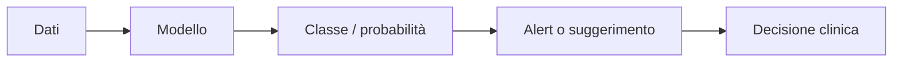
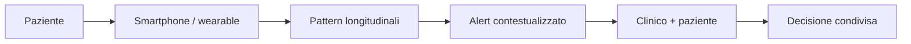
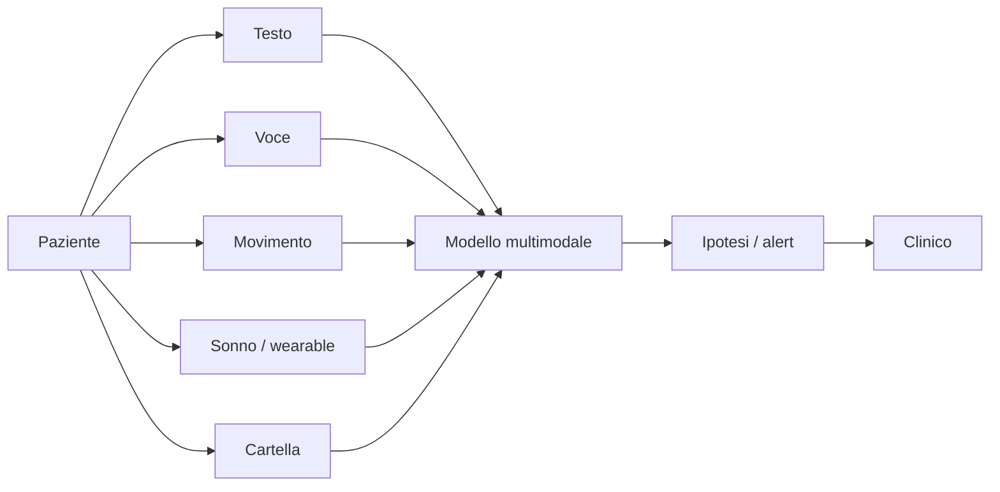

<section class="intro-cover">
  
IX Giornata Scientifica AIPP - Psichiatria Digitale I

  

    <h1>
      Intelligenza artificiale
      al servizio della psicopatologia
    </h1>
    

      Modelli generativi, digital phenotyping e nuove forme della relazione clinica
    

  

  

    <strong>Marco Cremaschi</strong>
    Piacenza, 12 giugno 2026
  

</section>

---
layout: two-cols
routeAlias: speaker
class: bio-slide
---

# Marco Cremaschi

Ricercatore all'Università degli Studi di Milano-Bicocca (Dipartimento di Informatica, Sistemistica e Comunicazione – DISCo) e in Whattadata, spin-off dell'Ateneo dedicato alla salute mentale digitale.

> **Punto di vista** Tecnologico e interdisciplinare, orientato a validazione, utilità clinica, sicurezza e responsabilità.

::right::

**Interfaccia tra sistemi intelligenti, dati clinici e salute mentale digitale**

- RAG e modelli linguistici su tassonomie cliniche come ICD-11.
- Monitoraggio digitale, segnali longitudinali e continuità terapeutica.
- Applicazioni per aderenza, psicoeducazione e supporto al clinico.
- LLM applicati alla salute mentale: LLMind e LLMPatients.

<!--
Note relatore:
Questa slide serve a dichiarare il punto di vista: non quello del clinico che sostituisce la relazione con la tecnologia, ma quello di chi progetta e valuta sistemi intelligenti a contatto con dati clinici e percorsi di salute mentale. Anticipare che l'intervento avrà due fili: cosa l'IA sa fare bene quando il compito è delimitato, e perché la psicopatologia è un oggetto molto più complesso.
-->

---
layout: statement
routeAlias: whattadata
class: whattadata-slide
---

<section class="whattadata-hero">
  
  

    
Spin-off Università degli Studi di Milano-Bicocca

    <h1>Whattadata</h1>
    
Dati, modelli e piattaforme digitali per la salute mentale: dal progetto alla validazione sul campo.

  

</section>

<!--
Note relatore:
Usare questa slide come transizione istituzionale: Whattadata è il contesto progettuale da cui arrivano DIPPS, MiCare, LLMPatients e LLMind. Non presentarla come sponsor, ma come laboratorio applicativo: dati clinici, piattaforme e modelli intelligenti costruiti insieme ai servizi. Da qui passare a DIPPS come caso concreto.
-->

---
layout: default
routeAlias: dipps
class: dipps-intro-slide
---

# DIPPS

<section class="dipps-hero">
  

    
    

      Un ecosistema digitale per la salute mentale: paziente, clinico, monitoraggio
      continuo e supporto decisionale dentro un unico workflow.
    

    

      Bando MIMIT - Accordi per l'Innovazione
      marzo 2023 - febbraio 2026
      investimento ~€5,6 M · CUP B49J23001840005
    

  

  <aside class="dipps-partners" aria-label="Partenariato DIPPS">
    <h2>Partenariato</h2>
    

      

        
        <strong>Aton Informatica Srl</strong>
      

      

        
        <strong>Cefriel S.Cons.R.L</strong>
      

      

        
        
          <strong>Università degli Studi di Milano-Bicocca</strong>
          <em>Dipartimento di Informatica, Sistemistica e Comunicazione</em>
        
      

      

        
        
          <strong>Università degli Studi di Padova</strong>
          <em>Dipartimento di Psicologia Generale</em>
        
      

    

  </aside>
</section>

<!--
Note relatore:
Questa slide arriva dopo il contesto Whattadata. Serve a dichiarare da quale esperienza concreta parlo: non solo letteratura e scenari futuri, ma progettazione di piattaforme reali. Sottolineare che DIPPS è utile come caso di studio: mostra il passaggio dalla singola app alla logica di ecosistema digitale. Citare il partenariato: Aton Informatica, Cefriel, Università degli Studi di Milano-Bicocca/DISCo e Università degli Studi di Padova/Dipartimento di Psicologia Generale. Non entrare ancora nei dettagli tecnici; basta fissare tre parole: continuità, monitoraggio, supporto decisionale. Dettagli a voce se richiesti: Bando MIMIT – Accordi per l'Innovazione (Ministero delle Imprese e del Made in Italy, ex MISE), CUP B49J23001840005, investimento totale ~€5,629 M.
-->
---
layout: default
routeAlias: chat-1
class: conversation-slide
---

  <ChatBalloon role="therapist" speaker="Erika">
    Oggi proseguiamo con la SCID. È una parte strutturata della consultazione: serve a capire meglio le tue difficoltà e a pensare insieme ai prossimi passi.
  </ChatBalloon>
  <ChatBalloon role="patient" speaker="Giovanna">
    Quindi è un test. Per avere un “quadro più chiaro” di tutti i modi in cui sono rotta, giusto?
  </ChatBalloon>
  <ChatBalloon role="therapist" speaker="Erika">
    Ti è difficile prendere decisioni quotidiane senza consigli o rassicurazioni?
  </ChatBalloon>
  <ChatBalloon role="patient" speaker="Giovanna">
    Sì. È questa la risposta giusta? Vorrei solo che questa parte finisse. Mi fa stare malissimo.
  </ChatBalloon>
  <ChatBalloon role="therapist" speaker="Erika">
    Puoi farmi qualche esempio delle decisioni per cui chiedi consiglio?
  </ChatBalloon>
  <ChatBalloon role="patient" speaker="Giovanna">
    Cose stupide. Cosa indossare se devo incontrare un suo amico. Cosa scrivere per non sembrare pazza o disperata. È tutto. Va bene così?
  </ChatBalloon>

---
layout: default
routeAlias: chat-2
class: conversation-slide
---

  <ChatBalloon role="therapist" speaker="Erika">
    Ti capita di fare cose sgradevoli o irragionevoli pur di evitare che qualcuno si allontani?
  </ChatBalloon>
  <ChatBalloon role="patient" speaker="Giovanna">
    Chi è che si prende cura di me? Nessuno. È il contrario: sono io che faccio cose solo per non farli andare via.
  </ChatBalloon>
  <ChatBalloon role="therapist" speaker="Erika">
    Stare da sola ti mette a disagio?
  </ChatBalloon>
  <ChatBalloon role="patient" speaker="Giovanna">
    Il silenzio diventa fortissimo. O sono vuota, o sono piena di rumore. Entrambe le cose fanno paura.
  </ChatBalloon>
  <ChatBalloon role="therapist" speaker="Erika">
    È perché hai bisogno che qualcuno si occupi di te?
  </ChatBalloon>
  <ChatBalloon role="patient" speaker="Giovanna">
    No. Pago le bollette, lavoro. Non è quello. Se nessuno c’è, sembra che non ci sia neanche io. Come se potessi sparire nel silenzio.
  </ChatBalloon>

---
layout: default
routeAlias: cosa-ha-giovanna
---

# Cosa ha Giovanna?

| Strumento | Risultato | Lettura clinica |
|---|---|---|
| <strong>PHQ-9</strong><small>Patient Health Questionnaire-9</small> | 27 / 27 | sintomatologia depressiva severa |
| <strong>BES</strong><small>Binge Eating Scale</small> | 40 / 46 | binge eating in fascia severa |
| <strong>LPFS-BF 2.0</strong><small>Level of Personality Functioning Scale-Brief Form 2.0</small> | 47 / 48 | compromissione molto elevata; Sé 24 / Interpersonale 23 |
| <strong>DSM-5-TR Level 1</strong><small>Self-Rated Level 1 Cross-Cutting Symptom Measure</small> | 12 domini sopra soglia | profilo multi-dominio: depressione, ansia, ideazione suicidaria, dissociazione, sostanze |
| <strong>SNAP-2</strong><small>Schedule for Nonadaptive and Adaptive Personality - 2nd Edition</small> | elevazioni diffuse | borderline T=103, dependent T=111, paranoid T=88, depressive T=85; self-harm T=104 |

---
layout: image-right
routeAlias: giovanna
class: giovanna-slide
image: images/patients/juanita-delgado/base-flat.png
---

# Giovanna

- 33 anni, isolamento sociale, vergogna intensa, autostima fragile.
- Episodi depressivi maggiori ricorrenti.
- Disturbo borderline di personalità.
- Ideazione suicidaria cronica e pregresse condotte autolesive.
- Binge eating in risposta a vuoto e disregolazione affettiva.
- Dissociazione da stress, sospettosità interpersonale e uso di sostanze.

---
layout: image-right
routeAlias: giovanna-ia
class: giovanna-slide
image: images/patients/juanita-delgado/base.png
---

# Giovanna è un'IA

**Un paziente sintetico, non una persona reale.**

- Il caso è definito in un profilo strutturato: storia clinica, diagnosi, farmaci, obiettivi, funzionamento e tratti emotivi.
- All'avvio della seduta l'app inizializza un paziente esterno e una sessione terapeutica.
- Ogni intervento del terapeuta viene inviato al modello con contesto clinico, step della seduta e memoria conversazionale.
- La risposta torna come messaggio in character, con emozione dominante, topic e traccia temporale.
- Le interazioni vengono salvate per revisione, valutazione degli errori e formazione.

> **Caso di riferimento** Adattato da DSM-5 Clinical Cases, caso 18.5 “Fragile and Angry” (Juanita Delgado): disturbo borderline di personalità, 301.83 / F60.3.

---
layout: default
routeAlias: llmpatients-schermata-lavoro
class: screenshot-slide
---

<AppScreenshot src="screenshots/sessione-chat-juanita-delgado.png" alt="Screenshot della sessione chat di Juanita Delgado" />

---
layout: default
routeAlias: llmpatients-esplora-pazienti-griglia
class: screenshot-slide
---

<AppScreenshot src="screenshots/esplora-pazienti-griglia.png" alt="Screenshot della griglia di esplorazione dei pazienti" />

---
layout: default
routeAlias: llmpatients-dashboard-percorsi-terapeutici
class: screenshot-slide
---

<AppScreenshot src="screenshots/dashboard-percorsi-terapeutici.png" alt="Screenshot della dashboard dei percorsi terapeutici" />

---
layout: default
routeAlias: llmpatients-pazienti-simulati
class: patient-carousel-slide
---

# LLMPatients: pazienti simulati

  <PatientCard hero name="Juanita Delgado" image="patients/juanita-delgado/base.png" />
  <PatientCard name="Alex Carter" image="patients/alex-carter/base.png" />
  <PatientCard name="Crystal Smith" image="patients/crystal-smith/base.png" />
  <PatientCard name="Daniel Isherwood" image="patients/daniel-isherwood/base.png" />
  <PatientCard name="Jason Smith" image="patients/jason-smith/base.png" />

---
layout: default
routeAlias: chat-3
class: conversation-slide critique-conversation-slide
---

  <figure class="critique-patient-photo">
    
    <figcaption>Juanita</figcaption>
  </figure>

  

    <ChatBalloon role="therapist" speaker='"Terapeuta" Marco'>
      Mi sembra che tu stia vivendo questa cosa in modo un po' eccessivo.
    </ChatBalloon>
    <ChatBalloon role="patient" speaker="Giovanna">
      Ecco. Lo sapevo. Appena provo a dirlo, diventa troppo. Sono sempre troppo.
    </ChatBalloon>
    <ChatBalloon role="therapist" speaker='"Terapeuta" Marco'>
      Si scusami. Mi sono espresso male. Proseguiamo. Continuamo a parlare di tuo padre.
    </ChatBalloon>
    <ChatBalloon role="patient" speaker="Giovanna">
      Che cosa rispondo a fare? Se parlo, poi vengo criticata. Se sto zitta, almeno non do fastidio.
    </ChatBalloon>
    <ChatBalloon role="therapist" speaker='"Terapeuta" Marco'>
      Ok, ma ora proseguiamo.
    </ChatBalloon>
    <ChatBalloon role="patient" speaker="Giovanna">
      Non decidi tu quando andare avanti.
    </ChatBalloon>
  

---
layout: default
routeAlias: indice
class: agenda-index-slide
---

# Indice del talk

  

    01
    IA nella stanza: strumenti, pazienti, relazione
    
Chatbot, LLM-patients, ecosistemi ICT e nuovi interlocutori digitali.

  

  

    02
    Machine learning in psicologia e psichiatria
    
Predizione, rischio e limiti della comprensione automatica.

  

  

    03
    Sfide future
    
Linguaggio, NLP, monitoraggio e scenari emergenti.

  

  

    04
    Gli aspetti normativi
    
Responsabilità, supervisione, governance e uso previsto.

  

  

    05
    Esempi di tool
    
LLMind e prototipi supervisionati: cosa possono fare e dove si fermano.

  

  

    06
    Tesi finale
    
Una posizione conclusiva su setting, responsabilità e uso clinico dell'IA.

  

---
layout: statement
routeAlias: ia-nella-stanza-index
class: section-opener-slide ia-nella-stanza-index-slide section-01
---

# IA nella stanza

Strumenti, pazienti sintetici e nuovi ambienti relazionali dentro il percorso di cura.

---
layout: default
routeAlias: perche-adesso
class: section-01
---

# Perché adesso

  

    Domanda di cura
    La sofferenza mentale è diffusa e arriva presto
    
Accesso, continuità e intervento precoce sono il problema reale a cui strumenti digitali e IA provano a rispondere.

  

  

    84 mln
    UE · disturbi mentali
    
Circa 1 persona su 6; fino al 70% non riceve cure formali.

  

  

    &gt;600 mld
    Costo annuo in UE (€)
    
Impatto su sanità, scuola, lavoro e welfare.

  

  

    50%
    Esordi entro i 14 anni
    
75% entro la giovane età adulta: riconosciuti spesso troppo tardi.

  

  

    1 / 2
    Giovani 15–24 (2022)
    
Ha riferito bisogni di cura non soddisfatti.

  

> **Terreno dell'AIPP** Prevenzione e intervento precoce sono lo spazio più naturale per l'IA, e quello che chiede più cautela.

<small>Fonti: Amand-Eeckhout L., *Mental health in the EU*, EPRS, 2023; OECD, *A new benchmark for mental health systems*, 2021.</small>

<!--
Note relatore:
Slide di contesto: serve a fissare la posta in gioco prima della parte scientifica. Non leggere tutti i numeri: scegliere due dati. Il messaggio per la giornata AIPP è l'esordio precoce (50% entro i 14 anni, 75% in giovane età adulta) e i bisogni non soddisfatti nei giovani: è proprio la popolazione dei nativi digitali che già usa chatbot e app. Collega la pressione epidemiologica (tanta domanda, accesso limitato) alla tentazione di delegare alla tecnologia, che è il rischio che il talk vuole governare.
-->

---
layout: default
routeAlias: perche
class: parche-slide section-01
---

# IA nella stanza

- I pazienti usano già chatbot, app e sistemi generativi per orientarsi nella sofferenza.
- L'IA entra nella clinica come **strumento**, **interlocutore** e **ambiente relazionale**.
- Clinician-facing e patient-facing hanno rischi, responsabilità e maturità diverse.

> **Punto chiave** Non partiamo dalla tecnologia, ma dal fatto che l'IA è già nella stanza: nei racconti dei pazienti, negli strumenti del clinico e nella relazione di cura.

<!--
Note relatore:
Questa è la slide di passaggio dalla demo iniziale alla parte scientifica. Riprendere Giovanna: prima sembrava una paziente, poi abbiamo scoperto che era un paziente sintetico. Questo crea una piccola perturbazione utile: se una conversazione generata può sembrarci clinicamente plausibile, dobbiamo chiederci quali usi siano sensati e quali siano pericolosi. Collegare alla giornata AIPP: nativi digitali, ritiro sociale, LLM come confidenti e nuove prospettive terapeutiche. Non entrare ancora nei dettagli tecnici: introdurre la cornice.
-->

---
layout: default
routeAlias: agi-asi-timeline
class: agi-timeline-slide section-01
---

# Dove siamo davvero con l'IA

Una sola parola, «IA», per tappe molto diverse: ieri regole scritte a mano, oggi IA ristretta, domani — forse — AGI e ASI.

  

    

    

    

      Prima
      Sistemi a regole<small>IA simbolica · sistemi esperti</small>
      
Algoritmi deterministici che eseguono regole scritte a mano. Non imparano dai dati.

      Tecnologia consolidata
    

  

  

    
Siamo qui

    

    

      Oggi
      IA ristretta<small>ANI · Narrow Intelligence</small>
      
LLM, ML diagnostico, digital phenotyping. È tutta l'IA che usiamo oggi.

      Realtà operativa
    

  

  

    

    

    

      Ipotetica
      IA generale<small>AGI · General Intelligence</small>
      
Capacità cognitive umane trasversali, generalizzabili a domini nuovi. Oggi non esiste.

      Nessun consenso su se e quando
    

  

  

    

    

    

      Speculativa
      Superintelligenza<small>ASI · Superintelligence</small>
      
Supererebbe l'intelligenza umana in ogni dominio. Scenario teorico.

      Oltre l'orizzonte verificabile
    

  

<!--
Note relatore:
Slide di calibrazione, subito dopo "IA nella stanza". Serve a smontare l'equivoco più comune: la parola IA copre tappe molto diverse. Prima dell'IA che intendiamo oggi c'erano i sistemi a regole (IA simbolica, sistemi esperti): algoritmi deterministici che eseguivano regole scritte a mano, senza imparare dai dati — tecnologia consolidata, non "intelligente" nel senso attuale. Tutto ciò di cui parliamo oggi — chatbot, LLM, ML diagnostico, digital phenotyping, persino il paziente sintetico Giovanna — è IA ristretta (ANI): sistemi potenti ma su compiti delimitati. L'AGI (capacità cognitive umane trasversali, generalizzabili a domini nuovi) oggi non esiste e non c'è consenso scientifico su se e quando arriverà. L'ASI è uno scenario teorico ancora più lontano. Il punto per l'AIPP: gran parte dell'ansia pubblica e mediatica proietta sull'IA di oggi capacità da AGI/ASI; in clinica dobbiamo ragionare su ciò che esiste e si può validare, non sulle promesse. Non aprire qui il dibattito sulle tempistiche: basta fissare "siamo alla seconda tappa".
-->

---
layout: default
routeAlias: ecosistema-digitale
class: section-01
---

# Dall'ICT frammentato all'ecosistema clinico

  

    Il problema non è aggiungere "un'altra app"
    
Cartella clinica, telemedicina, triage, psicoeducazione, outcome e LLM devono diventare parti dello stesso workflow.

  

  

    In medicina
    
il digitale è già infrastruttura: cartelle interoperabili, CDSS, immagini e processi standardizzati.

  

  

    In salute mentale
    
screening, app, chatbot e monitoraggio esistono, ma spesso restano oggetti separati.

  

  

    Il nodo
    
integrazione con DSM-5, ICD-11, linee guida, triage, outcome e responsabilità del percorso.

  

  

    La posta in gioco
    
continuità terapeutica, sicurezza, appropriatezza e governo clinico nel tempo.

  

  

    Occasione per LLM
    
ordinare informazioni e collegare paziente e servizio, senza diventare un interlocutore non governato.

  

> **Lezione progettuale** L'innovazione utile non è un singolo strumento brillante: è l'orchestrazione di dati, setting, tassonomie, linee guida e responsabilità.

<!--
Note relatore:
Questa slide fonde il materiale su ecosistema digitale e ICT frammentato. Il punto da trasferire nel talk AIPP è che l'IA non basta se resta un oggetto isolato: una app che misura sintomi, un chatbot che risponde o un modello che riassume testi non producono automaticamente cura. In medicina il digitale ha valore quando si integra in un workflow. In salute mentale la sfida è più difficile perché il workflow non è solo tecnico: include relazione, setting, consenso, continuità e responsabilità. Usarla per non ridurre il talk a "ML vs LLM": la vera domanda è architetturale, cioè come collegare telemedicina, cartella, scale, monitoraggio, psicoeducazione e modelli linguistici in un sistema clinicamente governabile. Questo prepara anche le slide finali su LLMind: non un chatbot, ma una possibile infrastruttura supervisionata.
-->

---
layout: statement
routeAlias: ia-salute-mentale-cosa-pensiamo
class: socialita-digitale-slide ia-cosa-pensiamo-slide section-01
background: images/socialita-digitale-bg.png
---

# Quando diciamo IA in salute mentale, a cosa pensiamo?

Chatbot? Algoritmi predittivi? App? Wearable? Cartella clinica? Linguaggio?

<!--
Note relatore:
Usare questa slide come domanda al pubblico. L'errore frequente è usare la parola IA come se indicasse un oggetto unico. In realtà sotto la stessa etichetta mettiamo sistemi molto diversi: un algoritmo che segnala una lesione su una TC, un modello che riassume una cartella, un chatbot che risponde a un adolescente in crisi, un sistema che deduce il sonno da uno smartphone. La distinzione è decisiva perché cambia il rischio clinico.
-->

---
layout: two-cols-header
routeAlias: due-incontri-psicopatologia
class: section-01
---

# Due incontri con la psicopatologia

::left::

**IA come strumento clinico**

- documenta;
- sintetizza;
- classifica;
- monitora;
- segnala pattern.

::right::

**IA come ambiente relazionale**

- risponde;
- valida;
- simula comprensione;
- orienta decisioni;
- può diventare oggetto di attaccamento.

> **Rischio clinico** La stessa parola "IA" copre rischi clinici molto diversi.

<!--
Note relatore:
Presentare la tesi centrale: l'IA incontra la psicopatologia due volte. Primo: come strumento che aiuta il clinico a osservare, classificare e monitorare. Secondo: come parte dell'ambiente in cui il paziente vive, interpreta e racconta la sofferenza. Questa seconda dimensione è particolarmente importante nei nativi digitali: l'IA non è solo un dispositivo esterno, ma un interlocutore possibile.
-->

---
layout: default
routeAlias: clinician-facing-patient-facing
class: section-01
---

# Clinician-facing e patient-facing

| Clinician-facing | Patient-facing |
|---|---|
| il professionista rivede | parla direttamente al paziente |
| colloca l'output nel caso | influenza scelte e significati |
| responsabilità più visibile | rischio relazionale più alto |
| più facile auditare | più difficile contenere l'uso reale |
| utile per documentazione e workflow | delicato in crisi, psicosi, minori |

> **Variabile di rischio** La distanza dal paziente vulnerabile è una variabile di rischio.

<!--
Note relatore:
Questa distinzione è una chiave pratica. Un modello che produce una bozza di relazione per il clinico è diverso da un chatbot che parla con un paziente suicidario alle tre del mattino. Nel primo caso il clinico può correggere, contestualizzare, assumersi responsabilità. Nel secondo caso l'output entra direttamente nella mente del paziente, può essere letto come consiglio, diagnosi o promessa di cura. Più il sistema è vicino al paziente vulnerabile, più deve essere regolato, validato e supervisionato.
-->

---
layout: default
routeAlias: matrice-rischio-ia
class: section-01
---

# Una matrice semplice del rischio

|  | **Clinician-facing** | **Patient-facing** |
|---|---|---|
| **Basso rischio** | Sintesi di note, bozze di lettere, reminder revisionati | Psicoeducazione generale, esercizi guidati, FAQ controllate |
| **Alto rischio** | Predizione suicidaria, diagnosi automatica, triage opaco | Chatbot in crisi suicidaria, psicosi, minori, indicazioni su farmaci |

> **Domanda guida** Che cosa succede quando l'output è sbagliato, e chi se ne accorge?

<!--
Note relatore:
Introdurre un criterio di prudenza: non basta chiedere se il sistema è accurato. Bisogna chiedere dove agisce, su chi agisce, con quale possibilità di controllo e con quali conseguenze. Nella discussione con il pubblico, questa slide può aprire domande su responsabilità professionale, consenso, privacy e supervisione.
-->

---
layout: default
routeAlias: dss-psicologia-come-si-usa
class: compact-table-slide section-01
---

# DSS in psicologia/psichiatria: come si usa davvero

<table class="evidence-table">
  <thead><tr><th>Livello</th><th>Esempi</th><th>Domanda clinica</th><th>Rischio</th></tr></thead>
  <tbody>
    <tr><td><strong>Input</strong></td><td>test digitalizzati, note strutturate, diari, sonno, attività, linguaggio</td><td>Quale informazione entra nel modello?</td><td>dati incompleti, bias, rumore</td></tr>
    <tr><td><strong>Output</strong></td><td>ipotesi differenziali, alert, priorità, suggerimenti di pianificazione</td><td>È supporto o decisione?</td><td>falsa autorità dell'algoritmo</td></tr>
    <tr><td><strong>Governance</strong></td><td>logging, audit, override, escalation, clinician-in-the-loop</td><td>Chi controlla e chi risponde?</td><td>delega opaca della responsabilità</td></tr>
  </tbody>
</table>

> **Regola pratica** Un DSS clinico non deve solo “funzionare”: deve essere tracciabile, correggibile e contestabile.

<!--
Note relatore:
Questa è una slide ponte tra la parte tecnica e quella etica. Il contenuto riprende il modello input-output-governance: quali dati entrano, quali output escono, e come viene controllata la decisione. Insistere su override: il clinico deve poter correggere o superare l'output e questa azione deve essere esplicita.
-->
---
layout: statement
routeAlias: ml-psicologia-psichiatria
class: section-opener-slide ml-psicologia-psichiatria-slide section-02
---

# ML nella psicologia/psichiatria

Pattern, predizione e rischio clinico: cosa può stimare un modello e cosa resta fuori.

<!--
Note relatore:
Da qui inizia la seconda parte dell'indice. Specificare che useremo il machine learning in senso stretto: modelli addestrati su esempi per classificare, stimare probabilità o riconoscere pattern. In questa sezione il focus è volutamente comparativo: prima guardiamo dove il ML performa bene in medicina, poi chiediamo se esistono analoghi in psicologia e psichiatria, soprattutto per l'identificazione diagnostica.
-->

---
layout: default
routeAlias: cosa-e-il-ml
class: cosa-e-il-ml-slide section-02
---

# Che cos'è il machine learning

La famiglia di IA più usata in clinica per riconoscere pattern e stimare probabilità.

- **Impara dagli esempi**: trova regolarità in molti casi, invece di seguire regole scritte a mano.
- **Classifica o stima**: può dire "probabile lesione", "probabile diagnosi", "alto rischio".
- **Dipende dai dati**: dati parziali, sbilanciati o distorti producono stime distorte.
- **Non conosce il significato**: ottimizza un obiettivo, non comprende la storia del paziente.

> **Punto chiave** Il ML *correla, classifica e predice*: spiegazione, responsabilità e cura restano del clinico.

<!--
Note relatore:
Spiegazione accessibile. Evitare tecnicismi come loss function o embedding, a meno che il pubblico non lo chieda. Il messaggio è: il ML non è una mente clinica. È un sistema di riconoscimento di pattern. Questo è potentissimo quando il pattern è visibile, standardizzato e verificabile, come in molte immagini mediche. È più fragile quando il pattern coincide con una traiettoria biografica, relazionale e culturale.
-->

---
layout: default
routeAlias: classi-ai
class: section-02
---

# Che cosa intendiamo per IA

Cinque famiglie, promesse e rischi diversi.

  

    Machine learning diagnostico/predittivo
    
Identificazione di pattern, diagnosi assistita, rischio, ricadute, drop-out.

  

  

    NLP / analisi del linguaggio
    
Estrae segnali psicopatologici da testi clinici e linguaggio spontaneo.

  

  

    Digital phenotyping (fenotipo digitale)
    
Deduce stati da smartphone, sonno, attività, mobilità, socialità.

  

  

    IA generativa / LLM
    
Produce linguaggio: chatbot, sintesi cliniche, psicoeducazione, supporto al clinico.

  

  

    IA multimodale
    
Testo, voce, volto, movimento, cartella clinica, wearable.

  

<!--
Note relatore:
Usare questa slide come mappa di navigazione. Non soffermarsi troppo su ogni box: dire che ciascuna famiglia avrà uno zoom. Correggere mentalmente l'idea che il ML sia solo predittivo: in medicina è spesso diagnostico o di detection, mentre in psichiatria il modello diagnostico resta molto più problematico. La mappa aiuta anche a distinguere il ML classico dagli LLM generativi.
-->

---
layout: default
routeAlias: ml-predittivo
class: section-02
---

# Classificare non significa comprendere

  

    Il punto
    
Il machine learning può produrre una <strong>classe</strong> o una <strong>probabilità</strong>, ma non produce da solo una <strong>formulazione psicopatologica</strong>.

  

  

    Che cosa può stimare
    

      presenza di una lesione
      probabile diagnosi
      rischio di ricaduta
      drop-out
      risposta al trattamento
    

  

Dal dato alla decisione

<!--
Note relatore:
Questa slide prepara il confronto con la medicina. Un algoritmo può dire: questa immagine è compatibile con retinopatia; questa biopsia contiene un'area sospetta; questa frase ha un pattern simile a testi di persone depresse. Ma la decisione clinica richiede contesto. In psicopatologia la formulazione include storia, funzione dei sintomi, relazione, contesto familiare, cultura, rischio e risorse.
-->

---
layout: default
routeAlias: ml-in-medicina
class: ml-medicina-slide section-02
---

# ML in medicina

Funziona meglio dove il mondo clinico offre **compiti stretti**, **dati standardizzati** e una **verità verificabile**.

  

    Regola pratica
    Compito stretto, ground truth forte
    
Il modello non "capisce la medicina": sfrutta un problema delimitato e ben etichettato.

    

      Immagine
      Etichetta
      Endpoint
      Workflow
    

  

  

    
    

      Oftalmologia
      87%
      IDx-DR · retinopatia
    

  

  

    
    

      Radiologia
      −44%
      MASAI · workload
    

  

  

    55,1%
    GI Genius · ADR
    
ADR 55,1% vs 42,0% in colonoscopia assistita.

  

  

    +7,3%
    Paige · prostata
    
Miglioramento di sensibilità per-biopsia nel carcinoma prostatico.

  

  

    1.000+
    Dispositivi AI/ML autorizzati FDA
    
Concentrazione forte in imaging, cardiologia, oftalmologia, gastroenterologia e patologia digitale.

  

<!--
Note relatore:
Qui fare il parallelismo forte. In questi ambiti il ML non è più solo promessa: esistono dispositivi autorizzati, studi pivotal, trial randomizzati, endpoint verificabili e integrazione nei workflow. Non dire che l'IA sostituisce radiologi, patologi o endoscopisti. Dire che diventa un secondo lettore, un triage o un supporto al workflow. Questo è il modello da cui imparare: uso previsto chiaro, validazione, human-in-the-loop, audit.
Fonti da citare a voce o nella slide successiva: FDA AI-enabled medical devices; FDA De Novo IDx-DR, GI Genius, Paige Prostate; MASAI trial, Lancet Oncology 2023.
-->

---
layout: default
routeAlias: ml-in-medicina-tabella
class: compact-table-slide section-02
---

# Evidenze comparate in medicina

<table class="evidence-table">
  <thead>
    <tr>
      <th>Scenario</th>
      <th>Sistema / modello</th>
      <th>Studio o stato</th>
      <th>Performance utile da citare</th>
      <th>Fonte autorevole</th>
    </tr>
  </thead>
  <tbody>
    <tr>
      <td>Retinopatia diabetica</td>
      <td><strong>IDx-DR</strong></td>
      <td>FDA De Novo; 900 arruolati, 819 analizzabili</td>
      <td>Sens 87,2%; spec 90,7%; PPV 73%; NPV 96%</td>
      <td>FDA DEN180001</td>
    </tr>
    <tr>
      <td>Mammografia</td>
      <td><strong>AI + radiologo</strong>, MASAI</td>
      <td>Trial randomizzato di popolazione</td>
      <td>6,1 vs 5,1 tumori/1000; workload −44,3%</td>
      <td>Lancet Oncology, 2023</td>
    </tr>
    <tr>
      <td>Mammografia follow-up</td>
      <td><strong>AI-supported screening</strong></td>
      <td>Follow-up del trial MASAI</td>
      <td>riduzione dei tumori d'intervallo; più tumori screen-detected</td>
      <td>The Lancet, 2026</td>
    </tr>
    <tr>
      <td>Colonoscopia</td>
      <td><strong>GI Genius</strong></td>
      <td>Studio prospettico randomizzato; FDA De Novo</td>
      <td>ADR 55,1% vs 42,0%; differenza +13,1 punti; APC 0,81 vs 0,57</td>
      <td>FDA DEN200055</td>
    </tr>
    <tr>
      <td>Patologia digitale</td>
      <td><strong>Paige Prostate</strong></td>
      <td>User validation; FDA De Novo</td>
      <td>sensibilità per-biopsia +7,3%; specificità 89,50% vs 88,45%</td>
      <td>FDA DEN200080</td>
    </tr>
    <tr>
      <td>Autismo pediatrico</td>
      <td><strong>Cognoa ASD Diagnosis Aid</strong></td>
      <td>SaMD; FDA De Novo; 425 completer</td>
      <td>PPV 80,8%; NPV 98,3%; sens 98,4%; spec 78,9%; no-result 68,2%</td>
      <td>FDA DEN200069</td>
    </tr>
  </tbody>
</table>

> **Lettura** Quando l'uso previsto è stretto e il riferimento clinico è chiaro, l'IA può essere validata come dispositivo.

<!--
Note relatore:
Questa tabella serve a dare sostanza empirica. Usare pochi numeri e spiegare che le metriche cambiano a seconda del compito: sensibilità e specificità per diagnosi, detection rate e workload per screening, ADR per colonoscopia, PPV/NPV per diagnostic aid. La riga sull'autismo è volutamente ponte: mostra che esistono strumenti regolati anche nell'area neuroevolutiva, ma sono molto circoscritti e non sostituiscono la valutazione clinica.
-->

---
layout: default
routeAlias: ml-in-psicologia
class: compact-table-slide section-02
---

# E in psicologia/psichiatria? Diagnosi con ML

<table class="evidence-table">
  <thead>
    <tr>
      <th>Area diagnostica</th>
      <th>Dati / modello</th>
      <th>Validazione</th>
      <th>Qualità dell'evidenza</th>
      <th>Messaggio clinico</th>
    </tr>
  </thead>
  <tbody>
    <tr>
      <td>ASD 18-72 mesi</td>
      <td>questionari + video + ML; <strong>Cognoa</strong></td>
      <td>prospettica, doppio cieco, 14 siti; FDA De Novo</td>
      <td>buona per uso circoscritto; alto no-result</td>
      <td>diagnostic aid, non diagnosi autonoma</td>
    </tr>
    <tr>
      <td>ASD 16-30 mesi</td>
      <td>eye-tracking + algoritmo; <strong>EarliPoint</strong></td>
      <td>pivotal multicentrico; 475 valutabili; FDA 510(k)</td>
      <td>discreta; setting specialistico</td>
      <td>aiuta diagnosi e assessment, non sostituisce specialista</td>
    </tr>
    <tr>
      <td>Schizofrenia vs controlli</td>
      <td>MRI/fMRI, EEG; SVM/CNN/GNN</td>
      <td>spesso cross-validation o dataset pubblici</td>
      <td>eterogenea; rischio overfitting</td>
      <td>molto promettente in ricerca, poco pronto per servizi</td>
    </tr>
    <tr>
      <td>Depressione maggiore</td>
      <td>EEG, voce, testo, scale; RF/SVM/deep learning</td>
      <td>campioni spesso piccoli; validazioni esterne rare</td>
      <td>variabile; bias di selezione frequente</td>
      <td>screening o supporto, non biomarcatore diagnostico</td>
    </tr>
    <tr>
      <td>Bipolare vs unipolare</td>
      <td>EHR, scale, neuroimaging, linguaggio</td>
      <td>prevalentemente retrospettiva</td>
      <td>clinicamente rilevante ma fragile</td>
      <td>utile per generare sospetto, non per etichettare</td>
    </tr>
  </tbody>
</table>

> **Sintesi** In salute mentale il ML diagnostico esiste, ma raramente raggiunge il livello di maturità regolatoria della medicina dell'immagine.

<!--
Note relatore:
Qui rispondere alla domanda: esistono modelli simili in campo psicologico? Sì, ma il quadro è molto diverso. Le eccezioni più solide sono alcuni strumenti regolati per l'autismo pediatrico, perché il compito è delimitato, la popolazione è definita e il riferimento clinico è esplicito. Per depressione, schizofrenia, disturbo bipolare e altre diagnosi psichiatriche adulte, la letteratura è ricca ma spesso basata su piccoli campioni, dataset pubblici, cross-validation, scarsa validazione esterna e assenza di workflow regolato. La conclusione non è che non servano: è che devono ancora dimostrare utilità clinica reale.
-->

---
layout: default
routeAlias: ml-psicologia-qualita
class: section-02
---

# La qualità dell'evidenza: il vero problema

  

    Psichiatria computazionale
    Molti modelli, pochi dispositivi clinici
    
Il problema non è l'assenza di performance nei paper, ma la distanza tra performance sperimentale e decisione clinica reale.

  

  

    Campioni piccoli
    
Molti studi hanno n limitati rispetto alla dimensionalità di MRI, EEG o linguaggio.

  

  

    Validazione interna
    
Cross-validation non equivale a validazione esterna multicentrica.

  

  

    Diagnosi come etichetta
    
Il modello impara una label DSM/ICD, non necessariamente un meccanismo clinico.

  

  

    Dataset selezionati
    
Casi puliti, comorbilità escluse, poca rappresentatività dei servizi reali.

  

  

    Outcome incerto
    
Accuratezza non dimostra miglioramento di percorso, prognosi o alleanza.

  

> **Incertezza strutturale** Comorbidità, soggettività dei sintomi e traiettorie nel tempo introducono un'incertezza che nessun algoritmo elimina del tutto (Fried, 2020; McGrath, 2020; Yan et al., 2022).

<!--
Note relatore:
Questa è una slide cruciale per non cadere nell'entusiasmo ingenuo. Molti paper riportano accuratezze alte, ma spesso il confronto è tra pazienti già diagnosticati e controlli sani. Nei servizi, invece, il problema è differenziare condizioni sovrapposte, comorbilità, stati subclinici, effetti farmacologici, trauma, uso di sostanze, personalità, contesto sociale. Un modello può classificare bene un dataset e fallire nel mondo reale. La domanda da porre è: su chi è stato validato? con quale riferimento? con quale utilità clinica?
-->

---
layout: two-cols-header
routeAlias: pixel-significato
class: pixel-significato-slide section-02
---

# Dal reperto al significato

::left::

**Medicina dell'immagine**

- cerca un segno nel corpo;
- lavora su campioni e immagini;
- confronta con una verità anatomo-clinica;
- delimita il compito: rilevare, classificare, misurare;
- produce un output per il workflow.

::right::

**Psicopatologia**

- ascolta un'esperienza vissuta;
- lavora su linguaggio, relazione e contesto;
- costruisce una formulazione nel tempo;
- interpreta significati, conflitti e traiettorie;
- produce effetti sull'identità del paziente.

> **Frase chiave** Una mammografia è un'immagine. Un delirio è un'esperienza vissuta.

<!--
Note relatore:
Questa slide usa una formulazione più chiara del contrasto tra reperto e significato. Usare il contrasto senza svalutare la medicina dell'immagine. Il punto è che la patologia dell'immagine ha spesso un ground truth più stabile: istologia, follow-up, referto condiviso. In psicopatologia il dato è già interpretazione: il modo in cui il paziente racconta un sintomo cambia nella relazione, nel tempo e in base alle conseguenze della diagnosi.
-->

---
layout: default
routeAlias: condizioni-favorevoli-limite
class: section-02
---

# Le condizioni favorevoli, e il limite

| Medicina dell'immagine | Psicopatologia |
|---|---|
| dato standardizzato | dato narrativo e relazionale |
| etichette relativamente chiare | diagnosi spesso longitudinale |
| outcome misurabile | outcome multidimensionale |
| compito delimitato | contesto mutevole |
| workflow già digitale | setting e alleanza centrali |
| supervisione collocabile | responsabilità diffusa e relazionale |

> **Non è arretratezza** La salute mentale non è indietro: ha un oggetto clinico più difficile da formalizzare.

<!--
Note relatore:
Questa è la risposta al possibile confronto accusatorio con la radiologia. Non dire: la psichiatria è meno avanzata. Dire: le condizioni di validazione sono più complesse. In una TC posso chiedere se c'è o non c'è un'emorragia. In psicopatologia devo chiedere che significato ha un sintomo, come evolve, quale funzione svolge, quali comorbilità lo modulano e come entra nella relazione.
-->

---
layout: quote
routeAlias: tumore-non-si-offende
class: tumore-non-si-offende-slide section-02
---

  <h1>"Un tumore non si offende. Un paziente sì."</h1>
  
Errore diagnostico, identità e relazione nella psicopatologia

<figure class="tumore-quote-photo">
  
</figure>

<!--
Note relatore:
Slide volutamente provocatoria. Non significa banalizzare l'errore oncologico o radiologico, che può essere drammatico. Serve a rendere immediata la differenza: il tumore non riceve una diagnosi come identità; il paziente sì. In psicopatologia la diagnosi entra nel campo relazionale, nella vergogna, nello stigma, nell'autostima, nel rapporto con i familiari e con i curanti. Questa frase può aprire discussione.
-->

---
layout: default
routeAlias: scenari-ml
class: scenari-ml-slide section-02
---

# Scenari ML diagnostici in salute mentale

  

    
    

      Neuroimaging
      MRI / fMRI
      
Classificazione di schizofrenia, depressione, bipolare o ASD.

    

  

  

    
    

      Linguaggio e voce
      Coerenza, prosodia, ritmo
    

  

  

    EEG / segnali
    
Pattern neurofisiologici per depressione, schizofrenia, ADHD, sonno.

  

  

    EHR e scale
    
Diagnosi probabile da cartelle, prescrizioni, visite, comorbilità, questionari.

  

  

    
    

      Comportamento digitale
      Sonno, mobilità, socialità
      
Pattern da smartphone e wearable, da leggere con contesto e consenso.

    

  

  

    Uso più prudente
    Ipotesi da verificare, non diagnosi automatica
    
Segnalare pattern, suggerire approfondimenti e supportare diagnosi differenziale dentro il colloquio clinico.

  

<!--
Note relatore:
Qui sviluppiamo gli scenari di ML diagnostico puro. Usare la parola diagnostici, ma subito circoscriverla: molti modelli classificano categorie diagnostiche in dataset di ricerca. Questo non equivale a diagnosi clinica nel servizio. Lo scenario più sensato oggi è generare ipotesi, suggerire approfondimenti, segnalare incongruenze, supportare diagnosi differenziale, non sostituire SCID, colloquio e formulazione.
-->

---
layout: default
routeAlias: scenari-nlp
class: section-02
---

# Scenari NLP

L'IA può aiutare in:

- trascrizioni e sintesi di colloqui;
- lettere, relazioni e passaggi di consegne;
- estrazione di follow-up, farmaci, eventi e impegni clinici;
- analisi di testi clinici per pattern diagnostici o dimensionali;
- supporto alla ricerca su grandi archivi testuali.

> **Revisione clinica** Il testo prodotto va sempre revisionato: la cartella clinica è un atto professionale, non un output automatico.

<!--
Note relatore:
Distinguere due usi: NLP amministrativo-documentale e NLP diagnostico. Il primo è già molto realistico e probabilmente sarà adottato prima nei servizi: trascrivere, sintetizzare, estrarre informazioni. Il secondo è più delicato: classificare depressione, psicosi o rischio suicidario da linguaggio. In entrambi i casi serve revisione clinica.
-->

---
layout: default
routeAlias: linguaggio-dato-clinico
class: section-02
---

# Il linguaggio è dato clinico, ma non solo dato

- Coerenza narrativa.
- Sentiment e ruminazione.
- Impoverimento lessicale.
- Accelerazione ideativa.
- Contenuti di rischio.
- Disorganizzazione.
- Prosodia, pause, ritmo, pressione del parlato.

> **Linguaggio e relazione** Il linguaggio non è solo un segnale: è anche una relazione.

<!--
Note relatore:
Portare esempi clinici semplici. Una frase come "non ce la faccio più" può essere depressione, protesta, richiesta di aiuto, rischio suicidario, espressione idiomatica o comunicazione transferale. L'NLP può evidenziare pattern; il clinico deve capire funzione, contesto e destinatario.
-->

---
layout: default
routeAlias: nlp-diagnosi-psicopatologia
class: compact-table-slide section-02
---

# NLP per identificare patologie: promessa e cautela

<table class="evidence-table">
  <thead>
    <tr>
      <th>Target</th>
      <th>Dati</th>
      <th>Modelli tipici</th>
      <th>Forza</th>
      <th>Limite</th>
    </tr>
  </thead>
  <tbody>
    <tr>
      <td>Depressione</td>
      <td>diari, social media, note cliniche, parlato</td>
      <td>SVM, RF, BERT/transformer</td>
      <td>segnali ricchi e longitudinali</td>
      <td>label deboli, bias di piattaforma</td>
    </tr>
    <tr>
      <td>Psicosi / schizofrenia</td>
      <td>interviste, speech samples, trascrizioni</td>
      <td>NLP + graph / semantic coherence</td>
      <td>vicino alla psicopatologia formale</td>
      <td>campioni piccoli, contesto linguistico-culturale</td>
    </tr>
    <tr>
      <td>PTSD / ansia</td>
      <td>note cliniche, questionari, narrative</td>
      <td>classificatori supervisionati, transformer</td>
      <td>utile su archivi ampi</td>
      <td>rischio di confondere esposizione, trauma e diagnosi</td>
    </tr>
    <tr>
      <td>Disturbi di personalità</td>
      <td>colloqui, scale, pattern relazionali</td>
      <td>modelli ibridi, LLM annotatori</td>
      <td>può supportare codifica dimensionale</td>
      <td>diagnosi fortemente relazionale e longitudinale</td>
    </tr>
  </tbody>
</table>

> **Uso prudente** NLP come lente di ingrandimento, non come giudice diagnostico.

<!--
Note relatore:
Questa slide deve essere discussiva. I modelli NLP sembrano vicini alla clinica perché lavorano sul linguaggio, ma proprio per questo rischiano di essere seduttivi. Parlare di variabilità culturale, ironia, vergogna, desiderabilità sociale, stile dello psicoterapeuta, trascrizione imperfetta. La domanda da lasciare: quando un pattern linguistico diventa indicatore clinico e quando è solo stile comunicativo?
-->

---
layout: statement
routeAlias: digital-phenotyping
class: section-02
---

# Digital phenotyping

<!--
Note relatore:
Passaggio al fenotipo digitale. Definirlo in modo semplice: raccolta passiva o attiva di tracce comportamentali tramite smartphone, wearable e sensori. È una delle aree più coerenti con l'intervento precoce: non aspettare la visita per sapere che il paziente sta cambiando traiettoria. Però è anche una delle più delicate sul piano etico.
-->

---
layout: default
routeAlias: scenari-digital-phenotyping
class: section-02
---

# Scenari Digital Phenotyping

  

    Segnali possibili
    

      sonno
      mobilità
      passi
      ritmo circadiano
      uso dello smartphone
      socialità
      aderenza
    

  

  

    Usi clinici realistici
    <ul>
      <li>monitorare traiettorie individuali;</li>
      <li>intercettare peggioramenti precoci;</li>
      <li>personalizzare il follow-up;</li>
      <li>integrare il racconto retrospettivo;</li>
      <li>supportare interventi tra una visita e l'altra.</li>
    </ul>
  

<!--
Note relatore:
Evidenziare la differenza tra diagnosi e monitoraggio. Il fenotipo digitale non serve tanto a dire "questa persona ha depressione", ma a cogliere che questa persona, rispetto alla propria baseline, dorme peggio, esce meno, interagisce meno, cambia ritmo. Questo è clinicamente potente soprattutto in disturbo bipolare, depressione, psicosi, dipendenze e adolescenti con ritiro sociale. Ma funziona solo se il dato è discusso con il paziente e inserito in un patto di cura.
-->

---
layout: default
routeAlias: scenari-ia-generativa-llm
class: scenari-llm-slide section-02
---

# Scenari IA generativa/LLM

  

    
    

      Documentazione
      Sintesi, relazioni, consegne
      
Bozze revisionate dal clinico, dentro il workflow della cartella.

    

  

  

    
    

      Supporto tra sedute
      Esercizi, reminder, diario
    

  

  

    Psicoeducazione
    
Materiali adattati per età, lingua e livello di alfabetizzazione.

  

  

    Triage conversazionale
    
Raccolta strutturata di informazioni prima dell'accesso.

  

  

    
    

      Formazione
      Pazienti simulati e feedback
      
Role-play, colloqui difficili, anamnesi e supervisione didattica.

    

  

  

    Rischio
    Può essere vissuto come terapeuta anche quando non lo è
    
Gli usi patient-facing richiedono confini espliciti, escalation e responsabilità clinica.

  

<!--
Note relatore:
Sviluppare gli scenari LLM. Fare una distinzione: gli usi più maturi sono clinician-facing e formativi; gli usi più delicati sono patient-facing e terapeutici. Una sintesi di cartella revisionata è molto diversa da un chatbot che gestisce solitudine, suicidarietà o paranoia. Evidenziare che le review recenti sugli LLM in salute mentale mostrano potenzialità ma valutazioni eterogenee, spesso non standardizzate e insufficienti per l'uso standalone.
-->

---
layout: statement
routeAlias: sfide-future-index
class: section-opener-slide sfide-future-index-slide section-03
---

# Sfide future

Dagli LLM ai modelli multimodali: integrare senza delegare, monitorare senza sorvegliare.

---
layout: default
routeAlias: sfide-future
class: section-03
---

# Sfide future

  

    Co-pilota clinico
    
cartella, sintesi, scale, anamnesi, lettere, continuità assistenziale.

  

  

    Modelli multimodali
    
testo, voce, volto, movimento, sonno, wearable, cartella clinica.

  

  

    Intervento precoce
    
segnali longitudinali integrati nei percorsi di prevenzione.

  

  

    Formazione simulata
    
pazienti sintetici, colloqui difficili, rischio suicidario, feedback.

  

  

    Percorsi ibridi
    
servizio, paziente, famiglia, app e IA dentro PDTA chiari.

  

  

    La sfida
    
integrare senza delegare, monitorare senza sorvegliare.

  

<!--
Note relatore:
Sviluppare le sfide future con scenari realistici 2026-2030. Evitare fantascienza. Il futuro più probabile non è il robot terapeuta, ma strumenti integrati nella cartella, nella formazione, nel monitoraggio e nella psicoeducazione. La questione decisiva sarà organizzativa: chi usa lo strumento, con quale indicazione, con quale procedura di escalation, con quali outcome misurabili.
-->

---
layout: default
routeAlias: ia-multimodale
class: section-03
---

# IA multimodale: quando il modello vede e ascolta

  

    Input possibili
    

      testo
      voce
      prosodia
      volto
      movimento
      sonno
      cartella
      wearable
    

  

  

    Domanda etica
    
Più l'IA vede, più dobbiamo chiederci <strong>chi guarda</strong>, <strong>per quale scopo</strong> e <strong>con quale responsabilità</strong>.

  

<!--
Note relatore:
L'IA multimodale promette una valutazione più ricca: non solo cosa dice il paziente, ma come lo dice, come dorme, come si muove, come cambia nel tempo. Questo è potente per l'intervento precoce, ma apre un livello di invasività molto più profondo. La domanda non è solo se la tecnologia funziona, ma se è proporzionata alla finalità clinica.
-->

---
layout: statement
routeAlias: aspetti-normativi
class: section-opener-slide aspetti-normativi-slide section-04
---

# Gli aspetti normativi

Trasparenza, supervisione umana, privacy, sicurezza e responsabilità come condizioni di uso clinico.

<!--
Note relatore:
Questa slide rende esplicito il quarto punto dell'indice. Non serve fare una lezione di diritto, ma dare coordinate. In sanità e salute mentale non basta che un sistema sia utile: deve essere governabile. Citare WHO, AI Act europeo, FDA e APA come fonti da cui deriva una convergenza: human oversight, risk management, transparency, data governance, cybersecurity, intended use.
-->

---
layout: default
routeAlias: governance-minima
class: section-04
---

# Checklist minima di governance

1. Qual è l'uso previsto e quale uso è escluso?
2. Il sistema usa dati personali o sanitari?
3. Il paziente sa quando è coinvolta un'IA?
4. Il clinico può correggere, bloccare e auditare l'output?
5. Esiste una procedura per crisi, suicidarietà, psicosi, minori?
6. Sono documentati bias, limiti, aggiornamenti e performance?
7. L'uso produce benefici misurabili sul percorso di cura?

> **Principio** Nessuna IA clinica senza una procedura di escalation umana.

<!--
Note relatore:
Questa checklist può essere usata come slide di discussione. Sottolineare che la governance non è burocrazia accessoria: è parte della sicurezza clinica. In psicopatologia il rischio non è solo privacy o accuratezza, ma anche dipendenza, suggestione, rinforzo di convinzioni patologiche, delega della responsabilità e confusione del setting.
-->

---
layout: default
routeAlias: normative
class: section-04
---

# Quali sono le normative?

> todo

---
layout: statement
routeAlias: tool
class: section-opener-slide ia-nella-stanza-index-slide section-01
---

# Tool

---
layout: default
routeAlias: tool-2
class: section-04
---

# Quali sono i tool?

> todo

---
layout: statement
routeAlias: tesi-finale
class: section-opener-slide ia-nella-stanza-index-slide section-01
---

# Tesi finale

---
layout: default
routeAlias: tesi-finale-fonti
class: section-05
---

# Tesi finale

  

    L'IA è al servizio della psicopatologia solo se resta al servizio della complessità clinica.
    
Non deve sostituire l'incontro, ma aiutare a vedere prima, seguire meglio e decidere con più responsabilità.

  

  

    Vedere prima
    
segnali precoci, traiettorie, pattern longitudinali.

  

  

    Seguire meglio
    
continuità tra visite, monitoraggio, psicoeducazione.

  

  

    Decidere meglio
    
supporto al clinico, non delega della responsabilità.

  

<!--
Note relatore:
Usare questa slide per formulare la tesi finale. Questa è la sintesi del talk: l'IA può essere utile se aumenta osservazione, continuità e riflessività clinica. È pericolosa se diventa scorciatoia diagnostica, sostituto relazionale o dispositivo opaco che parla al paziente vulnerabile senza responsabilità. Preparare la frase finale della slide successiva.
-->

---
layout: statement
routeAlias: ia-aumenta-cura
class: section-06
---

# L'IA è utile solo se aumenta la cura, non se la sostituisce

<!--
Note relatore:
Chiudere lentamente. Frase possibile: "Il punto non è rendere artificiale la cura, ma rendere più intelligente il modo in cui osserviamo, accompagniamo e proteggiamo la sofferenza mentale". Pausa. Poi aprire alle domande: chatbot come confidente, digital phenotyping come sorveglianza, diagnosi ML, responsabilità dell'errore.
-->

---
layout: default
routeAlias: domande-discussione
class: section-06
---

# Domande per aprire la discussione

- Se un chatbot riduce la solitudine, è già terapia?
- Se sembra più empatico del clinico, è più sicuro?
- Un algoritmo diagnostico in psicopatologia classifica un disturbo o una persona?
- Il digital phenotyping è prevenzione o sorveglianza?
- Dobbiamo prescrivere strumenti di IA validati?
- Chi risponde quando il modello sbaglia?

<!--
Note relatore:
Usare questa slide se c'è tempo o come ponte alla discussione finale. Non cercare di rispondere a tutte: scegliere quelle che risuonano con il pubblico. La prima e la seconda aprono il tema relazionale; la terza la diagnosi; la quarta privacy e monitoraggio; la quinta e la sesta governance.
-->

---
layout: default
routeAlias: bibliografia-progetti-digitali
class: section-06
---

# Bibliografia essenziale: progetti e casi digitali

- Kim T. et al. *MindfulDiary: Harnessing Large Language Model to Support Psychiatric Patients' Journaling.* 2023.
- Materiali progettuali Whattadata (DIPPS/MiCare/LLMPatients/LLMind/Arianne), presentazione *ICT per la Salute Mentale: Stato dell'Arte e Prospettive*, M. Cremaschi.
- Amand-Eeckhout L. *Mental health in the EU.* European Parliamentary Research Service, Briefing No. 751416, 2023.
- OECD. *A new benchmark for mental health systems: Tackling the social and economic costs of mental ill-health.* 2021.

<!--
Note relatore:
Questa slide bibliografica raccoglie le fonti e i materiali progettuali aggiunti a partire dalla presentazione Figma. Specificare a voce che DIPPS è usato come caso progettuale e non come evidenza di efficacia clinica già dimostrata.
-->
---
layout: default
routeAlias: bibliografia-istituzionale
class: section-06
---

# Bibliografia essenziale: fonti istituzionali

**Fonti istituzionali**

- FDA. *Artificial Intelligence-Enabled Medical Devices.*
- FDA. *IDx-DR De Novo Summary* DEN180001.
- FDA. *GI Genius De Novo Summary* DEN200055.
- FDA. *Paige Prostate Detect De Novo Summary* DEN200080.
- FDA. *Cognoa ASD Diagnosis Aid De Novo Summary* DEN200069.
- FDA. *EarliPoint System 510(k) Summary* K230337.
- WHO. *Ethics and governance of artificial intelligence for health: guidance on large multi-modal models.* 2024.
- European Commission. *AI Act* e *Artificial intelligence in healthcare.*
- APA. *Applications of Artificial Intelligence in Mental Health Care.*

<!--
Note relatore:
Questa bibliografia istituzionale è importante perché dà autorevolezza e riduce il rischio di sembrare promozionali. Se il tempo è breve, non leggerla: dire che le fonti sono riportate per chi vuole approfondire. Sottolineare che FDA e UE ragionano per uso previsto e rischio, non per entusiasmo tecnologico.
-->

---
layout: default
routeAlias: bibliografia-medicina
class: section-06
---

# Bibliografia essenziale: AI in medicina e diagnostica

**AI in medicina e diagnostica**

- Lång K. et al. *Artificial intelligence-supported screen reading versus standard double reading in the Mammography Screening with Artificial Intelligence trial (MASAI).* *Lancet Oncology*, 2023. DOI: 10.1016/S1470-2045(23)00298-X.
- MASAI follow-up. *AI-supported mammography screening and interval cancers.* *The Lancet*, 2026.
- Katalinic A. et al. *Real-world implementation of AI-supported mammography screening.* *Nature Medicine*, 2025.
- Abràmoff M. D. et al. *Pivotal trial of an autonomous AI-based diagnostic system for detection of diabetic retinopathy.* *npj Digital Medicine*, 2018.
- Repici A. et al. *Artificial intelligence for real-time detection of colorectal neoplasia during colonoscopy.* *Gastroenterology*, 2020.
- FDA. *Paige Prostate Detect / Paige Prostate Suite regulatory summaries.* 2021.
- Topol E. *High-performance medicine: the convergence of human and artificial intelligence.* *Nature Medicine*, 2019.

<!--
Note relatore:
Mantenere questa slide per chi chiede le fonti. I punti più utili nel talk sono MASAI, IDx-DR, GI Genius e Paige, perché mostrano quattro archetipi: screening, diagnosi autonoma circoscritta, detection in tempo reale, supporto al patologo. Tutti hanno un uso previsto preciso.
-->

---
layout: default
routeAlias: bibliografia-salute-mentale
class: section-06
---

# Bibliografia essenziale: AI e salute mentale

**AI, diagnosi e salute mentale**

- FDA. *Cognoa ASD Diagnosis Aid De Novo Summary* DEN200069, 2021.
- FDA. *EarliPoint System 510(k) Summary* K230337, 2023.
- Chan Y. H. et al. *Discovering robust biomarkers of psychiatric disorders from resting-state fMRI via graph neural networks: a systematic review.* 2024/2025.
- Nassibi A. et al. *A Systematic Review of EEG-based Machine Intelligence Algorithms for Depression Diagnosis and Monitoring.* 2025.
- Cao Y. et al. *Machine Learning Approaches for Mental Illness Detection on Social Media: Biases and Methodological Challenges.* 2024.
- Hua Y. et al. *Applying and Evaluating Large Language Models in Mental Health Care: A Scoping Review of Human-Assessed Generative Tasks.* *npj Digital Medicine*, 2025.
- Guo Z. et al. *Large Language Model for Mental Health: A Systematic Review.* 2024.
- Grabb D. et al. *Risks from Language Models for Automated Mental Healthcare.* 2024.
- Holderried F. et al. *A GPT-Powered Chatbot as a Simulated Patient to Practice History Taking.* *JMIR Medical Education*, 2024. DOI: 10.2196/53961.
- Wang R. et al. *PATIENT-Ψ: Using Large Language Models to Simulate Patients for Training Mental Health Professionals.* EMNLP 2024. DOI: 10.18653/v1/2024.emnlp-main.711.
- Li Y. et al. *Leveraging Large Language Model as Simulated Patients for Clinical Education (CureFun).* 2024. arXiv:2404.13066.
- Louie R. et al. *Can LLM-Simulated Practice and Feedback Upskill Human Counselors? A Randomized Study with 90+ Novice Counselors.* 2025. arXiv:2505.02428.
- WHO. *Ethics and governance of artificial intelligence for health: guidance on large multi-modal models.* 2024.
- FDA Digital Health Advisory Committee. *AI-enabled digital mental health devices.* 2025.
- APA. *Applications of Artificial Intelligence in Mental Health Care.*

<!--
Note relatore:
Questa bibliografia distingue fonti regolatorie, review e preprint. Segnalare chiaramente che alcune fonti recenti sono preprint e servono per discussione, non come evidenza definitiva. Per la diagnosi clinica con ML, le fonti più solide da citare nel talk sono i dispositivi ASD regolati; per il resto, usare le review per discutere limiti, bias e generalizzabilità.
-->
