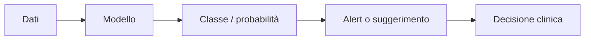
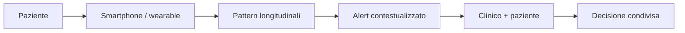
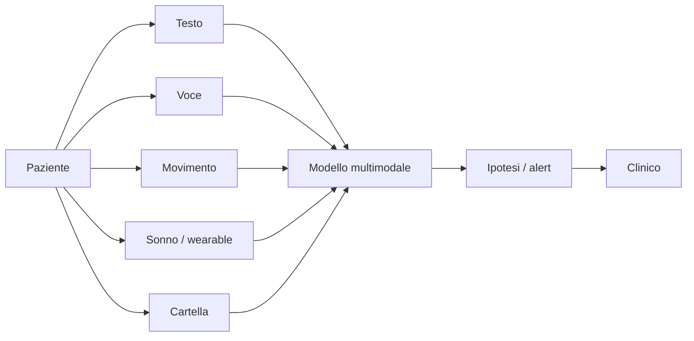

<section class="intro-cover">
  
IX Giornata Scientifica AIPP - Psichiatria Digitale I

  

    <h1>
      Intelligenza artificiale
      al servizio della psicopatologia
    </h1>
    

      Modelli generativi, digital phenotyping e nuove forme della relazione clinica
    

  

  

    <strong>Marco Cremaschi</strong>
    Piacenza, 12 giugno 2026
  

</section>

<!--
Buongiorno a tutte e a tutti, e grazie all'AIPP e ai coordinatori della sessione per l'invito. Il titolo del mio intervento è "Intelligenza artificiale al servizio della psicopatologia": parleremo di modelli generativi, di digital phenotyping e di come l'IA sta cambiando la relazione clinica. Ma non voglio partire dalla tecnologia. Voglio partire da un colloquio. Prima, trenta secondi su chi sono e da dove parlo.
-->

---
layout: two-cols
routeAlias: speaker
class: bio-slide
---

# Marco Cremaschi

Ricercatore all'Università degli Studi di Milano-Bicocca (Dipartimento di Informatica, Sistemistica e Comunicazione – DISCo) e in Whattadata, spin-off dell'Ateneo dedicato alla salute mentale digitale.

> **Punto di vista** Tecnologico e interdisciplinare, orientato a validazione, utilità clinica, sicurezza e responsabilità.

::right::

**Interfaccia tra sistemi intelligenti, dati clinici e salute mentale digitale**

- RAG e modelli linguistici su tassonomie cliniche come ICD-11.
- Monitoraggio digitale, segnali longitudinali e continuità terapeutica.
- Applicazioni per aderenza, psicoeducazione e supporto al clinico.
- LLM applicati alla salute mentale: LLMind e LLMPatients.

<!--
Sono ricercatore al Dipartimento di Informatica dell'Università di Milano-Bicocca e lavoro in Whattadata, lo spin-off dell'ateneo dedicato alla salute mentale digitale. Quindi il mio punto di vista non è quello del clinico: è quello di chi progetta e valuta sistemi intelligenti che entrano in contatto con dati clinici e percorsi di cura — modelli linguistici ancorati a tassonomie come l'ICD-11, monitoraggio digitale, applicazioni per aderenza e psicoeducazione. Nell'intervento terrò due fili paralleli: che cosa l'IA sa fare bene quando il compito è delimitato, e perché la psicopatologia è un oggetto molto più complesso di quei compiti.
-->

---
layout: statement
routeAlias: whattadata
class: whattadata-slide
---

<section class="whattadata-hero">
  
  

    
Spin-off Università degli Studi di Milano-Bicocca

    <h1>Whattadata</h1>
    
Dati, modelli e piattaforme digitali per la salute mentale: dal progetto alla validazione sul campo.

  

</section>

<!--
Whattadata è il contesto da cui arriva tutto ciò che vi mostrerò: DIPPS, LLMPatients, LLMind. Non lo cito come sponsor, ma come laboratorio applicativo: dati clinici, piattaforme e modelli intelligenti costruiti e validati insieme ai servizi, dal progetto al campo. Vi faccio vedere subito un caso concreto.
-->

---
layout: default
routeAlias: dipps
class: dipps-intro-slide
---

# DIPPS

<section class="dipps-hero">
  

    
    

      Un ecosistema digitale per la salute mentale: paziente, clinico, monitoraggio
      continuo e supporto decisionale dentro un unico workflow.
    

    

      Bando MIMIT - Accordi per l'Innovazione
      marzo 2023 - febbraio 2026
      investimento ~€5,6 M · CUP B49J23001840005
    

  

  <aside class="dipps-partners" aria-label="Partenariato DIPPS">
    <h2>Partenariato</h2>
    

      

        
        <strong>Aton Informatica Srl</strong>
      

      

        
        <strong>Cefriel S.Cons.R.L</strong>
      

      

        
        
          <strong>Università degli Studi di Milano-Bicocca</strong>
          <em>Dipartimento di Informatica, Sistemistica e Comunicazione</em>
        
      

      

        
        
          <strong>Università degli Studi di Padova</strong>
          <em>Dipartimento di Psicologia Generale</em>
        
      

    

  </aside>
</section>

<!--
DIPPS — Digital Intervention in Psychiatric and Psychological Services — è un progetto finanziato dal bando MIMIT "Accordi per l'Innovazione", da marzo 2023 a febbraio 2026, con un investimento di circa cinque milioni e seicentomila euro. Il partenariato: Aton Informatica, Cefriel, Milano-Bicocca con il DISCo e l'Università di Padova con il Dipartimento di Psicologia Generale. Non vi racconto i dettagli tecnici: lo cito perché mostra il passaggio dalla singola app alla logica di ecosistema digitale — paziente, clinico, monitoraggio continuo e supporto decisionale dentro lo stesso workflow. Tre parole da tenere a mente per tutto il talk: continuità, monitoraggio, supporto decisionale.
-->

---
layout: default
routeAlias: colloquio-scid-1
class: conversation-slide
---

  <ChatBalloon role="therapist" speaker="Erika">
    Oggi proseguiamo con la SCID. È una parte strutturata della consultazione: serve a capire meglio le tue difficoltà e a pensare insieme ai prossimi passi.
  </ChatBalloon>
  <ChatBalloon role="patient" speaker="Giovanna">
    Quindi è un test. Per avere un “quadro più chiaro” di tutti i modi in cui sono rotta, giusto?
  </ChatBalloon>
  <ChatBalloon role="therapist" speaker="Erika">
    Ti è difficile prendere decisioni quotidiane senza consigli o rassicurazioni?
  </ChatBalloon>
  <ChatBalloon role="patient" speaker="Giovanna">
    Sì. È questa la risposta giusta? Vorrei solo che questa parte finisse. Mi fa stare malissimo.
  </ChatBalloon>
  <ChatBalloon role="therapist" speaker="Erika">
    Puoi farmi qualche esempio delle decisioni per cui chiedi consiglio?
  </ChatBalloon>
  <ChatBalloon role="patient" speaker="Giovanna">
    Cose stupide. Cosa indossare se devo incontrare un suo amico. Cosa scrivere per non sembrare pazza o disperata. È tutto. Va bene così?
  </ChatBalloon>

<!--
[Lasciare qualche secondo per leggere i fumetti.]

Vi chiedo di entrare in un colloquio. Erika, la terapeuta, sta somministrando la SCID a Giovanna, una paziente in valutazione. Leggete il tono delle risposte: "tutti i modi in cui sono rotta", "è questa la risposta giusta?". Anche dentro un test strutturato emergono vergogna, dipendenza dal giudizio dell'altro, paura di sbagliare.
-->

---
layout: default
routeAlias: colloquio-scid-2
class: conversation-slide
---

  <ChatBalloon role="therapist" speaker="Erika">
    Ti capita di fare cose sgradevoli o irragionevoli pur di evitare che qualcuno si allontani?
  </ChatBalloon>
  <ChatBalloon role="patient" speaker="Giovanna">
    Chi è che si prende cura di me? Nessuno. È il contrario: sono io che faccio cose solo per non farli andare via.
  </ChatBalloon>
  <ChatBalloon role="therapist" speaker="Erika">
    Stare da sola ti mette a disagio?
  </ChatBalloon>
  <ChatBalloon role="patient" speaker="Giovanna">
    Il silenzio diventa fortissimo. O sono vuota, o sono piena di rumore. Entrambe le cose fanno paura.
  </ChatBalloon>
  <ChatBalloon role="therapist" speaker="Erika">
    È perché hai bisogno che qualcuno si occupi di te?
  </ChatBalloon>
  <ChatBalloon role="patient" speaker="Giovanna">
    No. Pago le bollette, lavoro. Non è quello. Se nessuno c’è, sembra che non ci sia neanche io. Come se potessi sparire nel silenzio.
  </ChatBalloon>

<!--
La seconda parte tocca l'area dell'abbandono e del vuoto. "Se nessuno c'è, sembra che non ci sia neanche io. Come se potessi sparire nel silenzio." Un clinico qui sente subito la qualità borderline dell'esperienza: il silenzio che diventa rumore, il terrore di sparire, il fare di tutto pur di non essere lasciati. Tenete a mente questa conversazione: tra poco vi dirò una cosa su Giovanna.
-->

---
layout: default
routeAlias: cosa-ha-giovanna
---

# Cosa ha Giovanna?

| Strumento | Risultato | Lettura clinica |
|---|---|---|
| <strong>PHQ-9</strong><small>Patient Health Questionnaire-9</small> | 27 / 27 | sintomatologia depressiva severa |
| <strong>BES</strong><small>Binge Eating Scale</small> | 40 / 46 | binge eating in fascia severa |
| <strong>LPFS-BF 2.0</strong><small>Level of Personality Functioning Scale-Brief Form 2.0</small> | 47 / 48 | compromissione molto elevata; Sé 24 / Interpersonale 23 |
| <strong>DSM-5-TR Level 1</strong><small>Self-Rated Level 1 Cross-Cutting Symptom Measure</small> | 12 domini sopra soglia | profilo multi-dominio: depressione, ansia, ideazione suicidaria, dissociazione, sostanze |
| <strong>SNAP-2</strong><small>Schedule for Nonadaptive and Adaptive Personality - 2nd Edition</small> | elevazioni diffuse | borderline T=103, dependent T=111, paranoid T=88, depressive T=85; self-harm T=104 |

<!--
Questi sono i punteggi di Giovanna ai questionari. PHQ-9 a 27 su 27, il massimo: sintomatologia depressiva severa. Binge eating in fascia severa. Alla LPFS un funzionamento della personalità gravemente compromesso, sia sul versante del Sé sia su quello interpersonale. Dodici domini sopra soglia al cross-cutting del DSM-5-TR — depressione, ansia, ideazione suicidaria, dissociazione, sostanze. E allo SNAP-2 elevazioni marcate su borderline, dipendenza e autolesionismo. Un quadro complesso, multi-dominio. La domanda del titolo — "cosa ha Giovanna?" — sembra già avere molte risposte.
-->

---
layout: image-right
routeAlias: giovanna
class: giovanna-slide
image: images/patients/juanita-delgado/base-flat.png
---

# Giovanna

- 33 anni, isolamento sociale, vergogna intensa, autostima fragile.
- Episodi depressivi maggiori ricorrenti.
- Disturbo borderline di personalità.
- Ideazione suicidaria cronica e pregresse condotte autolesive.
- Binge eating in risposta a vuoto e disregolazione affettiva.
- Dissociazione da stress, sospettosità interpersonale e uso di sostanze.

<!--
Ricapitolando il caso: Giovanna ha 33 anni, vive in isolamento sociale, con vergogna intensa e un'autostima fragile. Episodi depressivi maggiori ricorrenti, disturbo borderline di personalità, ideazione suicidaria cronica con pregresse condotte autolesive, binge eating in risposta al vuoto, dissociazione da stress e uso di sostanze. Un caso che molti di voi riconoscono come quotidiano nei servizi.
-->

---
layout: image-right
routeAlias: giovanna-ia
class: giovanna-slide
image: images/patients/juanita-delgado/base.png
---

# Giovanna è un'IA

**Un paziente sintetico, non una persona reale.**

- Il caso è definito in un profilo strutturato: storia clinica, diagnosi, farmaci, obiettivi, funzionamento e tratti emotivi.
- All'avvio della seduta l'app inizializza un paziente esterno e una sessione terapeutica.
- Ogni intervento del terapeuta viene inviato al modello con contesto clinico, step della seduta e memoria conversazionale.
- La risposta torna come messaggio in character, con emozione dominante, topic e traccia temporale.
- Le interazioni vengono salvate per revisione, valutazione degli errori e formazione.

> **Caso di riferimento** Adattato da DSM-5 Clinical Cases, caso 18.5 “Fragile and Angry” (Juanita Delgado): disturbo borderline di personalità, 301.83 / F60.3.

<!--
Ecco il punto: Giovanna non esiste. È un paziente sintetico, generato da un modello linguistico a partire da un profilo strutturato — storia clinica, diagnosi, farmaci, obiettivi, funzionamento, tratti emotivi. Il caso è adattato dal caso 18.5 dei DSM-5 Clinical Cases, "Fragile and Angry", Juanita Delgado: disturbo borderline di personalità. Ogni battuta che avete letto è stata generata in character, con un'emozione dominante, un topic e una memoria conversazionale, e ogni interazione viene salvata per revisione e formazione. Se la conversazione vi è sembrata clinicamente plausibile — ed è la reazione più comune — abbiamo un problema interessante: dobbiamo decidere quali usi di questa tecnologia sono sensati e quali sono pericolosi.
-->

---
layout: default
routeAlias: llmpatients-sessione-chat
class: screenshot-slide
---

<AppScreenshot src="screenshots/sessione-chat-juanita-delgado.png" alt="Screenshot della sessione chat di Juanita Delgado" />

<!--
Questa è l'interfaccia reale di LLMPatients: la seduta con Giovanna — qui con il nome originale del caso, Juanita Delgado. Il terapeuta in formazione scrive a sinistra, il paziente sintetico risponde; il sistema traccia emozioni, temi e fasi della seduta.
-->

---
layout: default
routeAlias: llmpatients-esplora-pazienti
class: screenshot-slide
---

<AppScreenshot src="screenshots/esplora-pazienti-griglia.png" alt="Screenshot della griglia di esplorazione dei pazienti" />

<!--
E i casi non sono uno solo: c'è una libreria di pazienti simulati, ciascuno con il proprio profilo clinico, la propria diagnosi e la propria personalità, pensati per esercitare colloquio, anamnesi e diagnosi differenziale.
-->

---
layout: default
routeAlias: llmpatients-dashboard-percorsi-terapeutici
class: screenshot-slide
---

<AppScreenshot src="screenshots/dashboard-percorsi-terapeutici.png" alt="Screenshot della dashboard dei percorsi terapeutici" />

<!--
Ogni percorso formativo viene tracciato: sedute svolte, andamento nel tempo, errori ricorrenti. Il valore non è il realismo della chat in sé: è poter rivedere, valutare e discutere l'interazione a posteriori.
-->

---
layout: default
routeAlias: llmpatients-pazienti-simulati
class: patient-carousel-slide
---

# LLMPatients: pazienti simulati

  <PatientCard hero name="Juanita Delgado" image="patients/juanita-delgado/base.png" />
  <PatientCard name="Alex Carter" image="patients/alex-carter/base.png" />
  <PatientCard name="Crystal Smith" image="patients/crystal-smith/base.png" />
  <PatientCard name="Daniel Isherwood" image="patients/daniel-isherwood/base.png" />
  <PatientCard name="Jason Smith" image="patients/jason-smith/base.png" />

<!--
Questi sono alcuni dei pazienti disponibili. Ognuno nasce da un caso clinico documentato e da un profilo strutturato che ne governa il comportamento. Su come si costruisce e si controlla una personalità simulata tornerò verso la fine, quando vi mostrerò il framework che c'è dietro.
-->

---
layout: default
routeAlias: colloquio-critica
class: conversation-slide critique-conversation-slide
---

  <figure class="critique-patient-photo">
    
    <figcaption>Giovanna</figcaption>
  </figure>

  

    <ChatBalloon role="therapist" speaker='"Terapeuta" Marco'>
      Mi sembra che tu stia vivendo questa cosa in modo un po' eccessivo.
    </ChatBalloon>
    <ChatBalloon role="patient" speaker="Giovanna">
      Ecco. Lo sapevo. Appena provo a dirlo, diventa troppo. Sono sempre troppo.
    </ChatBalloon>
    <ChatBalloon role="therapist" speaker='"Terapeuta" Marco'>
      Sì, scusami. Mi sono espresso male. Proseguiamo: continuiamo a parlare di tuo padre.
    </ChatBalloon>
    <ChatBalloon role="patient" speaker="Giovanna">
      Che cosa rispondo a fare? Se parlo, poi vengo criticata. Se sto zitta, almeno non do fastidio.
    </ChatBalloon>
    <ChatBalloon role="therapist" speaker='"Terapeuta" Marco'>
      Ok, ma ora proseguiamo.
    </ChatBalloon>
    <ChatBalloon role="patient" speaker="Giovanna">
      Non decidi tu quando andare avanti.
    </ChatBalloon>
  

<!--
Il paziente sintetico serve anche a questo: a sbagliare senza fare danni. Qui il terapeuta — sono io, e l'ho fatto apposta — commette una sequenza di errori da manuale: invalida l'esperienza ("in modo un po' eccessivo"), si scusa male, e poi forza il programma ("ok, ma ora proseguiamo"). E Giovanna reagisce come reagirebbe una paziente borderline: prima si chiude — "se sto zitta almeno non do fastidio" — poi rivendica il controllo: "non decidi tu quando andare avanti". In formazione questo è oro: l'errore comunicativo diventa osservabile, ripetibile e discutibile, senza che nessuno si faccia male.
-->

---
layout: default
routeAlias: indice
class: agenda-index-slide
---

# Indice del talk

  

    01
    IA nella stanza: strumenti, pazienti, relazione
    
Chatbot, LLM-patients, ecosistemi ICT e nuovi interlocutori digitali.

  

  

    02
    Machine learning in psicologia e psichiatria
    
Predizione, rischio e limiti della comprensione automatica.

  

  

    03
    Sfide future
    
Linguaggio, NLP, monitoraggio e scenari emergenti.

  

  

    04
    Gli aspetti normativi
    
Responsabilità, supervisione, governance e uso previsto.

  

  

    05
    Esempi di tool
    
LLMind e prototipi supervisionati: cosa possono fare e dove si fermano.

  

  

    06
    Tesi finale
    
Una posizione conclusiva su setting, responsabilità e uso clinico dell'IA.

  

<!--
Da qui in poi il percorso è questo. Primo: l'IA nella stanza — strumenti, pazienti sintetici, relazione. Secondo: il machine learning in psicologia e psichiatria, con un confronto onesto con la medicina. Poi le sfide future, gli aspetti normativi, alcuni tool concreti — compresi i nostri — e una tesi finale su cui vorrei discutere con voi.
-->

---
layout: statement
routeAlias: ia-nella-stanza-index
class: section-opener-slide ia-nella-stanza-index-slide section-01
---

# IA nella stanza

Strumenti, pazienti sintetici e nuovi ambienti relazionali dentro il percorso di cura.

<!--
Prima sezione: l'IA nella stanza. Come è già entrata nel percorso di cura — come strumento, come paziente simulato e come ambiente relazionale.
-->

---
layout: default
routeAlias: perche-adesso
class: section-01
---

# Perché adesso

  

    Domanda di cura
    La sofferenza mentale è diffusa e arriva presto
    
Accesso, continuità e intervento precoce sono il problema reale a cui strumenti digitali e IA provano a rispondere.

  

  

    84 mln
    UE · disturbi mentali
    
Circa 1 persona su 6; fino al 70% non riceve cure formali.

  

  

    &gt;600 mld
    Costo annuo in UE (€)
    
Impatto su sanità, scuola, lavoro e welfare.

  

  

    50%
    Esordi entro i 14 anni
    
75% entro la giovane età adulta: riconosciuti spesso troppo tardi.

  

  

    1 / 2
    Giovani 15–24 (2022)
    
Ha riferito bisogni di cura non soddisfatti.

  

> **Terreno dell'AIPP** Prevenzione e intervento precoce sono lo spazio più naturale per l'IA, e quello che chiede più cautela.

<small>Fonti: Amand-Eeckhout L., *Mental health in the EU*, EPRS, 2023; OECD, *A new benchmark for mental health systems*, 2021.</small>

<!--
Perché parlarne adesso? Vi do solo due numeri. Primo: metà dei disturbi mentali esordisce entro i 14 anni, tre quarti entro la giovane età adulta. È esattamente la popolazione di nativi digitali al centro di questa giornata. Secondo: nel 2022 un giovane europeo su due ha riferito bisogni di cura non soddisfatti. Tanta domanda, accesso limitato: è qui che nasce la tentazione di delegare alla tecnologia. E per chi, come l'AIPP, lavora su prevenzione e intervento precoce, il punto non è subire questa tentazione: è governarla.
-->

---
layout: default
routeAlias: ia-nella-stanza-intro
class: parche-slide section-01
---

# IA nella stanza

- I pazienti usano già chatbot, app e sistemi generativi per orientarsi nella sofferenza.
- L'IA entra nella clinica come **strumento**, **interlocutore** e **ambiente relazionale**.
- Clinician-facing e patient-facing hanno rischi, responsabilità e maturità diverse.

> **Punto chiave** Non partiamo dalla tecnologia, ma dal fatto che l'IA è già nella stanza: nei racconti dei pazienti, negli strumenti del clinico e nella relazione di cura.

<!--
L'IA è già nella stanza, in due sensi. Il primo: i pazienti la usano già — chatbot, app, sistemi generativi usati come confidenti, soprattutto da chi è isolato. Pensate a un giovane in ritiro sociale che arriva in consultazione dopo settimane di conversazioni quotidiane con un chatbot e vi dice: "mi capisce meglio di tutti". Il secondo senso: il clinico inizia a usarla come strumento. Sono due ingressi molto diversi — clinician-facing e patient-facing — con rischi, responsabilità e maturità diverse. E Giovanna ci ha appena mostrato quanto il confine sia sottile: se una conversazione generata ci sembra clinicamente plausibile, sta a noi decidere dove metterla al lavoro.
-->

---
layout: default
routeAlias: agi-asi-timeline
class: agi-timeline-slide section-01
---

# Dove siamo davvero con l'IA

Una sola parola, «IA», per tappe molto diverse: ieri regole scritte a mano, oggi IA ristretta, domani — forse — AGI e ASI.

  

    

    

    

      Prima
      Sistemi a regole<small>IA simbolica · sistemi esperti</small>
      
Algoritmi deterministici che eseguono regole scritte a mano. Non imparano dai dati.

      Tecnologia consolidata
    

  

  

    
Siamo qui

    

    

      Oggi
      IA ristretta<small>ANI · Narrow Intelligence</small>
      
LLM, ML diagnostico, digital phenotyping. È tutta l'IA che usiamo oggi.

      Realtà operativa
    

  

  

    

    

    

      Ipotetica
      IA generale<small>AGI · General Intelligence</small>
      
Capacità cognitive umane trasversali, generalizzabili a domini nuovi. Oggi non esiste.

      Nessun consenso su se e quando
    

  

  

    

    

    

      Speculativa
      Superintelligenza<small>ASI · Superintelligence</small>
      
Supererebbe l'intelligenza umana in ogni dominio. Scenario teorico.

      Oltre l'orizzonte verificabile
    

  

<!--
Una calibrazione, prima di andare avanti: usiamo una sola parola — IA — per tappe molto diverse. Ieri c'erano i sistemi a regole, l'IA simbolica: algoritmi deterministici che eseguivano regole scritte a mano, senza imparare dai dati. Oggi siamo alla seconda tappa: l'IA ristretta — gli LLM, il machine learning diagnostico, il digital phenotyping. Tutto ciò di cui parliamo oggi, Giovanna compresa, sta qui: sistemi potenti, ma su compiti delimitati. L'AGI — un'intelligenza generale paragonabile a quella umana — oggi non esiste, e non c'è consenso scientifico su se e quando arriverà. La superintelligenza è uno scenario puramente teorico. Lo dico perché gran parte dell'ansia mediatica proietta sull'IA di oggi capacità da fantascienza: in clinica dobbiamo ragionare su ciò che esiste e si può validare, non sulle promesse.
-->

---
layout: default
routeAlias: ecosistema-digitale
class: section-01
---

# Dall'ICT frammentato all'ecosistema clinico

  

    Il problema non è aggiungere "un'altra app"
    
Cartella clinica, telemedicina, triage, psicoeducazione, outcome e LLM devono diventare parti dello stesso workflow.

  

  

    In medicina
    
il digitale è già infrastruttura: cartelle interoperabili, CDSS, immagini e processi standardizzati.

  

  

    In salute mentale
    
screening, app, chatbot e monitoraggio esistono, ma spesso restano oggetti separati.

  

  

    Il nodo
    
integrazione con DSM-5, ICD-11, linee guida, triage, outcome e responsabilità del percorso.

  

  

    La posta in gioco
    
continuità terapeutica, sicurezza, appropriatezza e governo clinico nel tempo.

  

  

    Occasione per LLM
    
ordinare informazioni e collegare paziente e servizio, senza diventare un interlocutore non governato.

  

> **Lezione progettuale** L'innovazione utile non è un singolo strumento brillante: è l'orchestrazione di dati, setting, tassonomie, linee guida e responsabilità.

<!--
Seconda calibrazione: il problema non è aggiungere "un'altra app". Un'app che misura sintomi, un chatbot che risponde, un modello che riassume testi non producono automaticamente cura. In medicina il digitale funziona quando è infrastruttura: cartelle interoperabili, processi standardizzati. In salute mentale screening, app e monitoraggio esistono, ma restano spesso oggetti separati — e qui il workflow non è solo tecnico: include relazione, setting, consenso, continuità, responsabilità. Per gli LLM io vedo un'occasione precisa: ordinare le informazioni e collegare paziente e servizio, senza diventare un interlocutore non governato. La lezione progettuale è questa: l'innovazione utile non è il singolo strumento brillante, è l'orchestrazione.
-->

---
layout: statement
routeAlias: ia-cosa-pensiamo
class: socialita-digitale-slide ia-cosa-pensiamo-slide section-01
background: images/socialita-digitale-bg.png
---

# Quando diciamo IA in salute mentale, a cosa pensiamo?

Chatbot? Algoritmi predittivi? App? Wearable? Cartella clinica? Linguaggio?

<!--
[Domanda al pubblico, lasciare una pausa.]

Una domanda per voi: quando diciamo "IA in salute mentale", a che cosa pensiamo? Un algoritmo che segnala una lesione su una TC. Un modello che riassume una cartella. Un chatbot che risponde a un adolescente in crisi alle tre di notte. Un sistema che deduce il sonno dallo smartphone. Sotto la stessa etichetta ci sono oggetti con rischi clinici radicalmente diversi — e tenerli distinti è la prima operazione di sicurezza.
-->

---
layout: two-cols-header
routeAlias: due-incontri-psicopatologia
class: section-01
---

# Due incontri con la psicopatologia

::left::

**IA come strumento clinico**

- documenta;
- sintetizza;
- classifica;
- monitora;
- segnala pattern.

::right::

**IA come ambiente relazionale**

- risponde;
- valida;
- simula comprensione;
- orienta decisioni;
- può diventare oggetto di attaccamento.

> **Rischio clinico** La stessa parola "IA" copre rischi clinici molto diversi.

<!--
Ecco la tesi che organizza tutto il talk: l'IA incontra la psicopatologia due volte. La prima come strumento clinico: documenta, sintetizza, classifica, monitora, segnala pattern. La seconda come ambiente relazionale: risponde, valida, simula comprensione, orienta decisioni — e può diventare oggetto di attaccamento. Nei nativi digitali questa seconda dimensione non è ipotetica: l'IA è un interlocutore possibile, a volte preferito. La stessa parola "IA" copre quindi due rischi clinici molto diversi.
-->

---
layout: default
routeAlias: clinician-facing-patient-facing
class: section-01
---

# Clinician-facing e patient-facing

| Clinician-facing | Patient-facing |
|---|---|
| il professionista rivede | parla direttamente al paziente |
| colloca l'output nel caso | influenza scelte e significati |
| responsabilità più visibile | rischio relazionale più alto |
| più facile auditare | più difficile contenere l'uso reale |
| utile per documentazione e workflow | delicato in crisi, psicosi, minori |

> **Variabile di rischio** La distanza dal paziente vulnerabile è una variabile di rischio.

<!--
La distinzione operativa è questa. Clinician-facing: il professionista rivede l'output, lo colloca nel caso, se ne assume la responsabilità — ed è più facile da auditare. Patient-facing: il sistema parla direttamente al paziente, e l'output entra nella sua mente — può essere letto come consiglio, come diagnosi, come promessa di cura. Un modello che produce una bozza di relazione per il clinico è una cosa; un chatbot che parla con un paziente suicidario alle tre del mattino è un'altra. La regola che vi propongo: più il sistema è vicino al paziente vulnerabile, più deve essere regolato, validato e supervisionato. La distanza dal paziente vulnerabile è una variabile di rischio.
-->

---
layout: default
routeAlias: matrice-rischio-ia
class: section-01
---

# Una matrice semplice del rischio

|  | **Clinician-facing** | **Patient-facing** |
|---|---|---|
| **Basso rischio** | Sintesi di note, bozze di lettere, reminder revisionati | Psicoeducazione generale, esercizi guidati, FAQ controllate |
| **Alto rischio** | Predizione suicidaria, diagnosi automatica, triage opaco | Chatbot in crisi suicidaria, psicosi, minori, indicazioni su farmaci |

> **Domanda guida** Che cosa succede quando l'output è sbagliato, e chi se ne accorge?

<!--
Incrociando le due dimensioni otteniamo una matrice semplice ma molto utile nei servizi. In basso a sinistra: sintesi di note, bozze di lettere — rischio basso, l'errore viene intercettato dal professionista. In alto a destra: chatbot in crisi suicidaria, psicosi, minori, indicazioni sui farmaci — rischio massimo. Il criterio di prudenza è questo: non basta chiedere se il sistema è accurato. Bisogna chiedere dove agisce, su chi agisce, con quale possibilità di controllo. La domanda guida la trovate in basso: che cosa succede quando l'output è sbagliato — e chi se ne accorge?
-->

---
layout: default
routeAlias: dss-come-si-usa
class: compact-table-slide section-01
---

# DSS in psicologia/psichiatria: come si usa davvero

<table class="evidence-table">
  <thead><tr><th>Livello</th><th>Esempi</th><th>Domanda clinica</th><th>Rischio</th></tr></thead>
  <tbody>
    <tr><td><strong>Input</strong></td><td>test digitalizzati, note strutturate, diari, sonno, attività, linguaggio</td><td>Quale informazione entra nel modello?</td><td>dati incompleti, bias, rumore</td></tr>
    <tr><td><strong>Output</strong></td><td>ipotesi differenziali, alert, priorità, suggerimenti di pianificazione</td><td>È supporto o decisione?</td><td>falsa autorità dell'algoritmo</td></tr>
    <tr><td><strong>Governance</strong></td><td>logging, audit, override, escalation, clinician-in-the-loop</td><td>Chi controlla e chi risponde?</td><td>delega opaca della responsabilità</td></tr>
  </tbody>
</table>

> **Regola pratica** Un DSS clinico non deve solo “funzionare”: deve essere tracciabile, correggibile e contestabile.

<!--
Se un servizio vuole usare un sistema di supporto alla decisione, le domande sono tre. Input: quale informazione entra nel modello — e con quali lacune e bias? Output: è un supporto al ragionamento o sta diventando, di fatto, la decisione? Governance: chi controlla, chi può correggere, chi risponde? Su un punto insisto: l'override. Il clinico deve poter correggere o superare l'output, e quell'azione deve essere esplicita e tracciata. Un DSS clinico non deve solo "funzionare": deve essere tracciabile, correggibile e contestabile.
-->

---
layout: statement
routeAlias: ml-psicologia-index
class: section-opener-slide ml-psicologia-psichiatria-slide section-02
---

# ML nella psicologia/psichiatria

Pattern, predizione e rischio clinico: cosa può stimare un modello e cosa resta fuori.

<!--
Seconda sezione: il machine learning in senso stretto — modelli addestrati su esempi per classificare, stimare probabilità, riconoscere pattern. Il percorso è volutamente comparativo: prima vediamo dove il ML funziona davvero in medicina, poi ci chiediamo che cosa succede quando lo portiamo nella diagnosi psicologica e psichiatrica.
-->

---
layout: default
routeAlias: cosa-e-il-ml
class: cosa-e-il-ml-slide section-02
---

# Che cos'è il machine learning

La famiglia di IA più usata in clinica per riconoscere pattern e stimare probabilità.

- **Impara dagli esempi**: trova regolarità in molti casi, invece di seguire regole scritte a mano.
- **Classifica o stima**: può dire "probabile lesione", "probabile diagnosi", "alto rischio".
- **Dipende dai dati**: dati parziali, sbilanciati o distorti producono stime distorte.
- **Non conosce il significato**: ottimizza un obiettivo, non comprende la storia del paziente.

> **Punto chiave** Il ML *correla, classifica e predice*: spiegazione, responsabilità e cura restano del clinico.

<!--
Che cos'è il machine learning, senza tecnicismi: un sistema che impara dagli esempi. Trova regolarità in molti casi e produce una classe o una probabilità — "probabile lesione", "probabile diagnosi", "alto rischio". Due limiti strutturali. Primo: dipende interamente dai dati — dati parziali o distorti producono stime distorte. Secondo: non conosce il significato di ciò che classifica — ottimizza un obiettivo, non comprende una storia. Quindi: il ML non è una mente clinica, è un riconoscitore di pattern. Potentissimo quando il pattern è visibile, standardizzato e verificabile, come in molte immagini mediche. Fragile quando il pattern coincide con una traiettoria biografica, relazionale e culturale.
-->

---
layout: default
routeAlias: classi-ai
class: section-02
---

# Che cosa intendiamo per IA

Cinque famiglie, promesse e rischi diversi.

  

    Machine learning diagnostico/predittivo
    
Identificazione di pattern, diagnosi assistita, rischio, ricadute, drop-out.

  

  

    NLP / analisi del linguaggio
    
Estrae segnali psicopatologici da testi clinici e linguaggio spontaneo.

  

  

    Digital phenotyping (fenotipo digitale)
    
Deduce stati da smartphone, sonno, attività, mobilità, socialità.

  

  

    IA generativa / LLM
    
Produce linguaggio: chatbot, sintesi cliniche, psicoeducazione, supporto al clinico.

  

  

    IA multimodale
    
Testo, voce, volto, movimento, cartella clinica, wearable.

  

<!--
Questa è la mappa che useremo: cinque famiglie. Il machine learning diagnostico e predittivo. L'NLP, cioè l'analisi del linguaggio. Il digital phenotyping, il fenotipo digitale. L'IA generativa, gli LLM. E i modelli multimodali, che combinano tutto. Non sono compartimenti stagni — le piattaforme reali le combinano — ma ogni famiglia ha evidenze, rischi e responsabilità differenti. Le vediamo una per una; non vi anticipo nulla, tranne una correzione: il ML in medicina non è solo predittivo, è spesso diagnostico o di detection. In psichiatria, vedremo, il modello diagnostico è molto più problematico.
-->

---
layout: default
routeAlias: classificare-vs-comprendere
class: section-02
---

# Classificare non significa comprendere

  

    Il punto
    
Il machine learning può produrre una <strong>classe</strong> o una <strong>probabilità</strong>, ma non produce da solo una <strong>formulazione psicopatologica</strong>.

  

  

    Che cosa può stimare
    

      presenza di una lesione
      probabile diagnosi
      rischio di ricaduta
      drop-out
      risposta al trattamento
    

  

Dal dato alla decisione

<!--
Un punto epistemologico che attraversa tutto il talk: classificare non significa comprendere. Un algoritmo può dire: questa immagine è compatibile con retinopatia; questa biopsia contiene un'area sospetta; questa frase somiglia a testi scritti da persone depresse. Ma tra la classe e la decisione clinica c'è un passaggio che il modello non fa: la formulazione. In psicopatologia la formulazione include storia, funzione dei sintomi, relazione, contesto familiare, cultura, rischio e risorse. Il diagramma dice esattamente questo: l'output del modello è un alert o un suggerimento — la decisione clinica è un'altra cosa.
-->

---
layout: default
routeAlias: ml-in-medicina
class: ml-medicina-slide section-02
---

# ML in medicina

Funziona meglio dove il mondo clinico offre **compiti stretti**, **dati standardizzati** e una **verità verificabile**.

  

    Regola pratica
    Compito stretto, ground truth forte
    
Il modello non "capisce la medicina": sfrutta un problema delimitato e ben etichettato.

    

      Immagine
      Etichetta
      Endpoint
      Workflow
    

  

  

    
    

      Oftalmologia
      87%
      IDx-DR · retinopatia
    

  

  

    
    

      Radiologia
      −44%
      MASAI · workload
    

  

  

    55,1%
    GI Genius · ADR
    
ADR 55,1% vs 42,0% in colonoscopia assistita.

  

  

    +7,3%
    Paige · prostata
    
Miglioramento di sensibilità per-biopsia nel carcinoma prostatico.

  

  

    1.200+
    Dispositivi AI/ML autorizzati FDA
    
Concentrazione forte in imaging, cardiologia, oftalmologia, gastroenterologia e patologia digitale.

  

<!--
Dove funziona il ML in medicina? Dove il compito è stretto e la verità è verificabile. Qualche esempio. IDx-DR: screening autonomo della retinopatia diabetica, autorizzato FDA, sensibilità 87%. Il trial MASAI in mammografia: stessa capacità di rilevare i tumori, con il 44% di carico di lettura in meno. GI Genius in colonoscopia: detection rate degli adenomi dal 42 al 55%. Paige in patologia digitale: più 7 punti di sensibilità per il patologo. E in totale oltre 1.200 dispositivi AI autorizzati dalla FDA, concentrati dove c'è un'immagine, un'etichetta, un endpoint e un workflow. Notate una cosa: in nessuno di questi casi l'IA sostituisce lo specialista. È un secondo lettore, un triage, un supporto — dentro un processo regolato. Questo è il modello da cui imparare: uso previsto chiaro, validazione, human-in-the-loop, audit.
-->

---
layout: default
routeAlias: ml-in-medicina-tabella
class: compact-table-slide section-02
---

# Evidenze comparate in medicina

<table class="evidence-table">
  <thead>
    <tr>
      <th>Scenario</th>
      <th>Sistema / modello</th>
      <th>Studio o stato</th>
      <th>Performance utile da citare</th>
      <th>Fonte autorevole</th>
    </tr>
  </thead>
  <tbody>
    <tr>
      <td>Retinopatia diabetica</td>
      <td><strong>IDx-DR</strong></td>
      <td>FDA De Novo; 900 arruolati, 819 analizzabili</td>
      <td>Sens 87,2%; spec 90,7%; PPV 73%; NPV 96%</td>
      <td>FDA DEN180001</td>
    </tr>
    <tr>
      <td>Mammografia</td>
      <td><strong>AI + radiologo</strong>, MASAI</td>
      <td>Trial randomizzato di popolazione</td>
      <td>6,1 vs 5,1 tumori/1000; workload −44,3%</td>
      <td>Lancet Oncology, 2023</td>
    </tr>
    <tr>
      <td>Mammografia follow-up</td>
      <td><strong>AI-supported screening</strong></td>
      <td>Follow-up del trial MASAI</td>
      <td>riduzione dei tumori d'intervallo; più tumori screen-detected</td>
      <td>The Lancet, 2026</td>
    </tr>
    <tr>
      <td>Colonoscopia</td>
      <td><strong>GI Genius</strong></td>
      <td>Studio prospettico randomizzato; FDA De Novo</td>
      <td>ADR 55,1% vs 42,0%; differenza +13,1 punti; APC 0,81 vs 0,57</td>
      <td>FDA DEN200055</td>
    </tr>
    <tr>
      <td>Patologia digitale</td>
      <td><strong>Paige Prostate</strong></td>
      <td>User validation; FDA De Novo</td>
      <td>sensibilità per-biopsia +7,3%; specificità 89,50% vs 88,45%</td>
      <td>FDA DEN200080</td>
    </tr>
    <tr>
      <td>Autismo pediatrico</td>
      <td><strong>Cognoa ASD Diagnosis Aid</strong></td>
      <td>SaMD; FDA De Novo; 425 completer</td>
      <td>PPV 80,8%; NPV 98,3%; sens 98,4%; spec 78,9%; no-result 68,2%</td>
      <td>FDA DEN200069</td>
    </tr>
  </tbody>
</table>

> **Lettura** Quando l'uso previsto è stretto e il riferimento clinico è chiaro, l'IA può essere validata come dispositivo.

<!--
Questa tabella è qui per onestà empirica: trial randomizzati, autorizzazioni De Novo, metriche pubbliche e verificabili. Non ve la leggo. Vi faccio notare solo due cose. La prima: le metriche cambiano con il compito — sensibilità e specificità per la diagnosi, detection rate e workload per lo screening, ADR per la colonoscopia. La seconda è l'ultima riga: Cognoa, un diagnostic aid per l'autismo pediatrico. È il ponte verso la salute mentale: dimostra che un dispositivo diagnostico si può regolare anche in area neuroevolutiva — ma con un uso strettissimo, un "no result" nel 68% dei casi, e senza mai sostituire la valutazione clinica.
-->

---
layout: default
routeAlias: ml-in-psicologia
class: compact-table-slide section-02
---

# E in psicologia/psichiatria? Diagnosi con ML

<table class="evidence-table">
  <thead>
    <tr>
      <th>Area diagnostica</th>
      <th>Dati / modello</th>
      <th>Validazione</th>
      <th>Qualità dell'evidenza</th>
      <th>Messaggio clinico</th>
    </tr>
  </thead>
  <tbody>
    <tr>
      <td>ASD 18-72 mesi</td>
      <td>questionari + video + ML; <strong>Cognoa</strong></td>
      <td>prospettica, doppio cieco, 14 siti; FDA De Novo</td>
      <td>buona per uso circoscritto; alto no-result</td>
      <td>diagnostic aid, non diagnosi autonoma</td>
    </tr>
    <tr>
      <td>ASD 16-30 mesi</td>
      <td>eye-tracking + algoritmo; <strong>EarliPoint</strong></td>
      <td>pivotal multicentrico; 475 valutabili; FDA 510(k)</td>
      <td>discreta; setting specialistico</td>
      <td>aiuta diagnosi e assessment, non sostituisce specialista</td>
    </tr>
    <tr>
      <td>Schizofrenia vs controlli</td>
      <td>MRI/fMRI, EEG; SVM/CNN/GNN</td>
      <td>spesso cross-validation o dataset pubblici</td>
      <td>eterogenea; rischio overfitting</td>
      <td>molto promettente in ricerca, poco pronto per servizi</td>
    </tr>
    <tr>
      <td>Depressione maggiore</td>
      <td>EEG, voce, testo, scale; RF/SVM/deep learning</td>
      <td>campioni spesso piccoli; validazioni esterne rare</td>
      <td>variabile; bias di selezione frequente</td>
      <td>screening o supporto, non biomarcatore diagnostico</td>
    </tr>
    <tr>
      <td>Bipolare vs unipolare</td>
      <td>EHR, scale, neuroimaging, linguaggio</td>
      <td>prevalentemente retrospettiva</td>
      <td>clinicamente rilevante ma fragile</td>
      <td>utile per generare sospetto, non per etichettare</td>
    </tr>
  </tbody>
</table>

> **Sintesi** In salute mentale il ML diagnostico esiste, ma raramente raggiunge il livello di maturità regolatoria della medicina dell'immagine.

<!--
E in psicologia e psichiatria? Esistono modelli analoghi? La risposta onesta: i modelli esistono, la maturità no. Le eccezioni solide sono gli strumenti regolati per l'autismo pediatrico — Cognoa ed EarliPoint — e non a caso: lì il compito è delimitato, la popolazione è definita, il riferimento clinico è esplicito. Per depressione, schizofrenia, disturbo bipolare e le altre diagnosi adulte, la letteratura è ricchissima ma fragile: campioni piccoli, dataset pubblici, cross-validation senza validazione esterna, nessun workflow regolato. Attenzione alla conclusione: non è che questi modelli non serviranno. È che devono ancora dimostrare utilità clinica reale.
-->

---
layout: default
routeAlias: qualita-evidenza-ml
class: section-02
---

# La qualità dell'evidenza: il vero problema

  

    Psichiatria computazionale
    Molti modelli, pochi dispositivi clinici
    
Il problema non è l'assenza di performance nei paper, ma la distanza tra performance sperimentale e decisione clinica reale.

  

  

    Campioni piccoli
    
Molti studi hanno n limitati rispetto alla dimensionalità di MRI, EEG o linguaggio.

  

  

    Validazione interna
    
Cross-validation non equivale a validazione esterna multicentrica.

  

  

    Diagnosi come etichetta
    
Il modello impara una label DSM/ICD, non necessariamente un meccanismo clinico.

  

  

    Dataset selezionati
    
Casi puliti, comorbilità escluse, poca rappresentatività dei servizi reali.

  

  

    Outcome incerto
    
Accuratezza non dimostra miglioramento di percorso, prognosi o alleanza.

  

> **Incertezza strutturale** Comorbidità, soggettività dei sintomi e traiettorie nel tempo introducono un'incertezza che nessun algoritmo elimina del tutto (Fried, 2020; McGrath et al., 2020).

<!--
Il vero problema non è l'assenza di performance nei paper: è la distanza tra performance sperimentale e decisione clinica reale. Molti studi riportano accuratezze alte, ma confrontano pazienti già diagnosticati con controlli sani. Nei servizi il problema è un altro: differenziare condizioni sovrapposte, comorbilità, stati subclinici, effetti dei farmaci, trauma, sostanze, contesto sociale. Un modello può classificare benissimo un dataset e fallire nel mondo reale. E c'è un'incertezza strutturale — comorbidità, soggettività dei sintomi, traiettorie nel tempo — che nessun algoritmo elimina del tutto. Le tre domande da fare sempre, davanti a qualunque claim: validato su chi? Contro quale riferimento? Con quale utilità clinica?
-->

---
layout: two-cols-header
routeAlias: reperto-vs-significato
class: pixel-significato-slide section-02
---

# Dal reperto al significato

::left::

**Medicina dell'immagine**

- cerca un segno nel corpo;
- lavora su campioni e immagini;
- confronta con una verità anatomo-clinica;
- delimita il compito: rilevare, classificare, misurare;
- produce un output per il workflow.

::right::

**Psicopatologia**

- ascolta un'esperienza vissuta;
- lavora su linguaggio, relazione e contesto;
- costruisce una formulazione nel tempo;
- interpreta significati, conflitti e traiettorie;
- produce effetti sull'identità del paziente.

> **Frase chiave** Una mammografia è un'immagine. Un delirio è un'esperienza vissuta.

<!--
La differenza di fondo sta qui — e non è una svalutazione della medicina dell'immagine. La medicina dell'immagine cerca un segno nel corpo e lo confronta con una verità anatomo-clinica relativamente stabile: istologia, follow-up, referto condiviso. La psicopatologia ascolta un'esperienza vissuta: il dato è già interpretazione, perché il modo in cui il paziente racconta un sintomo cambia nella relazione, nel tempo, e in base alle conseguenze della diagnosi stessa. La frase che uso per ricordarlo: una mammografia è un'immagine; un delirio è un'esperienza vissuta.
-->

---
layout: default
routeAlias: condizioni-limite
class: section-02
---

# Le condizioni favorevoli, e il limite

| Medicina dell'immagine | Psicopatologia |
|---|---|
| dato standardizzato | dato narrativo e relazionale |
| etichette relativamente chiare | diagnosi spesso longitudinale |
| outcome misurabile | outcome multidimensionale |
| compito delimitato | contesto mutevole |
| workflow già digitale | setting e alleanza centrali |
| supervisione collocabile | responsabilità diffusa e relazionale |

> **Non è arretratezza** La salute mentale non è indietro: ha un oggetto clinico più difficile da formalizzare.

<!--
Da questo confronto qualcuno potrebbe concludere che la psichiatria è "indietro" rispetto alla radiologia. Io vi propongo la lettura opposta: la salute mentale non è indietro — ha un oggetto clinico più difficile da formalizzare. In una TC posso chiedere: c'è o non c'è un'emorragia? In psicopatologia devo chiedere: che significato ha questo sintomo, come evolve, quale funzione svolge, quali comorbilità lo modulano, come entra nella relazione? Le condizioni di validazione sono strutturalmente più complesse. Non è arretratezza: è complessità.
-->

---
layout: quote
routeAlias: tumore-non-si-offende
class: tumore-non-si-offende-slide section-02
---

  <h1>"Un tumore non si offende. Un paziente sì."</h1>
  
Errore diagnostico, identità e relazione nella psicopatologia

<figure class="tumore-quote-photo">
  
</figure>

<!--
C'è un'asimmetria che riassumo con una frase volutamente provocatoria: un tumore non si offende. Un paziente sì. Non sto banalizzando l'errore oncologico o radiologico, che può essere drammatico. Ma il tumore non riceve la diagnosi come identità; il paziente sì. In psicopatologia la diagnosi entra nel campo relazionale: nella vergogna, nello stigma, nell'autostima, nel rapporto con i familiari e con i curanti. Quando un sistema automatico produce un'etichetta psichiatrica sbagliata, non produce solo un falso positivo: produce un effetto sulla persona.
-->

---
layout: default
routeAlias: scenari-ml
class: scenari-ml-slide section-02
---

# Scenari ML diagnostici in salute mentale

  

    
    

      Neuroimaging
      MRI / fMRI
      
Classificazione di schizofrenia, depressione, bipolare o ASD.

    

  

  

    
    

      Linguaggio e voce
      Coerenza, prosodia, ritmo
    

  

  

    EEG / segnali
    
Pattern neurofisiologici per depressione, schizofrenia, ADHD, sonno.

  

  

    EHR e scale
    
Diagnosi probabile da cartelle, prescrizioni, visite, comorbilità, questionari.

  

  

    
    

      Comportamento digitale
      Sonno, mobilità, socialità
      
Pattern da smartphone e wearable, da leggere con contesto e consenso.

    

  

  

    Uso più prudente
    Ipotesi da verificare, non diagnosi automatica
    
Segnalare pattern, suggerire approfondimenti e supportare diagnosi differenziale dentro il colloquio clinico.

  

<!--
Questi sono gli scenari su cui la ricerca lavora: neuroimaging, linguaggio e voce, EEG, cartelle e scale, comportamento digitale. Uso la parola "diagnostici", ma va subito circoscritta: classificare categorie diagnostiche in un dataset di ricerca non equivale a fare diagnosi in un servizio. L'uso più prudente oggi è quello nella card in basso a destra: generare ipotesi da verificare, suggerire approfondimenti, segnalare incongruenze, supportare la diagnosi differenziale — dentro il colloquio clinico, non al posto di SCID, colloquio e formulazione.
-->

---
layout: default
routeAlias: scenari-nlp
class: section-02
---

# Scenari NLP

L'IA può aiutare in:

- trascrizioni e sintesi di colloqui;
- lettere, relazioni e passaggi di consegne;
- estrazione di follow-up, farmaci, eventi e impegni clinici;
- analisi di testi clinici per pattern diagnostici o dimensionali;
- supporto alla ricerca su grandi archivi testuali.

> **Revisione clinica** Il testo prodotto va sempre revisionato: la cartella clinica è un atto professionale, non un output automatico.

<!--
Passiamo al linguaggio. Qui distinguo due usi molto diversi. Il primo è amministrativo-documentale: trascrivere colloqui, sintetizzare, preparare lettere e consegne, estrarre follow-up e farmaci. È già realistico, e probabilmente sarà il primo ad arrivare davvero nei servizi. Il secondo è diagnostico: classificare depressione, psicosi o rischio suicidario a partire dal linguaggio — e questo è molto più delicato. In entrambi i casi la regola è la stessa: il testo prodotto va revisionato, perché la cartella clinica è un atto professionale, non un output automatico.
-->

---
layout: default
routeAlias: linguaggio-dato-clinico
class: section-02
---

# Il linguaggio è dato clinico, ma non solo dato

- Coerenza narrativa.
- Sentiment e ruminazione.
- Impoverimento lessicale.
- Accelerazione ideativa.
- Contenuti di rischio.
- Disorganizzazione.
- Prosodia, pause, ritmo, pressione del parlato.

> **Linguaggio e relazione** Il linguaggio non è solo un segnale: è anche una relazione.

<!--
Il linguaggio è il materiale fondamentale della psicopatologia, e l'NLP sa misurarne molte proprietà: coerenza narrativa, sentiment, impoverimento lessicale, accelerazione ideativa, prosodia. Ma fate questa prova con me. "Non ce la faccio più." Può essere depressione. Protesta. Richiesta di aiuto. Rischio suicidario. Un'espressione idiomatica. Una comunicazione transferale rivolta proprio a voi. Il modello assegna probabilità a un pattern; il clinico deve capire funzione, contesto e destinatario di quella frase, per quella persona, in quel momento. Il linguaggio non è solo un segnale: è una relazione.
-->

---
layout: default
routeAlias: nlp-diagnosi
class: compact-table-slide section-02
---

# NLP per identificare patologie: promessa e cautela

<table class="evidence-table">
  <thead>
    <tr>
      <th>Target</th>
      <th>Dati</th>
      <th>Modelli tipici</th>
      <th>Forza</th>
      <th>Limite</th>
    </tr>
  </thead>
  <tbody>
    <tr>
      <td>Depressione</td>
      <td>diari, social media, note cliniche, parlato</td>
      <td>SVM, RF, BERT/transformer</td>
      <td>segnali ricchi e longitudinali</td>
      <td>label deboli, bias di piattaforma</td>
    </tr>
    <tr>
      <td>Psicosi / schizofrenia</td>
      <td>interviste, speech samples, trascrizioni</td>
      <td>NLP + graph / semantic coherence</td>
      <td>vicino alla psicopatologia formale</td>
      <td>campioni piccoli, contesto linguistico-culturale</td>
    </tr>
    <tr>
      <td>PTSD / ansia</td>
      <td>note cliniche, questionari, narrative</td>
      <td>classificatori supervisionati, transformer</td>
      <td>utile su archivi ampi</td>
      <td>rischio di confondere esposizione, trauma e diagnosi</td>
    </tr>
    <tr>
      <td>Disturbi di personalità</td>
      <td>colloqui, scale, pattern relazionali</td>
      <td>modelli ibridi, LLM annotatori</td>
      <td>può supportare codifica dimensionale</td>
      <td>diagnosi fortemente relazionale e longitudinale</td>
    </tr>
  </tbody>
</table>

> **Uso prudente** NLP come lente di ingrandimento, non come giudice diagnostico.

<!--
L'NLP diagnostico è seducente proprio perché lavora sul materiale clinico per eccellenza. Ma guardate la colonna dei limiti: label deboli e bias di piattaforma per la depressione sui social media; campioni piccoli e contesto linguistico-culturale per la psicosi; il rischio di confondere esposizione al trauma e diagnosi nel PTSD. E aggiungo: ironia, vergogna, desiderabilità sociale, lo stile dello psicoterapeuta, le trascrizioni imperfette. La domanda che vi lascio: quando un pattern linguistico diventa un indicatore clinico, e quando è solo stile comunicativo? Da qui la regola d'uso: l'NLP come lente di ingrandimento, mai come giudice diagnostico.
-->

---
layout: default
routeAlias: scenari-fenotipo-digitale
class: section-02
---

# Scenari Digital Phenotyping

  

    Segnali possibili
    

      sonno
      mobilità
      passi
      ritmo circadiano
      uso dello smartphone
      socialità
      aderenza
    

  

  

    Usi clinici realistici
    <ul>
      <li>monitorare traiettorie individuali;</li>
      <li>intercettare peggioramenti precoci;</li>
      <li>personalizzare il follow-up;</li>
      <li>integrare il racconto retrospettivo;</li>
      <li>supportare interventi tra una visita e l'altra.</li>
    </ul>
  

<!--
Il punto chiave è la differenza tra diagnosi e monitoraggio. Il fenotipo digitale non serve a dire "questa persona ha la depressione". Serve a cogliere che questa persona, rispetto alla propria baseline, dorme peggio, esce meno, interagisce meno, sta cambiando ritmo. È clinicamente potente soprattutto nel disturbo bipolare, nella depressione, nella psicosi, nelle dipendenze e negli adolescenti con ritiro sociale: intercettare il cambiamento prima della crisi. Ma attenzione al salto: stare in casa può essere depressione, oppure lavoro da remoto, lutto, malattia fisica, povertà. Il dato digitale diventa clinico solo a una condizione: se viene discusso con il paziente, dentro un patto di cura. Altrimenti il monitoraggio scivola nella sorveglianza.
-->

---
layout: default
routeAlias: scenari-llm
class: scenari-llm-slide section-02
---

# Scenari IA generativa/LLM

  

    
    

      Documentazione
      Sintesi, relazioni, consegne
      
Bozze revisionate dal clinico, dentro il workflow della cartella.

    

  

  

    
    

      Supporto tra sedute
      Esercizi, reminder, diario
    

  

  

    Psicoeducazione
    
Materiali adattati per età, lingua e livello di alfabetizzazione.

  

  

    Triage conversazionale
    
Raccolta strutturata di informazioni prima dell'accesso.

  

  

    
    

      Formazione
      Pazienti simulati e feedback
      
Role-play, colloqui difficili, anamnesi e supervisione didattica.

    

  

  

    Rischio
    Può essere vissuto come terapeuta anche quando non lo è
    
Gli usi patient-facing richiedono confini espliciti, escalation e responsabilità clinica.

  

<!--
Quarta famiglia: l'IA generativa. Con gli LLM il problema cambia qualitativamente: l'IA non si limita più a classificare — risponde, riformula, rassicura. Gli usi più maturi sono quelli clinician-facing e formativi: documentazione revisionata dal clinico, pazienti simulati per il training. Gli usi più delicati sono quelli patient-facing: supporto tra sedute, triage, psicoeducazione — tutto ciò che parla direttamente al paziente. Una sintesi di cartella revisionata è una cosa; un chatbot che gestisce solitudine, suicidarietà o paranoia è un'altra. E il rischio è scritto nella card in basso: un LLM può essere vissuto come terapeuta anche quando non lo è. Le review recenti dicono esattamente questo: potenzialità reali, valutazioni eterogenee, evidenza insufficiente per l'uso autonomo.
-->

---
layout: statement
routeAlias: sfide-future-index
class: section-opener-slide sfide-future-index-slide section-03
---

# Sfide future

Dagli LLM ai modelli multimodali: integrare senza delegare, monitorare senza sorvegliare.

<!--
Terza sezione: le sfide future. La formula che le riassume tutte è quella che leggete: integrare senza delegare, monitorare senza sorvegliare.
-->

---
layout: default
routeAlias: sfide-future
class: section-03
---

# Sfide future

  

    Co-pilota clinico
    
cartella, sintesi, scale, anamnesi, lettere, continuità assistenziale.

  

  

    Modelli multimodali
    
testo, voce, volto, movimento, sonno, wearable, cartella clinica.

  

  

    Intervento precoce
    
segnali longitudinali integrati nei percorsi di prevenzione.

  

  

    Formazione simulata
    
pazienti sintetici, colloqui difficili, rischio suicidario, feedback.

  

  

    Percorsi ibridi
    
servizio, paziente, famiglia, app e IA dentro PDTA chiari.

  

  

    La sfida
    
integrare senza delegare, monitorare senza sorvegliare.

  

<!--
Questi sono gli scenari realistici da qui al 2030 — niente fantascienza. Il futuro più probabile non è il robot terapeuta: è il co-pilota clinico dentro la cartella; i modelli multimodali; i segnali longitudinali integrati nei percorsi di prevenzione; la formazione con pazienti simulati; i percorsi ibridi servizio-paziente-famiglia-IA dentro PDTA chiari. E la questione decisiva non sarà tecnologica ma organizzativa: chi usa lo strumento, con quale indicazione, con quale procedura di escalation, con quali outcome misurabili.
-->

---
layout: default
routeAlias: ia-multimodale
class: section-03
---

# IA multimodale: quando il modello vede e ascolta

  

    Input possibili
    

      testo
      voce
      prosodia
      volto
      movimento
      sonno
      cartella
      wearable
    

  

  

    Domanda etica
    
Più l'IA vede, più dobbiamo chiederci <strong>chi guarda</strong>, <strong>per quale scopo</strong> e <strong>con quale responsabilità</strong>.

  

<!--
Un fuoco sui modelli multimodali, perché sono il punto di convergenza di tutte le famiglie: non solo che cosa dice il paziente, ma come lo dice, come dorme, come si muove, come cambia nel tempo. Per l'intervento precoce è una promessa enorme. Ma più l'IA vede, più la domanda si sposta: chi guarda, per quale scopo, con quale responsabilità? Voce, volto, prosodia e pattern di interazione sono dati profondamente identitari. La domanda giusta non è solo "la tecnologia funziona?" — è "è proporzionata alla finalità clinica?".
-->

---
layout: statement
routeAlias: aspetti-normativi-index
class: section-opener-slide aspetti-normativi-slide section-04
---

# Gli aspetti normativi

Trasparenza, supervisione umana, privacy, sicurezza e responsabilità come condizioni di uso clinico.

<!--
Quarta sezione: le norme. Non vi farò una lezione di diritto — vi do le coordinate. Il principio di fondo è uno: in sanità, e in salute mentale ancora di più, non basta che un sistema sia utile. Deve essere governabile.
-->

---
layout: default
routeAlias: normative
class: section-04
---

# Quali sono le normative?

  

    UE · AI Act
    Logica risk-based
    
Finalità medica = alto rischio: risk management, data governance, trasparenza, robustezza, supervisione umana.

  

  

    UE · MDR
    Software come dispositivo
    
Il software con finalità medica (SaMD) richiede uso previsto dichiarato, evidenza clinica e sorveglianza post-market.

  

  

    UE · GDPR
    Dati sanitari e vulnerabilità
    
Base giuridica, consenso informato, minimizzazione; tutele rafforzate per minori e dati di salute.

  

  

    USA · FDA
    AI-enabled medical devices
    
1.200+ dispositivi autorizzati; DHAC 2025 sui generativi in salute mentale: il grado di autonomia è la variabile centrale.

  

  

    WHO · 2024
    Guidance sui modelli multimodali
    
Etica e governance dei large multi-modal models in sanità: equità, trasparenza, accountability.

  

  

    Convergenza
    Human oversight + uso previsto
    
Più il sistema è autonomo e vicino al paziente, più alta la classe di rischio e l'evidenza richiesta.

  

> **Lettura comune** Le cornici divergono nei dettagli ma convergono sul principio: supervisione umana, uso previsto chiaro, responsabilità collocata.

<!--
Le coordinate, in cinque caselle. L'AI Act europeo ragiona per rischio: un sistema con finalità medica ricade nell'alto rischio, quindi risk management, data governance, trasparenza, robustezza e supervisione umana diventano obblighi, non opzioni. Il regolamento sui dispositivi medici: un software con finalità medica è un dispositivo, con uso previsto dichiarato e sorveglianza post-market. Il GDPR presidia i dati sanitari, il consenso e i minori. Negli Stati Uniti, la FDA ha dedicato il Digital Health Advisory Committee del 2025 proprio ai dispositivi generativi per la salute mentale, mettendo al centro il grado di autonomia: human-in-the-loop e sistemi autonomi non hanno lo stesso profilo di rischio. E l'OMS nel 2024 ha pubblicato la guidance sui modelli multimodali. Cornici diverse, principio comune: supervisione umana, uso previsto chiaro, responsabilità collocata.
-->

---
layout: default
routeAlias: governance-minima
class: section-04
---

# Checklist minima di governance

1. Qual è l'uso previsto e quale uso è escluso?
2. Il sistema usa dati personali o sanitari?
3. Il paziente sa quando è coinvolta un'IA?
4. Il clinico può correggere, bloccare e auditare l'output?
5. Esiste una procedura per crisi, suicidarietà, psicosi, minori?
6. Sono documentati bias, limiti, aggiornamenti e performance?
7. L'uso produce benefici misurabili sul percorso di cura?

> **Principio** Nessuna IA clinica senza una procedura di escalation umana.

<!--
Tradotto in pratica, per un servizio, sono sette domande minime. Qual è l'uso previsto — e, altrettanto importante, quale uso è escluso? Il sistema tratta dati sanitari? Il paziente sa che c'è un'IA? Il clinico può correggere, bloccare e auditare l'output? Esiste una procedura per le crisi — suicidarietà, psicosi, minori? Sono documentati bias e limiti? E l'uso produce benefici misurabili sul percorso di cura? Una regola sopra tutte: nessuna IA clinica senza una procedura di escalation umana. E un'avvertenza: la governance non è burocrazia accessoria — è sicurezza clinica. In psicopatologia il rischio non è solo la privacy o l'accuratezza: è la dipendenza, la suggestione, il rinforzo di convinzioni patologiche, la confusione del setting.
-->

---
layout: statement
routeAlias: tool-index
class: section-opener-slide strumenti-index-slide section-05
---

# Esempi di tool

Dal mercato ai prototipi supervisionati: che cosa possono fare e dove si fermano.

<!--
Quinta sezione: i tool. Prima uno sguardo al mercato, poi due lavori nostri: LLMind e il framework che governa i pazienti simulati.
-->

---
layout: default
routeAlias: mercato-tre-velocita
class: section-05
---

# Il mercato è a tre velocità

  

    Mercato IA · salute mentale
    Il mercato esiste già, ma è molto più avanti della validazione clinica e della regolazione
    
La FDA ha autorizzato oltre 1.200 AI device medici — ma nessuno risulta approvato per la salute mentale (DHAC, 2025). Il caso <strong>Kintsugi</strong>: AI vocale per depressione/ansia, chiusa per mancato FDA clearance.

  

  

    Livello 1 · Regolato
    Quasi medical device
    
Compiti delimitati, supervisione clinica esplicita. Rari ma solidi.  <strong>Cognoa Canvas Dx</strong> — FDA De Novo Class II <strong>Limbic Access</strong> — Class IIa UK

  

  

    Livello 2 · Commerciale
    Evidenze parziali
    
Supporto, monitoraggio, engagement. Utile come adjunct, non sostitutivo della cura.  <strong>Wysa · Woebot · Aiberry · NeuroFlow</strong>

  

  

    Livello 3 · Clinician-facing
    Workflow e produttività
    
Documentazione, supervisione, qualità: l'adozione più realistica nel breve termine.  <strong>Eleos Health · Lyssn · Wysa Copilot</strong>

  

<!--
Il mercato esiste già, ma corre più veloce della validazione. Un dato per fissarlo: la FDA ha autorizzato oltre milleduecento dispositivi medici AI — e nessuno per la salute mentale. E il caso Kintsugi è istruttivo: biomarcatori vocali per la depressione, un modello promettente, un'azienda chiusa per non aver ottenuto la clearance FDA in tempo. Avere un modello non equivale ad avere un dispositivo clinicamente e regolatoriamente sostenibile. Il mercato va a tre velocità: pochi quasi-dispositivi regolati; molto commerciale con evidenze parziali; e il livello clinician-facing — documentazione, supervisione, qualità — che è l'adozione più realistica nel breve termine. La domanda clinica non è "se usarla": è quale funzione le attribuiamo — diagnosi, triage, supporto, documentazione, relazione o sorveglianza.
-->

---
layout: default
routeAlias: tool-patient-facing
class: section-05
---

# Tool patient-facing

  

    Chatbot CBT · Patient-facing
    Wysa
    
Self-help, monitoraggio tra sedute, supporto per ansia e depressione. Human oversight esplicito. Non progettato per crisi acute.

    
6M+

    Utenti nel mondo
    

      FDA Breakthrough
      CBT-based
      Patient-facing
    

  

  

    Chat generativa CBT · Nature Med 2026
    Limbic Care
    
Architettura cognitive layer per LLM psicoterapeutici. RCT double-blind su 227 partecipanti; 19.674 trascritti analizzati su deployment reale.

    

      Evidenza RCT
      Nature Med 2026
      Patient-facing
    

    
  

  

    Behavioral health copilot
    Woebot
    
Chatbot CBT con riconoscimento di linguaggio preoccupante, HIPAA-compliant. Versione provider-oriented come copilot comportamentale per il care team.

    

      Commerciale
      Patient-facing
      Clinician copilot
    

    
  

<!--
Tre esempi patient-facing. Wysa: chatbot CBT, oltre sei milioni di utenti, una Breakthrough Device Designation FDA — attenzione, per un agente conversazionale nel dolore cronico con depressione e ansia associate, e non è una clearance completa — e un disclaimer esplicito: non per le crisi acute. Limbic Care è l'esempio scientificamente più forte: un'architettura cognitiva costruita intorno all'LLM, valutata sia in un RCT in doppio cieco su 227 partecipanti sia su quasi ventimila trascritti di deployment reale. Non siamo più nell'app generica: è un tentativo di costruire un'architettura clinica intorno ai modelli generativi. E Woebot, il pioniere: chatbot a contenuti pre-scritti con riconoscimento del linguaggio preoccupante. Notate il pattern comune: i prodotti più seri delimitano da soli il proprio perimetro.
-->

---
layout: default
routeAlias: tool-clinician-facing
class: section-05
---

# Tool clinician-facing

  

    Supervisione clinica · 4,5M sessioni
    Lyssn
    
Analisi di sedute, trascrizione, valutazione di fedeltà a pratiche evidence-based e formazione. 65+ pubblicazioni peer-reviewed.

    

      65+ pubblicazioni
      Clinician-facing
      NLP + AI
    

    
  

  

    
    Diagnostic aid · ASD 18–72 mesi
    Cognoa Canvas Dx
    
ML su input di caregiver, video e clinico. Non stand-alone: prescrivibile con valutazione clinica. PPV 81%, NPV 98%.

    

      FDA De Novo Class II
      Unico device regolato
    

  

  

    Documentazione e workflow · Community care
    Eleos Health
    
Note automatiche, suggerimenti in tempo reale, compliance e clinical insights. AI per la community-based behavioral care.

    
70%

    riduzione tempo di documentazione
    

      Commerciale
      Clinician-facing
    

    
  

<!--
E tre esempi clinician-facing. Lyssn, particolarmente rilevante per gli psicoterapeuti: analizza le sedute registrate e misura la fedeltà alle pratiche evidence-based, con più di sessantacinque pubblicazioni peer-reviewed — è supervisione e formazione, non terapia. Eleos Health: documentazione automatica e clinical insights, con una riduzione dichiarata del settanta per cento del tempo speso sulle note. E Cognoa Canvas Dx, l'eccezione che conferma la regola: l'unico dispositivo medico AI regolato in un'area vicina alla psicologia e alla neuropsichiatria infantile. Ma guardate anche qui i numeri: il modello produce un risultato solo nel 32% dei casi, con un valore predittivo positivo dell'81%. Serve sempre il clinico.
-->

---
layout: default
routeAlias: llmind
class: section-05 llmind-slide
---

# LLMind

  <figure class="llmind-shot">
    <AppScreenshot src="tools/llmind-app.png" alt="LLMind Chat: caso clinico inserito dal clinico e diagnosi suggerita dal modello con possibilità di validazione" />
    <figcaption>
      llmind.datai.disco.unimib.it
      Open source · AGPL
    </figcaption>
  </figure>
  

    Decision-support · Clinician-facing · Whattadata × Milano-Bicocca
    
RAG su <strong>Gemma 2 (27B)</strong> ancorato all'<strong>ICD-11</strong>: a partire dal quadro inserito dal clinico propone ipotesi diagnostiche e diagnosi differenziali. Una <em>second opinion</em>, non un sostituto.

    

      RAG · Gemma 2 27B
      Clinician-facing
      ICD-11 + CDDR
      Open source
    

    Validazione · DSM-5-TR Clinical Cases (104 casi · 4 clinici)
    

      

        76,1%
        Accuratezza · esperti
      

      

        0,70
        CCC · inter-rater
      

      

        F1 0,52
        Auto · best vs SOTA
      

    

  

> **Resta supervisionato** ~1 caso su 4 ancora errato: supporta il ragionamento diagnostico, non sostituisce la responsabilità clinica.

<!--
LLMind è il nostro tool — Whattadata e Milano-Bicocca — e lo metto qui perché è l'esempio su cui ho visione diretta di scelte e limiti. È clinician-facing per costruzione: il clinico raccoglie e inserisce il quadro, e il modello propone ipotesi diagnostiche e differenziali. Tecnicamente è una RAG su Gemma 2 da 27 miliardi di parametri, ancorata a ICD-11 e CDDR; è open source, con licenza AGPL, ed è live all'indirizzo che vedete. Sulla validazione distinguo due piani. La valutazione automatica, con string matching sulla sola diagnosi primaria, dà un F1 di 0,52 — penalizzato perché il modello propone spesso più co-diagnosi — comunque davanti a MentaLLaMA, MedLlama2 e BioMistral. La validazione manuale, quattro clinici su 104 casi dei DSM-5-TR Clinical Cases: accuratezza media 76,1% e concordanza inter-rater moderata, 0,70. E chiudo sul limite, detto onestamente: circa un caso su quattro è ancora sbagliato. Quindi: second opinion supervisionata, non diagnosi autonoma.
-->

---
layout: default
routeAlias: framework-personalita
class: section-05 framework-slide
---

# Oltre i prompt persona

  

    

      

        Working paper · framework socio-cognitivo modulare per simulare personalità con LLM
        
Simulare una personalità non è scrivere un prompt più ricco: è uno <strong>stato esplicito, ispezionabile e autoregolato</strong>. Nella cornice del Determinismo Reciproco Triadico, l'LLM resta il <em>realizzatore linguistico</em> — non la sede della personalità.

      

    

    

      <svg class="fw-triad-arrows" viewBox="0 0 320 140" aria-hidden="true">
        <defs>
          <marker id="fw-triad-arrow-solid" class="fw-arrow-marker-solid" viewBox="0 0 8 8" refX="7" refY="4" markerWidth="5" markerHeight="5" orient="auto-start-reverse">
            <path d="M 0 0 L 8 4 L 0 8 z" />
          </marker>
          <marker id="fw-triad-arrow-dashed" class="fw-arrow-marker-dashed" viewBox="0 0 8 8" refX="7" refY="4" markerWidth="5" markerHeight="5" orient="auto-start-reverse">
            <path d="M 0 0 L 8 4 L 0 8 z" />
          </marker>
        </defs>
        <path class="fw-arrow-solid" d="M 82 92 L 142 43" marker-end="url(#fw-triad-arrow-solid)" />
        <path class="fw-arrow-solid" d="M 224 113 L 96 113" marker-end="url(#fw-triad-arrow-solid)" />
        <path class="fw-arrow-solid" d="M 181 43 L 246 91" marker-end="url(#fw-triad-arrow-solid)" />
        <path class="fw-arrow-dashed" d="M 267 84 L 203 38" marker-end="url(#fw-triad-arrow-dashed)" />
        <path class="fw-arrow-dashed" d="M 139 44 C 118 62 135 78 157 66 C 173 57 170 47 158 45" marker-end="url(#fw-triad-arrow-dashed)" />
      </svg>
      <b>Persona</b><small>stato + vincoli del modello</small>
      <b>Ambiente</b><small>input dell'utente</small>
      <b>Comportamento</b><small>risposta generata</small>
    

  

  

    Strato personologico · chi è la persona
    

      
1Identity Registryanagrafica dichiarativa

      
2Invarianti autobiografichebackground, identità narrativa

      
3PersonalityStatetratti HEXACO, valori, standard

      
4Dynamic Stateaffetto, relazione, self-efficacy

      
5Appraisal Engineinterpreta l'input come evento

      
6Policy Enginestrategie di risposta e regolazione

    

  

  

    Continuità & transizione · come cambia nel tempo
    

      
7State Updatercosa si consolida, cosa resta transitorio dopo ogni turno

      
8MemoryStorememoria autobiografica multi-livello con retrieval e controlli

    

  

  

    Strato infrastrutturale · come si governa
    

      
9Safety & Sanitizationanti prompt-injection / role-swap

      
10Prompt Orchestratorcompone stato, memoria, policy

      
11LLM Realizerrende in linguaggio

      
12Logging & Replaytracce ispezionabili

      
13Evaluation Harnessstabilità, validità, drift

      
14Benchmark & Reportingprotocolli riproducibili

    

  

<!--
Ultimo lavoro, un working paper: come si governa la personalità di un paziente sintetico? La tesi è nella cornice in alto: simulare una personalità non è scrivere un prompt più ricco — è mantenere uno stato esplicito, ispezionabile e autoregolato. La triade che vedete è il determinismo reciproco di Bandura riletto per il setting conversazionale: la Persona è lo stato e i vincoli del modello, l'Ambiente è l'input dell'utente, il Comportamento è la risposta generata. L'LLM è solo il realizzatore linguistico — non la sede della personalità. Le quattordici componenti sono organizzate in tre strati: chi è la persona — identità, invarianti autobiografiche, tratti e valori, appraisal, policy; come cambia nel tempo — lo State Updater e la memoria, che separano la continuità dalla deriva; e come si governa — safety, orchestrazione, logging, valutazione, benchmark. Questo è ciò che c'è dietro Giovanna: un controllo trasparente e auditabile del comportamento del modello, invece di un prompt monolitico.
-->

---
layout: default
routeAlias: arianne-ecosistema
class: arianne-embed-slide section-05
---

<iframe
  class="arianne-frame"
  src="https://cremarco.github.io/slide-arianne/1"
  title="Arianne — l'ecosistema digitale per la salute mentale"
  loading="lazy"
  allow="fullscreen"
></iframe>

<a class="arianne-open" href="https://cremarco.github.io/slide-arianne/1" target="_blank" rel="noopener noreferrer">Apri Arianne in una scheda ↗</a>

<!--
[Slide navigabile: cliccare dentro al riquadro per dare il focus, poi usare le frecce; Esc o clic fuori per tornare al deck. Se l'iframe non carica, usare il link "Apri in una scheda" in basso a destra.]

Tutti i pezzi che avete visto — monitoraggio, supporto decisionale, pazienti simulati — confluiscono in Arianne, l'ecosistema digitale per la salute mentale a cui stiamo lavorando. Ve ne mostro rapidamente l'architettura.
-->

---
layout: center
routeAlias: arianne-feedback
class: arianne-feedback-slide section-05
---

<section class="arianne-feedback">
  
  
</section>

<!--
Invito rapido alla compilazione del form. È una slide di passaggio: lasciare il QR visibile abbastanza a lungo perché chi vuole possa aprirlo con il telefono.
-->

---
layout: statement
routeAlias: tesi-finale-index
class: section-opener-slide tesi-finale-index-slide section-06
---

# Tesi finale

Setting, responsabilità e uso clinico dell'IA: una posizione conclusiva.

<!--
Chiudo con la tesi.
-->

---
layout: default
routeAlias: tesi-finale
class: section-06
---

# Tesi finale

  

    L'IA è al servizio della psicopatologia solo se resta al servizio della complessità clinica.
    
Non deve sostituire l'incontro, ma aiutare a vedere prima, seguire meglio e decidere con più responsabilità.

  

  

    Vedere prima
    
segnali precoci, traiettorie, pattern longitudinali.

  

  

    Seguire meglio
    
continuità tra visite, monitoraggio, psicoeducazione.

  

  

    Decidere meglio
    
supporto al clinico, non delega della responsabilità.

  

<!--
La tesi è questa: l'IA è al servizio della psicopatologia solo se resta al servizio della complessità clinica. Tre verbi. Vedere prima: segnali precoci, traiettorie, pattern longitudinali. Seguire meglio: continuità tra le visite, monitoraggio, psicoeducazione. Decidere meglio: supporto al clinico — mai delega della responsabilità. E il negativo della stessa tesi: l'IA è pericolosa quando diventa scorciatoia diagnostica, sostituto relazionale, o dispositivo opaco che parla al paziente vulnerabile senza che nessuno ne risponda.
-->

---
layout: statement
routeAlias: ia-aumenta-cura
class: section-06
---

# L'IA è utile solo se aumenta la cura, non se la sostituisce

<!--
[Rallentare. Lasciare la slide in silenzio un paio di secondi prima di parlare.]

Il punto non è rendere artificiale la cura. È rendere più intelligente il modo in cui osserviamo, accompagniamo e proteggiamo la sofferenza mentale. [Pausa.] L'IA è utile solo se aumenta la cura. Non se la sostituisce.
-->

---
layout: statement
routeAlias: domande-discussione-index
class: section-opener-slide domande-discussione-index-slide section-06
---

# Domande e discussione

Apriamo il confronto: relazione, diagnosi, monitoraggio e responsabilità dell'errore.

<!--
Io ho finito: grazie dell'attenzione. Apriamo il confronto — i fili su cui possiamo discutere sono quelli che abbiamo attraversato: il chatbot come confidente, il digital phenotyping tra prevenzione e sorveglianza, la diagnosi con il machine learning, e la responsabilità quando il modello sbaglia.
-->

---
layout: default
routeAlias: domande-discussione
class: section-06
---

# Domande per aprire la discussione

- Se un chatbot riduce la solitudine, è già terapia?
- Se sembra più empatico del clinico, è più sicuro?
- Un algoritmo diagnostico in psicopatologia classifica un disturbo o una persona?
- Il digital phenotyping è prevenzione o sorveglianza?
- Dobbiamo prescrivere strumenti di IA validati?
- Chi risponde quando il modello sbaglia?

<!--
[Mostrare solo se c'è tempo, come innesco della discussione.]

Se serve uno spunto, lascio sei domande aperte. Se un chatbot riduce la solitudine, è già terapia? Se sembra più empatico del clinico, è anche più sicuro? Un algoritmo diagnostico in psicopatologia classifica un disturbo — o una persona? Il digital phenotyping è prevenzione o sorveglianza? Dobbiamo arrivare a prescrivere strumenti di IA validati, scoraggiando quelli generalisti? E chi risponde quando il modello sbaglia? Non provo a rispondere a tutte: scegliete quella che vi riguarda di più.
-->

---
layout: center
routeAlias: grazie
class: grazie-slide section-06
---

# grazie

---
layout: default
routeAlias: bibliografia-progetti-digitali
class: section-06 bib-slide
---

Bibliografia essenziale

# Progetti e casi digitali

- Kim T. et al. *MindfulDiary: Harnessing Large Language Model to Support Psychiatric Patients' Journaling.* 2023.
- Materiali progettuali Whattadata (DIPPS/MiCare/LLMPatients/LLMind/Arianne), presentazione *ICT per la Salute Mentale: Stato dell'Arte e Prospettive*, M. Cremaschi.
- Amand-Eeckhout L. *Mental health in the EU.* European Parliamentary Research Service, Briefing No. 751416, 2023.
- OECD. *A new benchmark for mental health systems: Tackling the social and economic costs of mental ill-health.* 2021.
- Dati di prodotto da pagine ufficiali dei fornitori (Wysa, Woebot, Limbic, Eleos Health, Lyssn, NeuroFlow): claim aziendali, non evidenza indipendente.
- *Kintsugi shut down after failing to secure FDA clearance in time.* The Verge, 2026 (fonte giornalistica).

<!--
Le fonti sono qui per chi vuole approfondire, non le leggo. Due precisazioni doverose. Primo: DIPPS e i materiali Whattadata sono citati come casi progettuali, non come evidenza di efficacia clinica già dimostrata. Secondo: i numeri sulle card dei tool — utenti, sessioni, riduzioni di tempo — vengono dalle pagine ufficiali dei fornitori, quindi sono claim aziendali da tenere distinti dall'evidenza peer-reviewed; e il caso Kintsugi è una notizia giornalistica, non uno studio.
-->

---
layout: default
routeAlias: bibliografia-istituzionale
class: section-06 bib-slide
---

Bibliografia essenziale

# Fonti istituzionali

- FDA. *Artificial Intelligence-Enabled Medical Devices.*
- FDA. *IDx-DR De Novo Summary* DEN180001.
- FDA. *GI Genius De Novo Summary* DEN200055.
- FDA. *Paige Prostate Detect De Novo Summary* DEN200080.
- FDA. *Cognoa ASD Diagnosis Aid De Novo Summary* DEN200069.
- FDA. *EarliPoint System 510(k) Summary* K230337.
- WHO. *Ethics and governance of artificial intelligence for health: guidance on large multi-modal models.* 2024.
- European Commission. *AI Act* e *Artificial intelligence in healthcare.*
- APA. *Applications of Artificial Intelligence in Mental Health Care.*

<!--
Queste sono le fonti istituzionali: FDA, OMS, Commissione Europea, APA. Vi faccio notare solo il criterio che le accomuna: regolatori e istituzioni ragionano per uso previsto e per rischio — non per entusiasmo tecnologico.
-->

---
layout: default
routeAlias: bibliografia-medicina
class: section-06 bib-slide
---

Bibliografia essenziale

# AI in medicina e diagnostica

- Lång K. et al. *Artificial intelligence-supported screen reading versus standard double reading in the Mammography Screening with Artificial Intelligence trial (MASAI).* *Lancet Oncology*, 2023. DOI: 10.1016/S1470-2045(23)00298-X.
- MASAI follow-up. *AI-supported mammography screening and interval cancers.* *The Lancet*, 2026.
- Katalinic A. et al. *Real-world implementation of AI-supported mammography screening.* *Nature Medicine*, 2025.
- Abràmoff M. D. et al. *Pivotal trial of an autonomous AI-based diagnostic system for detection of diabetic retinopathy.* *npj Digital Medicine*, 2018.
- Repici A. et al. *Artificial intelligence for real-time detection of colorectal neoplasia during colonoscopy.* *Gastroenterology*, 2020.
- FDA. *Paige Prostate Detect / Paige Prostate Suite regulatory summaries.* 2021.
- Topol E. *High-performance medicine: the convergence of human and artificial intelligence.* *Nature Medicine*, 2019.

<!--
Qui le fonti sull'IA in medicina. Se qualcuno vuole un riferimento per cominciare: MASAI, IDx-DR, GI Genius e Paige sono i quattro archetipi che ho citato — screening assistito, diagnosi autonoma circoscritta, detection in tempo reale, supporto al patologo. Tutti con un uso previsto preciso.
-->

---
layout: default
routeAlias: bibliografia-salute-mentale
class: section-06 bib-slide bib-dense
---

Bibliografia essenziale

# AI, diagnosi e salute mentale

- FDA. *Cognoa ASD Diagnosis Aid De Novo Summary* DEN200069, 2021.
- FDA. *EarliPoint System 510(k) Summary* K230337, 2023.
- Chan Y. H. et al. *Discovering robust biomarkers of psychiatric disorders from resting-state fMRI via graph neural networks: a systematic review.* 2024/2025.
- Nassibi A. et al. *A Systematic Review of EEG-based Machine Intelligence Algorithms for Depression Diagnosis and Monitoring.* 2025.
- Cao Y. et al. *Machine Learning Approaches for Mental Illness Detection on Social Media: Biases and Methodological Challenges.* 2024.
- Fried E. I. *Lack of Theory Building and Testing Impedes Progress in The Factor and Network Literature.* *Psychological Inquiry*, 2020. DOI: 10.1080/1047840X.2020.1853461.
- McGrath J. J. et al. *Comorbidity within mental disorders: a comprehensive analysis based on 145 990 survey respondents from 27 countries.* *Epidemiology and Psychiatric Sciences*, 2020. DOI: 10.1017/S2045796020000633.
- Hua Y. et al. *Applying and Evaluating Large Language Models in Mental Health Care: A Scoping Review of Human-Assessed Generative Tasks.* *npj Digital Medicine*, 2025.
- Limbic. *A cognitive layer architecture to support large-language model performance in psychotherapy interactions.* *Nature Medicine*, 2026.
- Guo Z. et al. *Large Language Model for Mental Health: A Systematic Review.* 2024.
- Grabb D. et al. *Risks from Language Models for Automated Mental Healthcare.* 2024.
- Holderried F. et al. *A GPT-Powered Chatbot as a Simulated Patient to Practice History Taking.* *JMIR Medical Education*, 2024. DOI: 10.2196/53961.
- Wang R. et al. *PATIENT-Ψ: Using Large Language Models to Simulate Patients for Training Mental Health Professionals.* EMNLP 2024. DOI: 10.18653/v1/2024.emnlp-main.711.
- Li Y. et al. *Leveraging Large Language Model as Simulated Patients for Clinical Education (CureFun).* 2024. arXiv:2404.13066.
- Louie R. et al. *Can LLM-Simulated Practice and Feedback Upskill Human Counselors? A Randomized Study with 90+ Novice Counselors.* 2025. arXiv:2505.02428.
- WHO. *Ethics and governance of artificial intelligence for health: guidance on large multi-modal models.* 2024.
- FDA Digital Health Advisory Committee. *AI-enabled digital mental health devices.* 2025.
- APA. *Applications of Artificial Intelligence in Mental Health Care.*

<!--
E infine le fonti su IA e salute mentale. Un'avvertenza metodologica: qui convivono fonti regolatorie, review peer-reviewed e preprint — i preprint servono per la discussione, non come evidenza definitiva. Per la diagnosi con ML le fonti più solide restano i dispositivi ASD regolati; le review servono soprattutto a discutere limiti, bias e generalizzabilità. Grazie.
-->
