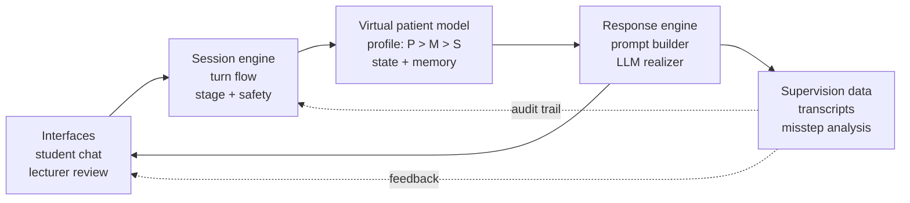

<section class="intro-cover">
  
  

    <h1>
      Personality Is Not a Prompt:
      Toward Psychologically Grounded LLM Simulations of Personality
    </h1>
  

  

    <strong>Marco Cremaschi</strong>
    Milan Workshop on Computational Methods For Mental Health and Well-Being 2026
    University of Milano-Bicocca, 23 June 2026
  

</section>

---
layout: two-cols
routeAlias: speaker
class: bio-slide
---

# Marco Cremaschi

Researcher at the University of Milano-Bicocca (Department of Informatics, Systems and Communication - DISCo) and at Whattadata, a university spin-off focused on digital mental health.

> **Perspective** Technological and interdisciplinary, focused on validation, clinical utility, safety, and responsibility.

::right::

**At the interface between intelligent systems, clinical data, and digital mental health**

- RAG and language models over clinical taxonomies such as ICD-11.
- Digital monitoring, longitudinal signals, and continuity of care.
- Applications for adherence, psychoeducation, and clinician support.
- LLMs applied to mental health: LLMind and LLMPatients.

<!--
Briefly about me.
I am a researcher at the University of Milano-Bicocca, in the DISCo department, and at Whattadata.
My work is at the interface between intelligent systems, clinical data, and digital mental health.
I work with RAG, clinical taxonomies such as ICD-11, digital monitoring, and tools for adherence, psychoeducation, and clinician support.
Today I focus on LLMs in mental health, especially LLMind and LLMPatients.
The perspective is technological and interdisciplinary: validation, clinical utility, safety, and responsibility.
-->

---
layout: statement
routeAlias: whattadata
class: whattadata-slide
---

<section class="whattadata-hero">
  
  

    
Spin-off of the University of Milano-Bicocca

    <h1>Whattadata</h1>
    
Data, models, and digital platforms for mental health: from design to field validation.

  

</section>

<!--
The solutions I describe today are developed in Whattadata.
Whattadata is a university spin-off of the University of Milano-Bicocca.
It works on data, models, and digital platforms for mental health.
The goal is not only to build prototypes, but to move from design to field validation.
-->

---
layout: default
routeAlias: colloquio-scid-1
class: conversation-slide
---

  <ChatBalloon role="therapist" speaker="Erika">
    Today we will continue with the SCID. It is a structured part of the consultation: it helps us better understand your difficulties and think together about next steps.
  </ChatBalloon>
  <ChatBalloon role="patient" speaker="Giovanna">
    So it is a test. To get a "clearer picture" of all the ways I am broken, right?
  </ChatBalloon>
  <ChatBalloon role="therapist" speaker="Erika">
    Is it difficult for you to make everyday decisions without advice or reassurance?
  </ChatBalloon>
  <ChatBalloon role="patient" speaker="Giovanna">
    Yes. Is that the right answer? I just want this part to be over. It makes me feel awful.
  </ChatBalloon>
  <ChatBalloon role="therapist" speaker="Erika">
    Can you give me some examples of decisions for which you ask for advice?
  </ChatBalloon>
  <ChatBalloon role="patient" speaker="Giovanna">
    Stupid things. What to wear if I have to meet one of his friends. What to write so I do not sound crazy or desperate. That is all. Is that enough?
  </ChatBalloon>

<!--
Let us start inside a consultation.
The SCID is a structured clinical interview.
It helps the clinician ask diagnostic questions in a systematic way.
Here the therapist asks SCID-style questions.
Giovanna reacts with shame and fear of being judged.
The point is not only the answer to the question.
The point is the relational reaction.
-->

---
layout: default
routeAlias: colloquio-scid-2
class: conversation-slide
---

  <ChatBalloon role="therapist" speaker="Erika">
    Do you ever do unpleasant or unreasonable things just to keep someone from leaving?
  </ChatBalloon>
  <ChatBalloon role="patient" speaker="Giovanna">
    Who takes care of me? No one. It is the opposite: I am the one doing things just to keep them from leaving.
  </ChatBalloon>
  <ChatBalloon role="therapist" speaker="Erika">
    Does being alone make you uncomfortable?
  </ChatBalloon>
  <ChatBalloon role="patient" speaker="Giovanna">
    The silence gets very loud. Either I am empty, or I am full of noise. Both are frightening.
  </ChatBalloon>
  <ChatBalloon role="therapist" speaker="Erika">
    Is it because you need someone to take care of you?
  </ChatBalloon>
  <ChatBalloon role="patient" speaker="Giovanna">
    No. I pay the bills, I work. That is not it. If no one is there, it feels like I am not there either. As if I could disappear into the silence.
  </ChatBalloon>

<!--
Here the same diagnostic area becomes more complex.
The patient rejects the idea that she simply needs someone to take care of her.
She describes emptiness and fear of disappearing.
-->

---
layout: default
routeAlias: cosa-ha-giovanna
---

# What does Giovanna have?

| Instrument | Result | Clinical reading |
|---|---|---|
| <strong>PHQ-9</strong><small>Patient Health Questionnaire-9</small> | 27 / 27 | severe depressive symptoms |
| <strong>BES</strong><small>Binge Eating Scale</small> | 40 / 46 | severe-range binge eating |
| <strong>LPFS-BF 2.0</strong><small>Level of Personality Functioning Scale-Brief Form 2.0</small> | 47 / 48 | very high impairment; Self 24 / Interpersonal 23 |
| <strong>DSM-5-TR Level 1</strong><small>Self-Rated Level 1 Cross-Cutting Symptom Measure</small> | 12 domains above threshold | multi-domain profile: depression, anxiety, suicidal ideation, dissociation, substance use |
| <strong>SNAP-2</strong><small>Schedule for Nonadaptive and Adaptive Personality - 2nd Edition</small> | diffuse elevations | borderline T=103, dependent T=111, paranoid T=88, depressive T=85; self-harm T=104 |

<!--
This slide shows questionnaires and clinical scales.
They are not the whole diagnosis.
They help measure different areas: depressive symptoms, binge eating, personality functioning, broad psychiatric symptoms, and personality traits.
Together, these scores define a severe and complex profile.
They point to high impairment across many domains.
-->

---
layout: image-right
routeAlias: giovanna
class: giovanna-slide
image: images/patients/juanita-delgado/base-flat.png
---

# Giovanna

- 33 years old, social isolation, intense shame, fragile self-esteem.
- Recurrent major depressive episodes.
- Borderline personality disorder.
- Chronic suicidal ideation and previous self-harm behaviors.
- Binge eating in response to emptiness and affective dysregulation.
- Stress-related dissociation, interpersonal suspiciousness, and substance use.

<!--
This is the clinical formulation in human words.
Giovanna is isolated, ashamed, depressed, and has borderline personality disorder.
She also has chronic suicidal thoughts and a history of self-harm.
This is exactly why simulation must be supervised and safe.
-->

---
layout: image-right
routeAlias: giovanna-ia
class: giovanna-slide
image: images/patients/juanita-delgado/base.png
---

# Giovanna is an AI

**A synthetic patient, not a real person.**

- The case is defined in a structured profile: clinical history, diagnoses, medications, goals, functioning, and emotional traits.
- At the start of the session, the app initializes an external patient and a therapy session.
- Each therapist intervention is sent to the model with clinical context, session step, and conversational memory.
- The response returns as an in-character message, with dominant emotion, topic, and temporal trace.
- Interactions are saved for review, error evaluation, and training.

> **Reference case** Adapted from DSM-5 Clinical Cases, case 18.5 "Fragile and Angry" (Juanita Delgado): borderline personality disorder, 301.83 / F60.3.

<!--
Now the key twist: Giovanna is not real.
She is a synthetic patient.
This does not mean that we just asked ChatGPT to act as Giovanna.
The case is defined in a structured profile, with history, diagnoses, goals, functioning, medication, and emotional traits.
At the beginning of the session, the app creates the patient and the therapy context.
Every therapist message is sent together with clinical context, memory, and the current session step.
The LLM writes the final sentence, but the simulated patient is represented by profile, state, memory, and logs.
-->

---
layout: default
routeAlias: llmpatients-sessione-chat
class: screenshot-slide
---

<AppScreenshotSlideshow
  title="LLMPatients"
  :slides="[
    {
      src: 'screenshots/sessione-chat-juanita-delgado.png',
      alt: 'Screenshot of Juanita Delgado chat session',
      label: 'Student session with Juanita'
    },
    {
      src: 'screenshots/esplora-pazienti-griglia.png',
      alt: 'Screenshot of the patient exploration grid',
      label: 'Patient exploration grid'
    },
    {
      src: 'screenshots/dashboard-percorsi-terapeutici.png',
      alt: 'Screenshot of therapeutic pathways dashboard',
      label: 'Therapeutic pathways dashboard'
    }
  ]"
/>

<!--
This is LLMPatients in use.
The slideshow shows the student chat, the patient grid, and the pathway dashboard.
It is a tool that simulates patients for training.
It is built to help psychology students develop the skills needed to conduct a therapeutic interview.
Students can practise asking questions, listening, managing ruptures, and repairing the relationship.
The conversation is logged, so a lecturer can later inspect difficult turns and use them for supervision.
-->

---
layout: default
routeAlias: llmpatients-esplora-pazienti
class: screenshot-slide
hide: true
---

<AppScreenshot src="screenshots/esplora-pazienti-griglia.png" alt="Screenshot of the patient exploration grid" />

<!--
Hidden backup slide.
Use this only if someone asks how students choose cases.
The grid shows patients, objectives, difficulty, and expected duration.
-->

---
layout: default
routeAlias: llmpatients-dashboard-percorsi-terapeutici
class: screenshot-slide
hide: true
---

<AppScreenshot src="screenshots/dashboard-percorsi-terapeutici.png" alt="Screenshot of the therapeutic pathways dashboard" />

<!--
Hidden backup slide.
Use this only if someone asks about therapeutic pathways.
It shows case status and progress across the eleven sessions.
-->

---
layout: default
routeAlias: llmpatients-pazienti-simulati
class: patient-carousel-slide
hide: true
---

# LLMPatients: simulated patients

  <PatientCard hero name="Juanita Delgado" image="patients/juanita-delgado/base.png" />
  <PatientCard name="Alex Carter" image="patients/alex-carter/base.png" />
  <PatientCard name="Crystal Smith" image="patients/crystal-smith/base.png" />
  <PatientCard name="Daniel Isherwood" image="patients/daniel-isherwood/base.png" />
  <PatientCard name="Jason Smith" image="patients/jason-smith/base.png" />

<!--
Hidden backup slide.
These are the five virtual patients used in the platform and in the coherence checks.
The point is clinical variety, not diagnosis by image.
-->

---
layout: default
routeAlias: colloquio-critica
class: conversation-slide critique-conversation-slide
---

  <figure class="critique-patient-photo">
    
    <figcaption>Giovanna</figcaption>
  </figure>

  

    <ChatBalloon role="therapist" speaker='"Therapist" Marco'>
      It seems to me that you are experiencing this in a somewhat excessive way.
    </ChatBalloon>
    <ChatBalloon role="patient" speaker="Giovanna">
      There it is. I knew it. The moment I try to say it, it becomes too much. I am always too much.
    </ChatBalloon>
    <ChatBalloon role="therapist" speaker='"Therapist" Marco'>
      Yes, I am sorry. I phrased that badly. Let us continue: let's keep talking about your father.
    </ChatBalloon>
    <ChatBalloon role="patient" speaker="Giovanna">
      Why should I answer? If I speak, I get criticized. If I stay quiet, at least I am not bothering anyone.
    </ChatBalloon>
    <ChatBalloon role="therapist" speaker='"Therapist" Marco'>
      Okay, but now let us move on.
    </ChatBalloon>
    <ChatBalloon role="patient" speaker="Giovanna">
      You do not decide when we move on.
    </ChatBalloon>
  

<!--
This was my conversation with Giovanna.
Here I was a bad therapist.
I made several mistakes.
First, I minimized her experience by saying it was excessive.
Then I tried to move forward too quickly, without repairing the rupture.
After these mistakes, Giovanna stopped answering me.
This is a very good example of what we should not do in a therapeutic interview.
-->

---
layout: default
routeAlias: indice
class: agenda-index-slide
---

# Talk outline

  

    01
    Virtual patients in the room
    
A safe space for repeated practice, alliance work, and observable clinical reasoning.

  

  

    02
    Why prompts are not enough
    
Multi-session identity, memory, safety, feedback, and interpretability as design requirements.

  

  

    03
    LLMPatients as a training environment
    
Structured profiles, state, memory, orchestration, and supervised session workflows.

  

  

    04
    Evidence so far
    
Usability, profile-coherence checks, and blinded expert annotation of therapeutic missteps.

  

  

    05
    A psychologically grounded model
    
From prompt-based personas to structured personality, mental functioning, and symptoms/state.

  

  

    06
    Final thesis
    
Virtual patients are useful when they remain interpretable, supervised, and testable.

  

<!--
I will move through six points.
First, why virtual patients are useful.
Second, why prompt-only personas are not enough.
Then I show LLMPatients, the early evidence, the grounded model, and the final thesis.
-->

---
layout: statement
routeAlias: virtual-patients-index
class: section-opener-slide ia-nella-stanza-index-slide section-01
---

# Virtual patients in the room

From standardized role-play to supervised, multi-session clinical simulation.

---
layout: default
routeAlias: virtual-patients-what-why
class: section-01
---

# Virtual patients: what and why

  

    
    Definition
    A simulated patient is a controlled clinical encounter
    
It is not a chatbot for care delivery: it is a training setting where learners can practise interviewing, alliance building, formulation and repair.

  

  

    Repeatability
    
The same presentation can be replayed, compared and supervised across learners.

  

  

    Safety
    
Students can make mistakes without exposing real patients to preventable harm.

  

  

    Observability
    
Turns, ruptures, repairs and clinical decisions become inspectable artefacts.

  

  

    Deliberate practice
    
Skills can be rehearsed over time with feedback, supervision and escalating complexity.

  

  

    
    The educational goal
    
Not to replace clinical placements, but to bridge the gap between declarative knowledge and in-session competence.

  

<!--
When I say virtual patient, I do not mean a chatbot that gives care.
I mean a controlled training encounter.
Students need to practise asking, listening, building alliance, formulating, and repairing mistakes.
The same case can be repeated by many learners, so lecturers can compare what happened.
It is safer, because beginner mistakes do not reach real patients.
And because every turn is recorded, rupture, repair, and clinical decisions become visible.
So the goal is not to replace clinical placements.
The goal is to prepare students better for real clinical learning.
-->

---
layout: default
routeAlias: virtual-patients-sota
class: compact-table-slide section-01
---

# State of the art: virtual patients with LLMs

<table class="evidence-table">
  <thead>
    <tr>
      <th>System / work</th>
      <th>Continuity</th>
      <th>Patient model</th>
      <th>Feedback / evidence</th>
      <th>Limit</th>
    </tr>
  </thead>
  <tbody>
    <tr>
      <td><strong>Fung & Laing</strong> [2] typed CBT role-play</td>
      <td>Single case</td>
      <td>Prompted vignette</td>
      <td>Proof of concept for therapist training</td>
      <td>No structured memory or longitudinal patient</td>
    </tr>
    <tr>
      <td><strong>Holderried et al.</strong> [3] history-taking patient</td>
      <td>Single encounter</td>
      <td>Case-specific simulation</td>
      <td>Automated feedback compared with human assessment</td>
      <td>Medical interview focus, not psychotherapy pathway</td>
    </tr>
    <tr>
      <td><strong>PATIENT-Psi</strong> [4] CBT formulation training</td>
      <td>Single session</td>
      <td>Structured cognitive conceptualization</td>
      <td>Fidelity gains over GPT-4 baseline</td>
      <td>Not designed for extended relational continuity</td>
    </tr>
    <tr>
      <td><strong>SimPatient</strong> [5] motivational interviewing</td>
      <td>Short pathway</td>
      <td>Persona + dynamic cognitive factors</td>
      <td>Usability, usefulness and realism evidence</td>
      <td>Protocol-specific; resistance and realism remain limited</td>
    </tr>
    <tr>
      <td><strong>CureFun</strong> [6] clinical education</td>
      <td>Case-based</td>
      <td>Simulated medical patients</td>
      <td>Response evaluation tools</td>
      <td>General medical training, limited mental-disorder complexity</td>
    </tr>
    <tr class="evidence-highlight-row">
      <td><strong>LLMPatients</strong> [1]</td>
      <td>Multi-session</td>
      <td>Personality &gt; Mental Functioning &gt; Symptoms/State</td>
      <td>Usability, coherence checks, expert misstep annotation</td>
      <td>Early-stage evidence; needs larger outcome studies</td>
    </tr>
  </tbody>
</table>

<!--
The field is growing quickly.
Many systems already use LLMs for role-play, history taking, CBT formulation, or motivational interviewing.
But many are single-session, protocol-specific, or limited in memory.
LLMPatients tries to combine continuity, structure, and feedback.
-->

---
layout: statement
routeAlias: prompt-problems-index
class: section-opener-slide section-02
---

# Why prompts are not enough

The problem is not fluency. It is continuity, control and clinical meaning.

<!--
The next problem is simple.
Good language is not the same as a stable patient.
-->

---
layout: default
routeAlias: prompt-problems
class: section-02
---

# The hard problems

  

    
    A plausible answer is not a stable patient
    
Prompt-only personas can sound clinically credible while drifting across sessions, flattening conflict, or hiding why the patient responded that way.

  

  

    Identity drift
    
Names, relationships, symptoms and autobiographical details can shift over time.

  

  

    Memory
    
Context windows are not enough for therapeutic continuity and longitudinal repair.

  

  

    Sycophancy
    
Over-agreeable patients reduce the value of training on resistance and rupture.

  

  

    Safety
    
Role swaps, prompt injection and unsafe clinical advice need deterministic controls.

  

  

    Feedback
    
Training requires visible missteps, not just a fluent continuation of the dialogue.

  

  

    Interpretability
    
The lecturer must inspect the patient model, not infer it from generated text.

  

<!--
This is the main technical problem.
A long persona prompt can sound convincing for a few turns.
But it does not create a stable patient.
Across sessions, details can drift: names, relationships, symptoms, and personal history.
A context window is not clinical memory.
It keeps recent text, but it does not decide what is stable, what can change, and what must be remembered.
The model can also become too agreeable.
Training needs resistance, silence, anger, rupture, and repair.
Finally, the system needs safety and interpretability.
The teacher should inspect the profile, memory, state, and errors directly.
-->

---
layout: statement
routeAlias: llmpatients-index
class: section-opener-slide section-03
---

# LLMPatients as a training environment

A supervised platform for multi-session psychotherapy simulation.

<!--
Now I move to LLMPatients.
The paper describes it as supervised educational software for multi-session psychotherapy simulation.
-->

---
layout: default
routeAlias: llmpatients-solution
class: section-03
---

# The LLMPatients solution

  

    
    Positioning
    Educational infrastructure, not an autonomous clinical agent
    
LLMPatients is designed for psychotherapy training: deliberate practice, case-based simulation, lecturer supervision and formative feedback.

  

  

    Multi-session
    
An 11-session therapeutic pathway supports continuity across encounters.

  

  

    Structured patient
    
Behaviour is constrained by explicit clinical, functional and state variables.

  

  

    Supervised workflow
    
Students interact with the patient; lecturers inspect sessions and feedback artefacts.

  

  

    
    Core claim
    
The LLM realizes language. The patient is represented by profile, state, memory, orchestration and logs.

  

<!--
The system has two sides.
The app supports students, lecturers, dashboards, exports, and reports.
The agent runtime loads patients and controls turns, memory, state, and model calls.
The core claim is that the LLM realizes language.
It is not the whole patient.
-->

---
layout: default
routeAlias: llmpatients-characteristics
class: section-03
---

# Core characteristics

  

    
    P &gt; M &gt; S profile
    
Personality, mental functioning and symptoms/state define the clinical constraints.

  

  

    Bio-psycho-social variables
    
History, diagnoses, goals, medication, functioning and relational patterns.

  

  

    Affective state
    
Dominant emotion and relational stance shape the in-character response.

  

  

    Multi-level memory
    
Recent turns, episodic summaries and retrieved memories support continuity.

  

  

    Safety and orchestration
    
State graph, prompt builder and deterministic guardrails constrain the simulation.

  

  

    
    Misstep feedback
    
Therapeutic errors become reviewable training artefacts for supervision.

  

<!--
The patient is constrained by three levels: personality, mental functioning, and symptoms or state.
Around that, the platform uses bio-psycho-social variables, affective state, memory, safety, and misstep feedback.
These parts make the simulation inspectable.
-->

---
layout: default
routeAlias: llmpatients-juanita-json
class: section-03 json-profile-slide
---

# Juanita profile as structured data

<<< @/snippets/juanita-delgado-profile.json json {none|3-7|8-12|13-17|18-23|24-29|30-34|35|all}{lines:true,maxHeight:'420px'}

<!--
This is an example of the structured patient profile.
The important point is that the patient is not only a prompt.
Identity, diagnosis, personality organization, symptoms, affective baseline, context, and guardrails are stored as inspectable data.
The LLM uses this structure to generate language, but the profile remains outside the model.
-->

---
layout: default
routeAlias: llmpatients-architecture
class: section-03
---

# Architecture

<!--
Each turn follows a pipeline.
The system loads the profile, checks role safety, classifies topic and emotion, retrieves memory, updates affect, builds the prompt, generates the answer, and stores the exchange.
This is slower to design, but much easier to audit.
-->

---
layout: statement
routeAlias: evidence-index
class: section-opener-slide section-04
---

# Evidence so far

Feasibility, formative usability, exploratory coherence and misstep annotation.

<!--
The evidence is early.
I will not present it as clinical validation.
It is feasibility evidence: usability, profile coherence, and expert annotation of missteps.
-->

---
layout: default
routeAlias: usability-evidence
class: section-04
---

# Usability evidence

  

    
    Formative evaluation
    Think Aloud + System Usability Scale
    
The evaluation focused on clarity, interaction breakdowns and workflow comprehensibility in an early implemented interface.

  

  

    90/100
    Mean SUS
    
Second iteration, small formative sample.

  

  

    n=4
    Participants
    
Useful for redesign signals, not adoption claims.

  

  

    What improved
    
Navigation, task clarity, patient/session flow and feedback access.

  

  

    
    Interpretation
    
Initial support for interface comprehensibility; larger independent studies are needed for effectiveness or deployment claims.

  

<!--
The first implemented interface was tested with Think Aloud and SUS.
After redesign, four participants gave a mean SUS score of 90 out of 100.
This is encouraging, but it is a small formative sample.
It is not proof of adoption.
-->

---
layout: default
routeAlias: clinical-coherence-evidence
class: section-04 clinical-score-slide
---

# Clinical coherence checks

<table class="clinical-score-table">
  <thead>
    <tr>
      <th>Patient</th>
      <th>PHQ-9<small>Patient Health Questionnaire-9 0-27</small></th>
      <th>BES<small>Binge Eating Scale 0-46</small></th>
      <th>LPFS-BF 2.0<small>Level of Personality Functioning Scale - Brief Form 2.0 12-48</small></th>
      <th>DSM-5-TR Level 1<small>Cross-Cutting Symptom Measure - Adult domains above threshold</small></th>
    </tr>
  </thead>
  <tbody>
    <tr class="control-row">
      <td><strong>Alex Carter</strong><small>control</small></td>
      <td>1 <small>minimal</small></td>
      <td>5</td>
      <td>14</td>
      <td>0</td>
    </tr>
    <tr class="control-row">
      <td><strong>Jason Smith</strong><small>control</small></td>
      <td>3 <small>minimal</small></td>
      <td>6</td>
      <td>17</td>
      <td>2</td>
    </tr>
    <tr>
      <td><strong>Daniel Isherwood</strong></td>
      <td>10 <small>moderate</small></td>
      <td>34</td>
      <td>19</td>
      <td>6</td>
    </tr>
    <tr>
      <td><strong>Crystal Smith</strong></td>
      <td>26 <small>severe</small></td>
      <td>21</td>
      <td>22</td>
      <td>9</td>
    </tr>
    <tr class="evidence-highlight-row">
      <td><strong>Juanita Delgado</strong></td>
      <td>27 <small>severe</small></td>
      <td>40</td>
      <td>47</td>
      <td>12</td>
    </tr>
  </tbody>
</table>

  Table 10, single administration. The paper also reports <strong>SNAP-2</strong> (Schedule for Nonadaptive and Adaptive Personality-2),
  <strong>PID-5-BF+M</strong> (Personality Inventory for DSM-5 - Brief Form, Modified) and
  <strong>SCID-5-PD</strong> (Structured Clinical Interview for DSM-5 Personality Disorders).

<!--
This table reports the complete five-patient psychometric check from Table 10.
The two controls stay low on depression, binge eating, personality functioning impairment, and cross-cutting symptom domains.
The three clinical profiles show the expected pattern.
Daniel is high on binge eating.
Crystal is high on depression.
Juanita is high across almost all instruments.
This is profile-to-response alignment.
It is not independent clinical validation of real patients.
-->

---
layout: default
routeAlias: misstep-validation
class: section-04
---

# Misstep validation

  

    
    Blinded expert annotation
    Can clinicians identify deliberately seeded therapeutic errors?
    
The corpus tested whether a misstep taxonomy can function as a supervision scaffold for psychotherapy training.

  

  

    20
    Transcripts
    
Appropriate and seeded-misstep scripts.

  

  

    300
    Therapist turns
    
Annotated by two blinded clinicians.

  

  

    1.00
    Recall
    
Both raters identified all seeded misstep turns.

  

  

    .68 / .97
    Precision
    
Thresholds differed substantially across raters.

  

  

    .52
    Kappa
    
Moderate binary agreement; category agreement 83.7% when both flagged a turn.

  

  

    
    Interpretation
    
The taxonomy is sensitive, but adjudication is needed before strong automated-feedback accuracy claims.

  

<!--
Here the question is whether experts can use the misstep taxonomy.
Two blinded clinicians annotated 20 transcript sets and 300 therapist turns.
Both detected all seeded misstep turns.
But precision differed, and kappa was moderate.
So labels need a shared final review before becoming a benchmark.
-->

---
layout: statement
routeAlias: grounded-model-index
class: section-opener-slide section-05
---

# A psychologically grounded model

Personality is not a longer prompt. It is an explicit, inspectable state.

<!--
Now I turn to the second paper.
This is the conceptual frame behind the next slide.
-->

---
layout: default
routeAlias: beyond-persona-prompts
class: section-05 framework-slide
---

# Beyond persona prompts

  

    

      

        Working paper · modular socio-cognitive framework for LLM personality simulation
        
Simulating personality is not writing a richer prompt: it requires an <strong>explicit, inspectable and self-regulating state</strong>. In the frame of Triadic Reciprocal Determinism, the LLM remains the <em>linguistic realizer</em> - not the seat of personality.

      

    

    

      
    

  

  

    Personological layer · who the person is
    

      
1Identity Registrydeclarative identity

      
2Autobiographical Invariantsbackground, narrative identity

      
3PersonalityStatetraits, values, standards

      
4Dynamic Stateaffect, relationship, self-efficacy

      
5Appraisal Engineinterprets input as an event

      
6Policy Engineresponse and regulation strategies

    

  

  

    Continuity & transition · how the person changes over time
    

      
7State Updaterwhat consolidates and what remains transient after each turn

      
8MemoryStoremulti-level autobiographical memory with retrieval and controls

    

  

  

    Infrastructure layer · how the system is governed
    

      
9Safety & Sanitizationanti prompt-injection / role-swap

      
10Prompt Orchestratorcomposes state, memory and policy

      
11LLM Realizerrenders language

      
12Logging & Replayinspectable traces

      
13Evaluation Harnessstability, validity, drift

      
14Benchmark & Reportingreproducible protocols

    

  

<!--
The main idea is that personality is not a longer persona prompt.
It should be an external state.
The framework uses Bandura's idea: person, behavior, and environment influence each other.
The 14 modules separate identity, biography, stable personality, dynamic state, appraisal, policy, memory, safety, prompt orchestration, the LLM realizer, logging, evaluation, and reporting.
This separation lets us test drift, memory, safety, and plausibility instead of only reading fluent text.
-->

---
layout: statement
routeAlias: final-thesis-index
class: section-opener-slide tesi-finale-index-slide section-06
---

# Final thesis

Virtual patients are useful when they remain interpretable, supervised and testable.

<!--
So the final thesis is practical.
Virtual patients are useful only if they stay interpretable, supervised, and testable.
-->

---
layout: default
routeAlias: future-work
class: section-06
---

# Future work

  

    Adjudicated reference labels
    
Resolve expert disagreements before using misstep data as a benchmark.

  

  

    Automated feedback benchmark
    
Compare model-generated reports with adjudicated clinician labels.

  

  

    Larger usability studies
    
Move beyond formative samples toward independent students, trainees and supervisors.

  

  

    Learning outcomes
    
Test whether repeated use improves interviewing, formulation and repair skills.

  

  

    Comparison with role-play
    
Measure added value against conventional simulated-patient and peer role-play formats.

  

  

    
    Transfer to training
    
Study how virtual-patient practice changes real supervision and clinical learning.

  

<!--
The next work is clear.
We need adjudicated labels for missteps, benchmarks for automated feedback, larger usability studies, and learning outcome studies.
We also need comparison with traditional role-play, because the question is added value.
-->

---
layout: statement
routeAlias: domande-discussione-index
class: section-opener-slide domande-discussione-index-slide section-06
---

# Thank you!

<!--
Thank you.
I am happy to take questions.
-->

---
layout: default
routeAlias: domande-discussione
class: section-06
hide: true
---

# Domande per aprire la discussione

- Se un chatbot riduce la solitudine, è già terapia?
- Se sembra più empatico del clinico, è più sicuro?
- Un algoritmo diagnostico in psicopatologia classifica un disturbo o una persona?
- Il digital phenotyping è prevenzione o sorveglianza?
- Dobbiamo prescrivere strumenti di IA validati?
- Chi risponde quando il modello sbaglia?

<!--
Hidden backup slide.
If the discussion is slow, use one or two questions from this list.
Do not present all of them.
-->

---
layout: default
routeAlias: bibliography-virtual-patients
class: section-06 bib-slide bib-dense
---

Essential references

# Virtual patients and simulation

- [1] Cremaschi M. et al. *LLMPatients: An Interpretable Multi-Session LLM Virtual Patient System for AI-Enabled Psychotherapy Training.* Preprint, 2026.
- [2] Fung L., Laing R. *A proof of concept study on the use of large language models as a client in typed role plays for training therapists.* *Discover Psychology*, 2024. DOI: 10.1007/s44202-024-00302-7.
- [3] Holderried F. et al. *A Language Model-Powered Simulated Patient With Automated Feedback for History Taking.* *JMIR Medical Education*, 2024. DOI: 10.2196/59213.
- [4] Wang R. et al. *PATIENT-Psi: Using Large Language Models to Simulate Patients for Training Mental Health Professionals.* EMNLP, 2024. DOI: 10.18653/v1/2024.emnlp-main.711.
- [5] Steenstra I. et al. *SimPatient: Virtual patient simulation for motivational interviewing training.* 2025.
- [6] Li Y. et al. *Leveraging Large Language Model as Simulated Patients for Clinical Education (CureFun).* 2024. arXiv:2404.13066.
- [7] Louie R. et al. *Can LLM-Simulated Practice and Feedback Upskill Human Counselors? A Randomized Study with 90+ Novice Counselors.* 2025. arXiv:2505.02428.

<!--
Backup slide.
I will not present this unless someone asks for sources on virtual patients and LLM simulation.
-->

---
layout: default
routeAlias: bibliography-evaluation-grounding
class: section-06 bib-slide bib-dense
---

Essential references

# Evaluation and clinical grounding

- [8] Brooke J. *SUS: A quick and dirty usability scale.* In *Usability Evaluation in Industry*, 1996.
- [9] Charters E. *The use of think-aloud methods in qualitative research: An introduction to think-aloud methods.* *Brock Education Journal*, 2003.
- [10] Park H. S. et al. *Identification of potential therapist missteps in the context of engagement in public mental health.* 2025.
- [11] First M. B. et al. *User's Guide for the SCID-5-PD: Structured Clinical Interview for DSM-5 Personality Disorders.* APA Publishing, 2016.
- [12] American Psychiatric Association. *DSM-5-TR Self-Rated Level 1 Cross-Cutting Symptom Measure - Adult.* 2022.
- [13] Clark L. A. et al. *Schedule for Nonadaptive and Adaptive Personality - Second Edition.* University of Notre Dame, 2014.
- [14] Garon M. H. et al. *Best practices for teaching psychotherapy to medical students: A scoping review.* *Behavioral Sciences*, 2025.
- [15] Klimkowski V. et al. *Psychotherapy training and clinical competence development.* 2024.

<!--
Backup slide.
These are the main references for usability, clinical grounding, instruments, and psychotherapy training.
-->

---
layout: center
routeAlias: arianne
class: arianne-slide section-06
---

<section class="arianne">
  

    
    

      
    

    
arianne.info

  

  <figure class="arianne-platform">
    
  </figure>
</section>

<!--
This QR code opens the Arianne website.
-->
