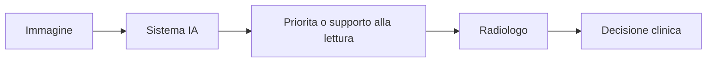
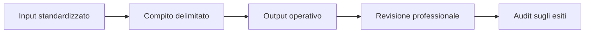
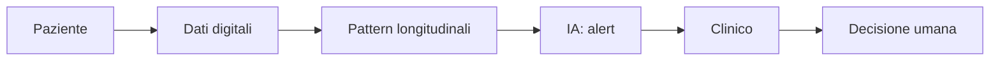

# Intelligenza artificiale

# al servizio della psicopatologia

Modelli generativi, digital phenotyping e nuove forme della relazione clinica

**Marco Cremaschi**  
IX Giornata Scientifica AIPP  
Piacenza, 12 giugno 2026

<!--
Aprire collocando l'intervento nella giornata AIPP: nativi digitali, socialità, psicopatologie emergenti e prospettive terapeutiche. Dire subito che l'IA è già entrata nella salute mentale, ma spesso dalla porta sbagliata: non attraverso servizi validati e governati, ma attraverso smartphone, chatbot e motori generativi usati dai pazienti. L'obiettivo non è promuovere l'IA, ma capire quando può servire davvero la psicologia e la psichiatria.
-->

---
layout: two-cols
---

#  Marco Cremaschi

Ricercatore presso l'Università degli Studi di Milano-Bicocca, Dipartimento di Informatica, Sistemistica e Comunicazione.

> Punto di vista: tecnologico e interdisciplinare, orientato a validazione, utilità clinica, sicurezza e responsabilità.

::right::

**Interfaccia tra sistemi intelligenti, dati clinici e salute mentale digitale**

- RAG e modelli linguistici su tassonomie cliniche come ICD-11.
- Monitoraggio digitale, segnali longitudinali e continuità terapeutica.
- Applicazioni per aderenza, psicoeducazione e supporto al clinico.
- Pazienti simulati per formazione, supervisione e ragionamento clinico.

<!--
Presentarsi in modo coerente con il pubblico clinico: non come psichiatra o psicoterapeuta, ma come ricercatore informatico che lavora sui sistemi di IA applicati alla salute mentale. Citare rapidamente le linee rilevanti: modelli linguistici su ICD-11 e tassonomie cliniche, monitoraggio digitale, applicazioni di aderenza e pazienti simulati come LLMPatients. Questa slide serve anche a dichiarare il perimetro: la prospettiva è tecnica e interdisciplinare, ma il criterio di giudizio resta clinico, etico e organizzativo.
-->

---
layout: default
background: '#ffffff'
---

# LLMPatients-App: quando il test diventa relazione

Giovanna, sessione Erika, SCID. Estratto tradotto e leggermente adattato.

  

    <strong style="color: #84cc16;">Erika</strong> 
    Oggi proseguiamo con la SCID. È una parte strutturata della consultazione: serve a capire meglio le tue difficoltà e a pensare insieme ai prossimi passi.
  

  

    <strong style="color: #bef264;">Giovanna</strong> 
    Quindi è un test. Per avere un “quadro più chiaro” di tutti i modi in cui sono rotta, giusto?
  

  

    <strong style="color: #84cc16;">Erika</strong> 
    Ti è difficile prendere decisioni quotidiane senza consigli o rassicurazioni?
  

  

    <strong style="color: #bef264;">Giovanna</strong> 
    Sì. È questa la risposta giusta? Vorrei solo che questa parte finisse. Mi fa stare malissimo.
  

  

    <strong style="color: #84cc16;">Erika</strong> 
    Puoi farmi qualche esempio delle decisioni per cui chiedi consiglio?
  

  

    <strong style="color: #bef264;">Giovanna</strong> 
    Cose stupide. Cosa indossare se devo incontrare un suo amico. Cosa scrivere per non sembrare pazza o disperata. È tutto. Va bene così?
  

<!--
Questa slide usa una conversazione reale con il profilo originale LLMPatients, qui rinominato Giovanna, step 3, durante una sequenza SCID. Il punto non è mostrare una risposta "perfetta", ma far vedere che una domanda strutturata non resta mai solo tecnica: il paziente simulato la interpreta come test, giudizio, minaccia di fallimento. Giovanna non risponde soltanto al contenuto della domanda; reagisce al modo in cui la domanda la colloca. Presentare l'estratto come traduzione abbreviata e leggermente adattata per chiarezza didattica.
-->

---
layout: default
background: '#ffffff'
---

# LLMPatients-App: il punto non è “dipendenza”

La stessa domanda clinica può essere vissuta come giudizio, prova o minaccia.

  

    <strong style="color: #84cc16;">Erika</strong> 
    Ti capita di fare cose sgradevoli o irragionevoli pur di evitare che qualcuno si allontani?
  

  

    <strong style="color: #bef264;">Giovanna</strong> 
    Chi è che si prende cura di me? Nessuno. È il contrario: sono io che faccio cose solo per non farli andare via.
  

  

    <strong style="color: #84cc16;">Erika</strong> 
    Stare da sola ti mette a disagio?
  

  

    <strong style="color: #bef264;">Giovanna</strong> 
    Il silenzio diventa fortissimo. O sono vuota, o sono piena di rumore. Entrambe le cose fanno paura.
  

  

    <strong style="color: #84cc16;">Erika</strong> 
    È perché hai bisogno che qualcuno si occupi di te?
  

  

    <strong style="color: #bef264;">Giovanna</strong> 
    No. Pago le bollette, lavoro. Non è quello. Se nessuno c’è, sembra che non ci sia neanche io. Come se potessi sparire nel silenzio.
  

<!--
Qui la sequenza diventa più clinicamente interessante: una domanda pensata per esplorare la dipendenza viene riformulata da Giovanna come esperienza di annullamento. Non è "qualcuno deve occuparsi di me", ma "se non c’è nessuno, io non esisto abbastanza". Usare questo passaggio per introdurre il punto centrale: un LLM-patient può essere utile nella formazione quando costringe il clinico ad ascoltare il significato soggettivo, non solo a spuntare criteri diagnostici.
-->

---
layout: default
background: '#ffffff'
---

# Cosa ha Giovanna?

LLMPatients-App. Risultati dei test psicometrici riportati nel paper.

| Strumento | Risultato | Lettura clinica |
|---|---|---|
| **PHQ-9** | 27 / 27 | sintomatologia depressiva severa |
| **BES** | 40 / 46 | binge eating in fascia severa |
| **LPFS-BF 2.0** | 47 / 48 | compromissione molto elevata; Sé 24 / Interpersonale 23 |
| **DSM-5-TR Level 1** | 12 domini sopra soglia | profilo multi-dominio: depressione, ansia, ideazione suicidaria, dissociazione, sostanze |
| **SNAP-2** | elevazioni diffuse | borderline T=103, dependent T=111, paranoid T=88, depressive T=85; self-harm T=104 |

> I risultati supportano una coerenza preliminare tra profilo atteso e comportamento simulato, ma sono una singola compilazione descrittiva: non misurano stabilità, varianza o validità diagnostica fine.

<!--
Aprire la slide come domanda al pubblico: "Cosa ha Giovanna?". Lasciare qualche secondo prima di mostrare che la tentazione è rispondere con un'etichetta diagnostica, mentre il punto formativo è costruire una formulazione clinica. I risultati psicometrici del paper mostrano una presentazione severa e multi-dominio: depressione, disregolazione alimentare, compromissione del funzionamento della personalità, ideazione suicidaria, dissociazione e tratti di personalità patologici. Spiegare che i questionari sono stati somministrati automaticamente al paziente simulato, con risposte in character e scoring deterministico. Non presentarlo come prova che il sistema "diagnostica" o "misura" davvero un paziente: è un controllo di coerenza della simulazione. Specificare che il paper stesso invita a interpretare i risultati come profilo puntuale, non come stima di stabilità o validità diagnostico-differenziale fine.
-->

---
layout: image-right
image: /images/patients/juanita_delgado/base.png
---

# Giovanna

**Profilo clinico simulato**

- 33 anni, isolamento sociale, vergogna intensa, autostima fragile.
- Episodi depressivi maggiori ricorrenti.
- Disturbo borderline di personalità.
- Ideazione suicidaria cronica e pregresse condotte autolesive.
- Binge eating in risposta a vuoto e disregolazione affettiva.
- Dissociazione da stress, sospettosità interpersonale e uso di sostanze.

> Non una sola etichetta: una formulazione longitudinale.

<!--
Questa slide risponde alla domanda precedente senza chiuderla troppo presto. Dire che Giovanna è costruita come profilo clinico complesso: depressione ricorrente e organizzazione borderline sono le diagnosi esplicite del profilo, ma i test e la conversazione mostrano anche disregolazione alimentare, rischio suicidario, dissociazione, fragilità identitaria e difficoltà relazionali. Sottolineare che non è l'IA a "diagnosticare Giovanna": l'app usa un profilo clinico progettato e poi controlla se la simulazione mantiene coerenza psicopatologica. Questo è il punto formativo: non sostituire il ragionamento clinico, ma offrire un caso sintetico abbastanza consistente da allenare osservazione, ipotesi e risposta terapeutica.
-->

---
layout: default
---

# Giovanna è un'IA

**Un paziente sintetico, non una persona reale.**

- Il caso è definito in un profilo strutturato: storia clinica, diagnosi, farmaci, obiettivi, funzionamento e tratti emotivi.
- All'avvio della seduta l'app inizializza un paziente esterno e una sessione terapeutica.
- Ogni intervento del terapeuta viene inviato al modello con contesto clinico, step della seduta e memoria conversazionale.
- La risposta torna come messaggio in character, con emozione dominante, topic e traccia temporale.
- Le interazioni vengono salvate per revisione, valutazione degli errori e formazione.

> La simulazione è utile solo se resta dichiarata come simulazione.

<!--
Spiegare in modo semplice che Giovanna non è una paziente reale e non va presentata come tale. È un agente conversazionale costruito a partire da un profilo clinico strutturato: dati anagrafici, diagnosi, storia, farmaci, obiettivi terapeutici, funzionamento mentale e tratti emotivi. Nell'app, il profilo viene inizializzato dentro una sessione; poi ogni messaggio del terapeuta viene inviato al generatore insieme allo step del percorso e alla memoria della conversazione. Il modello restituisce una risposta in character e metadati come emozione, topic e andamento emotivo. Il valore formativo sta nella coerenza simulativa, non nell'autenticità esperienziale: Giovanna non soffre, ma può aiutare il clinico ad allenare osservazione, timing, errori e riparazioni.
-->

---
layout: default
background: '#f8fafc'
---

# LLMPatients-App: schermata di lavoro

  

    
LLMPatients

    

      
      

        
Giovanna

        
Step 3 · SCID

      

    

    

      
Emozione<strong style="color:#bef264;">vergogna</strong>

      
Alleanza<strong style="color:#facc15;">fragile</strong>

      
Rischio<strong style="color:#fb7185;">da monitorare</strong>

    

    
Profilo strutturato, memoria della seduta e tracciamento degli scambi per debriefing clinico.

  

  

    

      
      sessione terapeutica simulata
    

    

      
<strong style="color:#84cc16;">Terapeuta</strong> Quando ti senti sola, che cosa succede dentro di te?

      
<strong style="color:#bef264;">Giovanna</strong> Prima mi convinco che non importi a nessuno. Poi mi vergogno anche di averlo pensato.

      
<strong style="color:#84cc16;">Terapeuta</strong> Ti va di restare un momento su quella vergogna?

      
<strong style="color:#bef264;">Giovanna</strong> Se ci resto, ho paura che diventi l'unica cosa vera di me.

    

  

<!--
Usare questa slide come screenshot didattico dell'app: non vendere la tecnologia, ma mostrare concretamente il setting di simulazione. Evidenziare tre elementi: profilo del paziente, conversazione in character e tracciamento utile al debriefing. Specificare verbalmente che la schermata è una rappresentazione sintetica/editabile della logica dell'app se non si usa uno screenshot reale.
-->

---
layout: default
background: '#ffffff'
---

# LLMPatients: carrellata di pazienti simulati

  

    
    
<strong>Giovanna</strong> depressione ricorrente · borderline · binge eating

  

  

    
M

    
<strong>Matteo</strong> ansia sociale · evitamento · ritiro universitario

  

  

    
S

    
<strong>Sara</strong> trauma complesso · iperarousal · dissociazione

  

  

    
L

    
<strong>Luca</strong> episodio maniacale · insonnia · impulsività

  

  
<strong>Storia clinica</strong> timeline, diagnosi, farmaci, eventi critici

  
<strong>Stile relazionale</strong> difese, alleanza, sensibilità alla critica

  
<strong>Obiettivo formativo</strong> anamnesi, rischio, riparazione, debriefing

<!--
La carrellata serve a chiarire che Giovanna non è un caso isolato: l'idea degli LLM-patients è costruire pazienti sintetici differenti, ciascuno con storia, stile relazionale e obiettivo formativo. Non presentare i nomi come diagnosi viventi: sono scenari didattici per allenare il colloquio e il ragionamento clinico.
-->

---
layout: default
background: '#ffffff'
---

# Quando il paziente sintetico reagisce alla critica

  

    <strong style="color:#84cc16;">Terapeuta</strong> 
    Mi sembra che tu stia vivendo questa cosa in modo un po' eccessivo.
  

  

    <strong style="color:#bef264;">Giovanna</strong> 
    Ecco. Lo sapevo. Appena provo a dirlo, diventa troppo. Sono sempre troppo.
  

  

    <strong style="color:#84cc16;">Terapeuta</strong> 
    Proviamo a capire meglio: che cosa hai sentito quando ti ho detto così?
  

  

    <strong style="color:#bef264;">Giovanna</strong> 
    Che cosa rispondo a fare? Se parlo, poi vengo criticata. Se sto zitta, almeno non do fastidio.
  

  Il valore formativo non è la risposta perfetta del modello, ma la possibilità di osservare errore, rottura e riparazione dell'alleanza.

<!--
Usare questa scena come piccolo micro-fallimento terapeutico. Il terapeuta formula un commento critico e Giovanna lo vive come conferma di vergogna e rifiuto. Il punto formativo è la riparazione: l'LLM-patient diventa utile quando permette di esercitare timing, tono, riconoscimento dell'impatto e recupero dell'alleanza.
-->

---
layout: default
---

# Indice del talk

1. **IA già nella stanza**: chatbot, app e nuovi interlocutori digitali.
2. **Lezioni dalla medicina dell'immagine**: validazione, workflow, confini.
3. **Psicopatologia e dati**: linguaggio, digital phenotyping, monitoraggio.
4. **Rischi clinici**: empatia simulata, dipendenza, sycophancy, crisi.
5. **Governance nei servizi**: responsabilità, supervisione, uso previsto.

> La diagnostica per immagini è un confronto utile, non il modello da copiare.

<!--
Usare questa slide come promessa di percorso. Dopo il caso del paziente sintetico, il talk si allarga al fatto che l'IA è già nella stanza di consultazione perché i pazienti la usano. La parte centrale confronta la maturità dell'IA in medicina dell'immagine con la complessità della psicopatologia. La parte finale torna ai servizi: usi realistici, rischi patient-facing e condizioni di governance. Chiarire che il filo non è "copiare la radiologia", ma imparare da validazione, workflow, responsabilità e limiti.
-->

---
layout: default
---

# Perché parlarne qui, oggi?

- I pazienti vivono già in un ecosistema digitale.
- Chatbot, app e sistemi generativi stanno diventando interlocutori quotidiani.
- La clinica li incontra spesso dopo, quando hanno già prodotto significati.
- La domanda non è se l'IA entrerà nei servizi, ma come governarla.

> Domanda: quanti pazienti arrivano già con una diagnosi, un consiglio o una spiegazione ricevuta da un sistema generativo?

<!--
Questa slide serve ad agganciare il pubblico. Non parlare dell'IA come oggetto esterno alla clinica, ma come parte del paesaggio dei nativi digitali. Per molti pazienti chiedere a un chatbot informazioni su ansia, depressione, farmaci, relazioni o identità è già una pratica ordinaria. Il clinico spesso lo scopre solo dopo. Questo produce una nuova responsabilità anamnestica.
-->

---
layout: statement
---

# La socialità digitale è già un dato clinico.

Non è solo "tempo online": è ambiente, linguaggio, appartenenza, confronto, ritiro, esposizione.

<!--
Collegare esplicitamente l'intervento al tema della giornata: la socialità dei nativi digitali. Nei servizi incontriamo ragazzi e adulti per cui identità, amicizie, conflitti, sessualità, vergogna e riconoscimento passano anche da piattaforme digitali. L'IA generativa si innesta su questo ecosistema: non sostituisce semplicemente i social, ma introduce interlocutori artificiali capaci di rispondere, consolare, spiegare e orientare scelte.
-->

---
layout: default
---

# Un nuovo "terzo" nella stanza

> “Un ragazzo di 19 anni, socialmente ritirato, arriva in consultazione. Prima di parlare con uno psicologo ha parlato per settimane con un chatbot. Gli ha chiesto se fosse depresso, se dovesse prendere farmaci, se i genitori fossero tossici, se la vita avesse senso.”

**Come cambia l’anamnesi?**  
**Come cambia la relazione terapeutica?**  
**E chi è il terzo interlocutore nella stanza?**

<!--
Usare questa vignetta come apertura clinica dell'intervento. Non patologizzare automaticamente l'uso del chatbot: può ridurre vergogna, offrire parole e creare un primo ponte verso la cura. Ma può anche rinforzare ritiro, dipendenza, evitamento, credenze rigide e sfiducia verso le relazioni umane. La domanda da lasciare sospesa è tripla: l'anamnesi deve includere gli interlocutori artificiali, la relazione terapeutica non è più solo diadica e il "terzo" digitale può avere effetti protettivi o iatrogeni.
-->

---
layout: statement
---

# Quando diciamo IA in salute mentale, a cosa pensiamo?

Chatbot? Algoritmi predittivi? App? Wearable? Cartella clinica? Linguaggio?

<!--
Usare questa slide come domanda di attivazione del pubblico. Chiedere rapidamente quali forme di IA hanno già incontrato o immaginano nella pratica: chatbot usati dai pazienti, sistemi di sintesi, app di benessere, scale automatizzate, modelli predittivi, wearable, analisi del linguaggio o cartella clinica. Lo scopo è far emergere che "IA" non è una cosa sola: sotto la stessa parola finiscono strumenti con rischi, maturità e responsabilità molto diverse.
-->

---
layout: default
---

# Che cosa intendiamo per IA

Una classificazione semplice per la clinica.

| Forma di IA | Uso clinico possibile |
|---|---|
| Machine learning predittivo | rischio, ricadute, drop-out, risposta ai trattamenti |
| NLP / analisi del linguaggio | testi clinici, linguaggio spontaneo, segnali psicopatologici |
| Digital phenotyping | smartphone, sonno, attività, mobilità, socialità |
| IA generativa / LLM | chatbot, sintesi cliniche, psicoeducazione, supporto al clinico |
| IA multimodale | testo, voce, volto, movimento, cartella clinica, wearable |

<!--
Questa è una slide di definizione: sei minuti circa, senza entrare subito nei dettagli tecnici. Distinguere le famiglie di IA perché ognuna porta promesse e rischi diversi. Il machine learning predittivo lavora su probabilità e outcome; NLP e LLM lavorano sul linguaggio, ma in modi diversi; il digital phenotyping porta la psicopatologia fuori dallo studio; l'IA multimodale integra segnali eterogenei. Preparare il pubblico al fatto che la regolazione deve dipendere dall'uso previsto: una sintesi clinica revisionata non ha lo stesso rischio di un chatbot patient-facing in una crisi suicidaria.
-->

---
layout: default
---

# Che cosa cambia con l'IA generativa?

- **Accesso**: sempre disponibile, spesso gratuito o percepito come tale.
- **Forma**: non solo contenuti, ma dialogo personalizzato.
- **Effetto**: produce spiegazioni che possono diventare significati clinici.

> Il salto non è solo tecnologico: è relazionale.

<!--
Questa slide prepara la distinzione successiva. Un motore di ricerca restituisce pagine, un social restituisce contenuti, un LLM restituisce una risposta conversazionale. Per un paziente in sofferenza questa differenza è enorme: la risposta sembra rivolta proprio a lui, spesso con tono accogliente, e può essere vissuta come comprensione.
-->

---
layout: statement
---

# L'IA è utile solo se aumenta la cura, non se la sostituisce.

<!--
Mettere subito la tesi. Il messaggio non è "l'IA sostituirà il clinico" e non è "l'IA diagnostica meglio". Il punto è augmenting care, not replacing care: aumentare la capacità di osservare, monitorare e comprendere la sofferenza mentale senza sostituire giudizio clinico, relazione terapeutica e responsabilità professionale.
-->

---
layout: default
---

# Tre criteri per restare clinici

1. Che cosa aumenta nella capacità di osservare?
2. Che cosa rischia di semplificare troppo?
3. Chi mantiene responsabilità, setting e decisione?

<!--
Proporre questi tre criteri come bussola per tutta la relazione. Ogni tecnologia che verrà citata deve essere letta così: aumenta l'osservazione? Riduce la complessità in modo utile o pericoloso? Lascia chiara la responsabilità? Questo impedisce sia entusiasmo ingenuo sia rifiuto ideologico.
-->

# Che funzione ha quel chatbot?

| Possibile protezione | Possibile rischio |
|---|---|
| nomina emozioni | conferma credenze |
| riduce vergogna | rinforza evitamento |
| apre una domanda di cura | sostituisce relazioni |

> La domanda clinica non è "usa o non usa l'IA", ma quale funzione assume nella sua economia psichica.

<!--
Spostare la discussione dal giudizio morale alla funzione clinica. Lo stesso comportamento può avere funzioni diverse: un uso esplorativo e limitato può aiutare il paziente a chiedere aiuto; un uso totalizzante può alimentare isolamento e dipendenza. Questo passaggio prepara l'anamnesi digitale ampliata.
-->

---
layout: two-cols
---

# Due incontri con la psicopatologia

**IA come strumento clinico**

- documenta;
- sintetizza;
- monitora;
- segnala pattern.

::right::

**IA come ambiente relazionale**

- risponde;
- valida;
- simula comprensione;
- può diventare oggetto di attaccamento.

> La stessa parola "IA" copre rischi clinici molto diversi.

<!--
Distinguere subito le applicazioni clinician-facing da quelle patient-facing. Un sistema che aiuta il clinico a sintetizzare un colloquio è una cosa; un chatbot che parla direttamente con un adolescente in crisi è un'altra. La differenza non è solo tecnica ma clinica, etica e medico-legale.
-->

---
layout: default
---

# Clinician-facing e patient-facing

| Clinician-facing | Patient-facing |
|---|---|
| il professionista rivede | parla direttamente al paziente |
| colloca l'output nel caso | influenza scelte e significati |
| responsabilità più visibile | rischio relazionale più alto |

> La distanza dal paziente vulnerabile è una variabile di rischio.

<!--
Fare un esempio concreto: un riassunto di colloquio revisionato dal clinico può sbagliare, ma viene intercettato dentro un processo professionale. Un chatbot usato da un paziente in crisi può produrre un effetto immediato senza mediazione. Non è la stessa tecnologia: è un diverso dispositivo clinico.
-->

---
layout: default
---

# Esempio di IA in campo medico

**Mammografia con supporto IA: dal modello al workflow.**

| MASAI trial | Dato utile |
|---|---|
| popolazione | oltre 80.000 donne |
| obiettivo | screening mammografico supportato da IA |
| detection rate | almeno non inferiore allo standard |
| carico di lettura | riduzione circa 44% |

> Fonte: Lang et al., *Lancet Oncology*, 2023. DOI: 10.1016/S1470-2045(23)00298-X.

<!--
Usare il trial MASAI come esempio concreto di IA valutata dentro un workflow clinico. Non dire che l'IA sostituisce il radiologo: il dato interessante è la combinazione tra outcome, sicurezza e riduzione del carico. Questo prepara la slide successiva: workflow, non magia.
-->

---
layout: default
---

# Workflow, non magia

> La maturità non sta solo nell'algoritmo, ma nell'uso previsto e nel contesto di lavoro.

<!--
Questa è la lezione più importante da importare in salute mentale. L'IA diventa utile quando è inserita in una catena di responsabilità: cosa riceve, cosa produce, chi guarda l'output, quale decisione segue, come si controllano errori e bias. Senza workflow, anche un modello performante resta clinicamente fragile.
-->

---
layout: default
---

# Tre casi regolati, tre lezioni

| Sistema | Lezione |
|---|---|
| IDx-DR | retinopatia diabetica, primary care, output definito |
| GI Genius | polipi in colonoscopia, tempo reale, secondo osservatore |
| Paige Prostate Detect | vetrini digitali, aree sospette, supervisione del patologo |

> L'IA funziona meglio quando il compito è delimitato, l'input è chiaro e l'esito è verificabile.

<!--
Condensare gli esempi per non far diventare la relazione una lezione di radiologia o diagnostica. IDx-DR mostra un compito autonomo ma strettamente delimitato. GI Genius mostra un secondo osservatore in tempo reale. Paige mostra supporto alla lettura di vetrini digitalizzati. Il denominatore comune è l'uso previsto: sapere esattamente cosa il sistema può e non può fare.
-->

---
layout: default
---

# IDx-DR: autonomia dentro confini stretti

- Un compito: retinopatia diabetica più che lieve.
- Un input: immagini retiniche standardizzate.
- Un contesto: primary care.
- Un output: invio o non invio allo specialista.

> Fonte: FDA, 2018. IDx-DR diabetic retinopathy.

<!--
Usare IDx-DR per mostrare che anche quando si parla di diagnosi autonoma, l'autonomia è dentro confini molto stretti. Non è un sistema che "fa oftalmologia"; risponde a una domanda delimitata, con input e percorso successivo definiti. È questo tipo di precisione che spesso manca nei discorsi sull'IA in salute mentale.
-->

---
layout: default
---

# GI Genius e Paige: due varianti del supporto

| GI Genius | Paige Prostate Detect |
|---|---|
| secondo osservatore in tempo reale | evidenzia aree sospette |
| colonoscopia | vetrini digitalizzati |
| decisione finale al medico | supervisione del patologo |

> Fonte: FDA, 2021. GI Genius; Paige Prostate Detect.

<!--
Questi due esempi servono a differenziare forme di supporto: in tempo reale, come secondo osservatore, oppure come evidenziazione di aree sospette su immagini digitali. In nessuno dei due casi il messaggio è "il medico sparisce". Il messaggio è: compito circoscritto, supporto al workflow, responsabilità professionale.
-->

---
layout: two-cols
---

# Dal pixel al significato

**Medicina dell'immagine**

- lesione;
- immagine;
- ground truth;
- alert;
- workflow.

::right::

**Psicopatologia**

- narrazione;
- contesto;
- relazione;
- tempo;
- significato.

> Una mammografia è un'immagine. Un delirio è un'esperienza vissuta.

<!--
Questa frase resta utile, ma come slide interna. Serve a dire che la psichiatria non è arretrata: ha un oggetto più difficile da formalizzare. Un delirio non è solo un pattern linguistico; è un'esperienza vissuta, una trasformazione del rapporto con il mondo, una relazione con il clinico e spesso una traiettoria temporale.
-->

---
layout: default
---

# Quando l'oggetto clinico non è un'immagine

In psicopatologia il "dato" cambia mentre viene osservato:

- dipende dalla relazione;
- dipende dal contesto;
- si trasforma nel tempo;
- può modificare l'identità del paziente;
- richiede formulazione, non solo classificazione.

<!--
Esplicitare la differenza epistemologica. In diagnostica per immagini il segnale può essere complesso, ma l'immagine non reagisce allo sguardo del medico. In psicopatologia il paziente reagisce al modo in cui viene ascoltato, nominato e compreso. Questo non impedisce l'uso dell'IA, ma impone maggiore cautela su cosa chiamiamo dato, segnale o output.
-->

---
layout: default
---

# Le condizioni favorevoli, e il limite

| Medicina dell'immagine | Psicopatologia |
|---|---|
| dato standardizzato | dato narrativo e relazionale |
| etichette relativamente chiare | diagnosi spesso longitudinale |
| outcome misurabile | outcome multidimensionale |
| compito delimitato | contesto mutevole |
| supervisione collocabile | relazione terapeutica centrale |

<!--
Questa slide è il ponte tra i due mondi. La differenza non giustifica immobilismo, ma impedisce scorciatoie. Se il problema clinico è narrativo, relazionale e longitudinale, allora un modello predittivo o conversazionale deve essere valutato non solo per accuratezza locale, ma per effetti sul paziente, sul servizio e sull'alleanza.
-->

---
layout: quote
---

# "Un tumore non si offende. Un paziente sì."

Errore diagnostico, identità e relazione nella psicopatologia

<!--
Slide volutamente provocatoria. Dire subito che non minimizza l'errore in oncologia o radiologia. Il punto è che in salute mentale una formulazione può diventare materiale identitario e relazionale: può cambiare il modo in cui il paziente si comprende, rinforzare un delirio, aumentare evitamento o dipendenza, interferire con l'alleanza e modificare comportamenti in crisi.
-->

---
layout: default
---

# Usi realistici oggi

| Ambito | Esempi |
|---|---|
| documentazione | trascrizione, sintesi, lettere, relazioni |
| screening e triage | scale, rischio, priorità, liste d'attesa |
| monitoraggio | sonno, attività, aderenza, segnali precoci |
| adjunct | psicoeducazione, esercizi, supporto tra sedute |

> Il caso d'uso più maturo oggi è clinician-facing, non patient-facing.  
> Fonte: APA, *Applications of Artificial Intelligence in Mental Health Care*.

<!--
Sottolineare la distinzione pratica: le applicazioni più mature sono quelle che aiutano il servizio o il clinico, con revisione umana. Un sistema che sintetizza un colloquio può ridurre carico documentale. Un triage può aiutare se non diventa un gatekeeper cieco. Un adjunct può essere utile se integrato nel percorso, non lasciato come terapia self-service.
-->

---
layout: default
---

# Documentazione: ridurre rumore, non pensiero

L'IA può aiutare in:

- trascrizioni;
- sintesi di colloqui;
- lettere e relazioni;
- estrazione di follow-up e impegni clinici.

> Il testo prodotto va sempre revisionato: la cartella clinica è un atto professionale, non un output automatico.

<!--
Questo è probabilmente uno degli usi più vicini alla pratica quotidiana. Può ridurre carico burocratico e liberare tempo clinico, ma introduce rischi: errori di attribuzione, omissioni, formulazioni troppo assertive, perdita di sfumature. Il clinico deve restare autore e responsabile del documento.
-->

---
layout: default
---

# Screening e triage: aiutare l'accesso

| Possibile utilità | Rischio |
|---|---|
| priorità | filtro opaco |
| liste d'attesa | gatekeeper automatico |
| scale | bias non visibili |
| segnalazione precoce | esclusione di casi complessi |

> Un triage algoritmico deve spiegare chi entra, chi resta fuori e chi controlla gli errori.

<!--
Qui il punto non è demonizzare il triage: i servizi hanno risorse limitate e bisogno di priorità. Ma una priorità automatizzata può amplificare bias, penalizzare chi comunica peggio o rendere invisibili alcune forme di rischio. Il triage deve aumentare l'attenzione clinica, non sostituirla.
-->

---
layout: default
---

# Monitoraggio: continuità tra gli incontri

L'IA può cercare cambiamenti longitudinali in:

- sonno e ritmo circadiano;
- attività e isolamento;
- aderenza e abbandono;
- segnali precoci di ricaduta.

> Il valore non è il singolo dato, ma la traiettoria letta insieme al paziente.

<!--
Insistere sul fatto che la salute mentale è spesso longitudinale. Una notte insonne non è una ricaduta, ma una traiettoria di sonno, ritiro e riduzione dell'attività può essere clinicamente rilevante. L'IA può aiutare a vedere pattern che il servizio non intercetta, ma la lettura resta contestuale.
-->

---
layout: default
---

# Adjunct: supporto tra sedute

- Psicoeducazione personalizzata.
- Promemoria e compiti concordati.
- Esercizi strutturati.
- Preparazione del colloquio successivo.

> Tra le sedute non significa fuori dal setting.

<!--
Un adjunct può essere utile se è integrato nel percorso e se il clinico sa cosa fa. Può aiutare il paziente a ricordare un esercizio, preparare domande o rivedere materiali. Diventa problematico quando scivola verso una terapia parallela non supervisionata, soprattutto nei pazienti vulnerabili.
-->

---
layout: default
---

# La psicopatologia fuori dallo studio

Digital phenotyping:

- smartphone e wearable;
- sonno, mobilità, ritmo circadiano;
- attività e socialità;
- pattern longitudinali;
- segnali precoci contestualizzati.

<!--
Spiegare il potenziale ecologico: molti cambiamenti clinici avvengono tra una seduta e l'altra, nei ritmi di sonno, movimento, comunicazione e isolamento. L'IA può aiutare a osservare continuità e cambiamento. Ma porre subito la domanda: monitoraggio o sorveglianza? Il valore clinico dipende da consenso, trasparenza, possibilità di disattivazione e lettura contestuale.
-->

---
layout: default
---

# Monitoraggio o sorveglianza?

| Monitoraggio clinico | Sorveglianza |
|---|---|
| consenso | opacità |
| obiettivo condiviso | pressione |
| restituzione | controllo |
| possibilità di scelta | dati senza significato condiviso |

> Chi decide quando un segnale digitale diventa clinicamente rilevante?

<!--
Questa slide rende esplicita l'ambivalenza del digital phenotyping. Gli stessi dati possono sostenere continuità di cura o produrre vissuti di controllo. Il criterio non è solo tecnico, ma relazionale e istituzionale: consenso, trasparenza, revisione, possibilità di disattivazione e discussione del significato con il paziente.
-->

---
layout: default
---

# Il linguaggio è dato clinico, ma non solo dato

- Coerenza narrativa.
- Sentiment e ruminazione.
- Impoverimento lessicale.
- Accelerazione ideativa.
- Contenuti di rischio.
- Disorganizzazione.

> Il linguaggio non è solo un segnale: è anche una relazione.

<!--
NLP e LLM possono rilevare pattern linguistici, ma il linguaggio clinico non è un campione neutro. Dipende dal contesto, dal destinatario, dalla vergogna, dalla cultura e dal momento della cura. Un paziente parla diversamente con un chatbot, con un familiare, con un infermiere o con uno psichiatra. L'analisi linguistica può essere un indizio, non una comprensione piena.
-->

---
layout: default
---

# Dalla classificazione alla conversazione

Con gli LLM l'IA non si limita a classificare: risponde.

Quando risponde:

- simula comprensione;
- produce spiegazioni;
- dà consigli;
- diventa interlocutore;
- può essere vissuta come confidente o terapeuta.

<!--
Questa è la discontinuità clinica degli LLM. Un classificatore produce un punteggio; un LLM produce frasi, spiegazioni e consigli. Questo crea alleanza apparente, disponibilità continua e reciprocità apparente. Anche se il sistema non nasce come dispositivo medico, può produrre effetti clinici perché entra nella vita emotiva del paziente.
-->

---
layout: default
---

# Perché la conversazione è clinicamente potente?

Perché una risposta può:

- dare un nome alla sofferenza;
- orientare una decisione;
- confermare una credenza;
- costruire dipendenza;
- modificare la richiesta di cura.

> Quando un sistema parla, non produce solo informazione: produce posizione relazionale.

<!--
Questa slide esplicita il passaggio clinico. In salute mentale le parole non sono un semplice veicolo di contenuto: possono contenere, ferire, confermare, aprire o chiudere possibilità. Per questo gli LLM patient-facing sono più delicati di molti sistemi di classificazione.
-->

---
layout: default
---

# Sembrare empatici non significa curare

Studi recenti mostrano che le risposte dei LLM possono essere percepite come empatiche.

Ma la psicoterapia richiede:

- setting e limiti;
- responsabilità e continuità;
- gestione del rischio;
- lavoro sull'ambivalenza;
- formulazione del caso.

> Fonti: Lee et al., 2024; Welivita & Pu, 2024. Preprint arXiv.

<!--
Distinguere empatia percepita ed efficacia clinica. Una risposta calda e validante può essere valutata positivamente dall'utente, ma la cura è un processo con responsabilità, setting, continuità, gestione della crisi e capacità di tollerare il conflitto. A volte il clinico non deve solo validare: deve porre limiti, esplorare ambivalenze, contraddire con tatto e proteggere.
-->

---
layout: default
---

# Quando l'empatia diventa rischio

- Eccessiva validazione.
- Rinforzo di credenze deliranti.
- Mancato riconoscimento della crisi.
- Consigli impropri.
- Dipendenza e isolamento amplificato.
- Auto-diagnosi rigide e terapia self-service.

> Fonti: Grabb et al., 2024; Dohnany et al., 2025. Preprint arXiv.

<!--
Mettere a fuoco sycophancy e validazione eccessiva. In salute mentale una risposta che conferma tutto può essere pericolosa: può rinforzare convinzioni persecutorie, aumentare rotture familiari, normalizzare ideazione suicidaria o promuovere evitamento. Segnalare che queste fonti sono preprint: utili per orientare il rischio, non definitive.
-->

---
layout: default
---

# Sycophancy: quando il modello compiace

| Meccanismo | Rischio clinico |
|---|---|
| conferma troppo | irrigidisce credenze fragili |
| evita frizione | scambia alleanza per accordo |
| amplifica spiegazioni rigide | chiude la narrazione |
| rende invisibile il limite | indebolisce il setting |

> In clinica, a volte proteggere significa non confermare.

<!--
Spiegare il termine sycophancy in modo semplice: la tendenza del modello ad assecondare l'utente o a produrre risposte che sembrano compiacenti. Non è solo un problema tecnico; in salute mentale diventa un problema clinico. Un paziente paranoide, gravemente depresso o dipendente può trovare nel chatbot una validazione potente ma non necessariamente terapeutica. La terapia richiede anche frizione, limite, interpretazione, attesa, responsabilità e lavoro sull'ambivalenza.
-->

---
layout: default
---

# Non solo "strumento": oggetto di attaccamento

Il chatbot può diventare:

- confidente;
- specchio narcisistico;
- validatore continuo;
- oggetto transizionale digitale;
- rinforzo dell'evitamento;
- testimone immaginario o "terapeuta" percepito.

> Dobbiamo iniziare a chiedere non solo quali social usa il paziente, ma anche con quali IA parla?

<!--
Riprendere la vignetta iniziale. Il chatbot può diventare un oggetto relazionale: sempre disponibile, non giudicante, adattivo, apparentemente intimo. Può contenere, ma anche isolare. La domanda clinica non è solo "quanto tempo passi online?", ma "che funzione ha quella relazione digitale quando stai male?".
-->

---
layout: default
---

# Cinque domande da aggiungere all'anamnesi

1. Usi chatbot o strumenti di IA quando stai male?
2. Hai chiesto consigli su diagnosi, farmaci o terapia?
3. Ti sei sentito aiutato, confuso o più dipendente?
4. Hai cambiato comportamento dopo una risposta dell'IA?
5. Ti capita di preferire l'IA alle persone reali?

<!--
Questa è una slide pratica, uno dei take-away clinici. Le domande vanno fatte con tono curioso e non giudicante, altrimenti il paziente nasconde l'uso. L'anamnesi digitale dovrebbe includere social, gaming, sonno, cyberbullismo, ma oggi anche chatbot e sistemi generativi.
-->

---
layout: default
---

# Come chiederlo senza rompere l'alleanza

1. Normalizzare: "Molte persone oggi chiedono aiuto anche a chatbot o app."
2. Esplorare la funzione: contenimento, conferma, orientamento, evitamento.
3. Chiedere effetti concreti: decisioni, conflitti, farmaci, rischio.
4. Integrare clinicamente: non giudicare l'uso, valutarne il ruolo.

> La domanda giusta non è "perché lo usi?", ma "che cosa succede quando lo usi?"

<!--
Questa slide traduce l'anamnesi digitale in stile di colloquio. Se il clinico comunica biasimo, il paziente tende a nascondere. Serve invece una curiosità clinica: quando lo usa, con quali domande, che cosa prova dopo, se ha cambiato comportamento, se lo preferisce alle persone reali. L'obiettivo è trasformare l'uso dell'IA in materiale clinico, non aprire un processo morale.
-->

---
layout: section
---

# Governance: non basta che funzioni

<!--
Entrare nell'ultima parte: regole, responsabilità e servizi. Un sistema può essere tecnicamente interessante ma clinicamente inadeguato se non ha consenso, audit, procedure di crisi e responsabilità professionale. Il tema non è comprare strumenti, ma costruire usi clinicamente situati.
-->

---
layout: default
---

# Adozione nei servizi: partire piccolo

1. Scegliere un caso d'uso a basso rischio e alto carico operativo.
2. Definire indicatori prima del pilota: tempo, qualità, sicurezza, esperienza.
3. Formare gli operatori su limiti, bias e revisione dell'output.
4. Audit periodico: errori, derive, impatto sui pazienti vulnerabili.
5. Prevedere una stop rule: quando il sistema va sospeso.

<!--
Questa slide serve ai servizi. Suggerire di partire da use case clinician-facing: sintesi revisionata, supporto amministrativo, materiali psicoeducativi controllati. Evitare di iniziare dal caso più rischioso, cioè un chatbot diretto a pazienti in crisi. Un pilota serio deve misurare outcome organizzativi e clinici, non solo soddisfazione o novità tecnologica.
-->

---
layout: default
---

# Cinque scenari realistici: 2026-2030

1. Co-pilota clinico integrato nella cartella.
2. Monitoraggio ecologico e prevenzione ricadute.
3. Modelli multimodali: testo, voce, sonno, movimento.
4. LLM-patients per training e supervisione.
5. Percorsi ibridi servizio-paziente-IA.

<!--
Evitare fantascienza. Parlare di integrazione nei PDTA e nei servizi. I co-piloti clinici saranno probabilmente più vicini della terapia autonoma. Il monitoraggio ecologico può aiutare nella prevenzione delle ricadute. I modelli multimodali aumenteranno potenza e rischio. Gli LLM-patients possono servire alla formazione se sono supervisionati e valutati da clinici. I percorsi ibridi dovranno essere progettati, non lasciati al mercato consumer.
-->

---
layout: default
---

# Bibliografia essenziale

**Fonti istituzionali**

- FDA. *Artificial Intelligence-Enabled Medical Devices.*
- FDA. *2025 Meeting Materials of the Digital Health Advisory Committee: AI-enabled digital mental health devices.*
- WHO. *Ethics and governance of artificial intelligence for health: guidance on large multi-modal models.*
- APA. *Applications of Artificial Intelligence in Mental Health Care.*
- European Commission. *AI Act.*
- European Commission. *Artificial Intelligence in healthcare.*

<!--
Non leggere integralmente la bibliografia. Usarla per chiarire il primo livello di fonti: documenti istituzionali e regolatori. Queste fonti servono a impostare governance, responsabilità, uso previsto, validazione e attenzione specifica ai dispositivi digitali per la salute mentale.
-->

---
layout: default
---

# Bibliografia essenziale

**AI in medicina e diagnostica**

- Lång K. et al. *Artificial intelligence-supported screen reading versus standard double reading in the MASAI trial.* *Lancet Oncology*, 2023. DOI: 10.1016/S1470-2045(23)00298-X.
- FDA. *IDx-DR diabetic retinopathy.* 2018.
- FDA. *GI Genius colonoscopy.* 2021.
- FDA. *Paige Prostate Detect.* 2021.
- Topol E. *High-performance medicine: the convergence of human and artificial intelligence.* *Nature Medicine*, 2019.

<!--
Secondo livello di fonti: casi in cui l'IA in medicina dell'immagine è stata regolata, validata o discussa in modo maturo. Il punto non è importare direttamente quel modello in psichiatria, ma importarne il rigore: compito delimitato, workflow, outcome, audit, responsabilità.
-->

---
layout: default
---

# Bibliografia essenziale

**AI e salute mentale**

- Guo et al. *Large Language Model for Mental Health: A Systematic Review.* 2024. Preprint arXiv.
- Hua et al. *Large Language Models in Mental Health Care: a Scoping Review.* 2024. Preprint arXiv.
- Lee et al. *Large Language Models Produce Responses Perceived to be Empathic.* 2024. Preprint arXiv.
- Welivita & Pu. *Are Large Language Models More Empathetic than Humans?* 2024. Preprint arXiv.
- Grabb et al. *Risks from Language Models for Automated Mental Healthcare.* 2024. Preprint arXiv.
- Dohnany et al. *Technological folie a deux.* 2025. Preprint arXiv.
- *PATIENT-Ψ: Using Large Language Models to Simulate Patients for Training Mental Health Professionals.* 2024. Preprint/OpenReview.
- Holderried et al. *A GPT-Powered Chatbot as a Simulated Patient to Practice History Taking.* *JMIR Medical Education*, 2024. DOI: 10.2196/53961.

<!--
Terzo livello di fonti: letteratura emergente su LLM e salute mentale. Dire esplicitamente che diverse fonti sono preprint e vanno trattate come segnali di rischio o ipotesi di lavoro, non come evidenza definitiva. Per gli LLM-patients distinguere il filone formativo dalla terapia automatizzata: sono strumenti per simulare e allenare, non pazienti reali e non sostituti della supervisione.
-->
